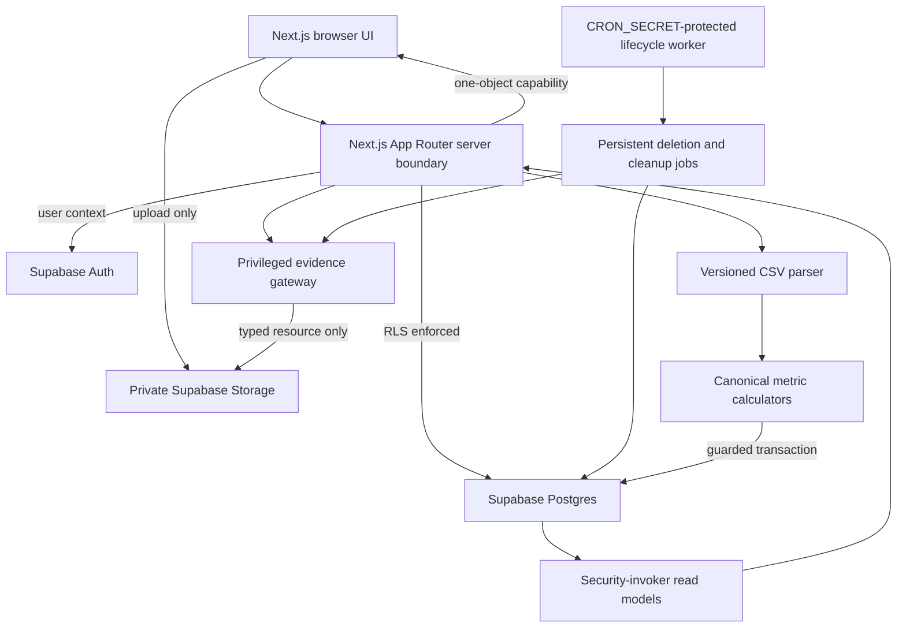
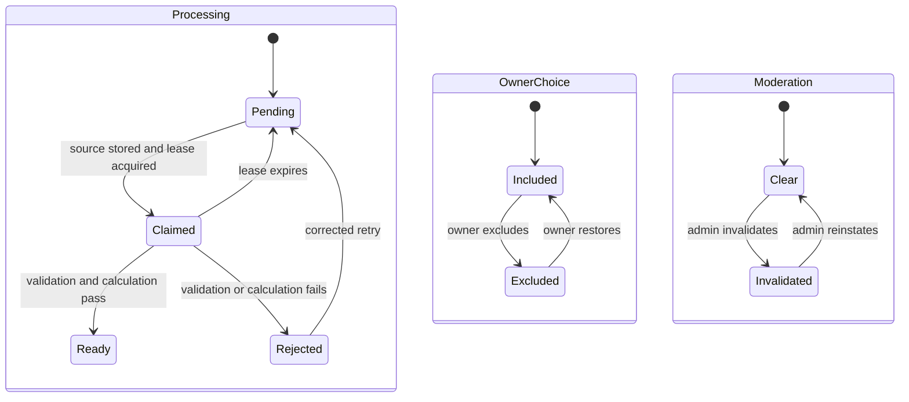

# Tindeq Group Leaderboard - Plan

## Goal Capsule

- **Objective:** Deliver a private, invite-only Tindeq companion where climbers upload assessment CSVs, compare trustworthy protocol-matched results, and track personal and group progress.
- **Authority:** This Product Contract and the confirmed conversation outrank implementation convenience; official Supabase, Next.js, Vercel, and Tindeq contracts outrank remembered APIs.
- **Execution profile:** Build a secure RFD vertical slice first, then add maximum-pull, critical-force, and repeater adapters only when representative exports and expected results exist.
- **Stop conditions:** Stop rather than guessing if a Tindeq export cannot be mapped to the versioned calculation contract, or if an authorization change would expose another group or a private source file.
- **Tail ownership:** Finish with current migrations, negative RLS and Storage tests, browser acceptance flows, production email configuration, a Vercel preview, and removal of abandoned implementation experiments.

---

## Product Contract

### Summary

Build a metric-only Next.js web application for small private climbing groups, using Supabase for email/password authentication, Postgres, and private CSV storage, with Vercel hosting. Group-owned immutable protocols make results comparable across assessment type, grip, edge depth, hand, timing, and scoring rules.

### Problem Frame

Tindeq exports assessment CSVs in different shapes: RFD and critical force contain metadata plus sampled force data, while the supplied maximum-force export is a summary-only CSV. These isolated exports do not provide durable group comparison or longitudinal progress views. Comparing climbers is only meaningful when test conditions and calculation rules match, so the product must make protocol identity, calculation provenance, trace availability, and data validity first-class rather than treating uploads as arbitrary scores.

The first groups contain fewer than ten known climbers. The product should favor clear workflows and trustworthy calculations while preserving a data model that supports multiple private groups per account.

### Actors

- A1. Member uploads and manages personal assessments, views group results, and may create a new group.
- A2. Admin manages invitations and protocols, reviews flagged source evidence, and moderates or verifies results.
- A3. Owner has all admin powers plus role management, ownership transfer, and group deletion.

### Requirements

**Accounts and groups**

- R1. Users sign up with Supabase email/password authentication and must verify their email before using protected product features.
- R2. Any verified user may create a private group and becomes its owner; one account may belong to multiple groups.
- R3. Owners and admins invite members through Resend-delivered, email-bound, hashed, single-use links that expire after seven days and reject a signed-in account with a different email. The raw token travels in the URL fragment, is removed with `history.replaceState` before any third-party request, and is submitted only in the confirmation `POST` body; opening an invitation never redeems it.
- R4. Owners manage admins and ownership transfer; admins manage invitations, protocols, and result moderation; members manage only their own assessment data.
- R26. Authentication includes verification resend, forgotten-password, reset-password, expired-link, already-used-link, wrong-account, and delivery-failure recovery states.

**Comparable protocols and sessions**

- R5. Admins create shared protocol templates for maximum pull, RFD, critical force, and repeaters with grip, edge depth, timing, threshold, scoring, and unit settings. A protocol version also fixes setup, warm-up, body position, device placement, execution instructions, maximum eligible attempts per session, minimum recovery between attempts, best-of-N selection of the highest eligible single attempt, and minimum validity criteria; the uploader confirms adherence for every session.
- R6. Protocols move through draft, published, locked, and archived states; comparison settings become immutable after the first result and changes create a new version.
- R27. The server owns an assessment-capability registry. Release 1 permits publication and ranking only for RFD; maximum pull, critical force, and repeaters remain visible as disabled future types until their adapter-specific release gates pass.
- R7. One assessment session belongs to one group, protocol version, hand, and test date; it may include a body-weight measurement and several one-attempt CSV uploads.
- R8. A session's best valid attempt supplies its leaderboard and progress score while every attempt remains available to its owner.

**Imports and calculations**

- R9. Each CSV is stored as immutable source evidence; supported, valid CSVs are parsed into versioned vendor fields and canonical metrics, with a normalized SI trace only when the export contains time-series samples.
- R10. Canonical scores are the unit-normalized exported maximum measurement for summary-only maximum pull, 20–80% RFD for RFD, versioned critical force for the critical-force assessment, and average active force for repeaters with fatigue shown separately.
- R11. Metric calculations are deterministic, retain parser and algorithm versions, and can be replayed without overwriting prior metric runs.
- R12. Imports are self-attested by default and publish immediately only after every expected file is valid and calculated or explicitly excluded by the owner. Each file has an independently retryable staged state; malformed, duplicate, unsupported, incomplete, or invalid attempts remain private and unranked with actionable errors.
- R13. Manual results appear in personal history but remain unranked until an admin verifies their evidence and records an audit reason.
- R25. A structurally valid but incomplete assessment remains in the owner's private history with its trace and diagnostic status, but it cannot rank unless it satisfies the protocol version's minimum repetition and validity rules.
- R28. Every published result carries a visible trust status: `self_attested` by default or `admin_verified` after an evidence-backed review. Leaderboards can filter to admin-verified results without implying that self-attested uploads were independently witnessed.
- R29. Sessions store both the user-declared test time and the export timestamp with timezone provenance. When a valid export timestamp exists it is the ranked capture time; missing or materially mismatched timestamps require a visible, audited admin exception. All date-window comparisons use UTC instants with the viewer's local calendar boundaries stated in the UI.

**Comparison and privacy**

- R14. Every protocol version and hand has leaderboard and progress views based on each member's best valid session result for the active score basis.
- R15. Leaderboards default to all-time best and allow latest, 30-day, 90-day, and custom-date views, with one row per eligible member.
- R16. Maximum pull, RFD, critical-force, and repeater results support absolute and body-weight-relative views. The best session is selected independently for each basis, so the absolute and relative leaderboards may use different sessions.
- R17. Exact body weight, notes, and original CSV remain private; group members see display name, protocol, hand, date, score, derived relative score, progress history, and a normalized force curve when the source export contains one.
- R18. The UI discloses that showing both absolute and relative scores allows group members to infer approximate body weight.
- R19. Source CSV access is limited to its owner or an owner/admin using an explicit audited review flow; no permanent public source-file URLs exist.
- R20. Leaving or removal immediately hides the person's publications from that group while preserving their private assessment history; rejoining may restore publication.
- R21. Account deletion immediately tombstones the account, revokes sessions, and hides publications; every private Postgres, Storage, and evidence authorization checks live non-deleted account status so already-issued access tokens fail immediately. A durable deletion job then removes personal records, source files, and the Auth identity in retryable phases; group rankings recalculate without the deleted user. Retained audit facts contain no direct identifiers, minimize timestamp/action precision, and disclose that small-group context may still permit inference.
- R22. All stored and displayed measurement units are metric: newtons internally, kilograms-force for force display, seconds for duration, percent body weight for relative force, and percent body weight per second for relative RFD.

**Experience and operations**

- R23. The responsive interface uses a persistent application shell with account controls, group switcher, group overview, protocols, upload/history, leaderboard/progress, and role-gated moderation/settings navigation. It supports signup, protocol management, multi-file session upload, result review, filters, and comparison charts on desktop and mobile, with explicit pending/success/failure states and confirmation for destructive or ranking-changing actions.
- R24. Authentication, membership, protocol, moderation, manual-verification, recalculation, and admin source-review events produce an append-only audit history without copying private measurement data into logs. Only current group owners/admins may read an allowlisted group audit projection; tokens, emails, exact measurements, traces, source paths, and free-form private payloads are excluded.
- R30. Charts expose the same values in an accessible table, do not rely on colour alone, support keyboard focus and screen-reader labels, and remain legible at 320 CSS pixels and at 200% zoom.
- R31. Source upload capabilities are object-bound, single-use, short-lived, and issued only after server-side quota checks. Initial limits are 5 MB per CSV enforced both by Storage/bucket configuration before acceptance and again during finalization, 10 files per session, 20 pending objects and 50 MB pending evidence per account, and 30 finalizations per account per hour; all are server-configured and audited when changed.

### Key Flows

- F1. Account and membership
  - **Trigger:** A person signs up, creates a group, or opens an invitation.
  - **Actors:** A1, A2, A3
  - **Steps:** Verify email or recover password; create or select account; open the invitation confirmation page without redeeming; authenticate the matching email; confirm redemption; create membership; choose active group.
  - **Outcome:** The user reaches only groups where an active membership exists.
- F2. Protocol publication
  - **Trigger:** An admin prepares a comparable assessment.
  - **Actors:** A2, A3
  - **Steps:** Configure comparison fields and physical execution instructions; validate the assessment capability and settings; publish; lock after first accepted result; clone for later changes.
  - **Outcome:** Every ranked result references one immutable protocol version.
- F3. Session import
  - **Trigger:** A member uploads one or more exports from the same testing session.
  - **Actors:** A1
  - **Steps:** Choose group, protocol, hand, declared time, and optional weight; attest protocol adherence; upload directly to private Storage; retry or exclude each failed file; review trust/timestamp/eligibility states; atomically publish the ready manifest.
  - **Outcome:** Valid attempts publish atomically and the best attempt becomes the session score.
- F4. Compare performance
  - **Trigger:** A member opens a protocol leaderboard or progress page.
  - **Actors:** A1, A2, A3
  - **Steps:** Select protocol version, hand, score basis, and date window; view rankings; select members for overlay; inspect normalized curves when the assessment supplies trace data.
  - **Outcome:** Only comparable, eligible results appear and private source fields remain hidden.
- F5. Moderate or verify
  - **Trigger:** An admin reviews a flagged upload or manual entry.
  - **Actors:** A2, A3
  - **Steps:** Start audited review; inspect permitted evidence; invalidate, restore, or verify with reason.
  - **Outcome:** Derived views recalculate and the action remains attributable.

### Acceptance Examples

- AE1. Given a verified member of Group A who is not in Group B, when they query Group B protocols, sessions, metrics, traces, or Storage objects directly, then every access path returns no data or denies access.
- AE2. Given an invitation for one email, when a link scanner or browser performs `GET`, another signed-in account opens it, or two matching clients submit redemption concurrently, then `GET` creates no membership, no unauthorized membership is created, and at most one authenticated matching-email `POST` succeeds.
- AE3. Given three valid RFD CSV files uploaded into one session, when finalization succeeds, then all attempts remain visible to the owner and the highest canonical 20–80% RFD supplies the session score.
- AE4. Given the same source file retried after a network interruption, when finalization runs again, then idempotency returns the existing attempt instead of creating a duplicate ranked result.
- AE5. Given an archived or superseded protocol version, when a member opens its history, then its own leaderboard remains available but its results never merge with another version.
- AE6. Given a session without a valid positive body weight, when leaderboards load, then its absolute score remains eligible and its relative score is omitted.
- AE7. Given an admin invalidates the current winning attempt with a reason, when the leaderboard refreshes, then the member's next-best eligible session becomes their row and the audit history records the action.
- AE8. Given a member leaves a group, when any remaining member loads comparisons, then the departed member is absent while the departed user retains private access to their own assessments.
- AE9. Given a group owner or admin attempts to open another member's source CSV outside an explicit review action, access is denied; a valid review grants only short-lived authenticated access and records who reviewed it and why. The source owner retains authenticated access to their own CSV.
- AE10. Given an account deletion completes, when group results and Storage are inspected, then that user's source files and personal results are gone and rankings no longer include them.
- AE11. Given the supplied two-row maximum-force CSV, when it is imported, then `type=single` and `max weight` are validated, optional blank fields are preserved, the measurement is normalized to SI without inventing a trace, and the attempt can rank after its expected conversion is approved.
- AE12. Given the supplied critical-force CSV, when it is imported, then metadata, repetition medians, threshold boundaries, and all 2,284 time/weight samples are retained; its vendor critical-force value remains provenance and ranking waits for the versioned canonical rule to be confirmed.
- AE13. Given the supplied partial repeater CSV containing two completed repetitions and exported `Avg=0.0` and `Peak=0.0`, when it is imported under a protocol requiring more repetitions, then its 2,616 samples and detected repetitions remain privately reviewable, its zero summaries do not replace calculated metrics, and the attempt remains unranked as incomplete.
- AE14. Given the same member has one session with the highest absolute score and another with the highest body-weight-relative score, each leaderboard selects its own winning session and identifies the active score basis.
- AE15. Given one of three session files fails validation, the two valid attempts remain private and staged; the owner can retry or exclude the failed file, and only the resulting reviewed manifest publishes atomically.
- AE16. Given an RFD import before the approved independent numeric-oracle manifest exists, parsing and private review may succeed but the result cannot publish or rank.
- AE17. Given a deleted account once performed an audited action, authorized reviewers see only a pseudonymous tombstone actor and allowlisted action facts, never the deleted profile, email, evidence locator, or private measurement data.

### Success Criteria

- A new group can complete the RFD path from verified signup through invitation, protocol publication, multi-attempt upload, ranking, progress comparison, and moderation without manual database work.
- A pilot group of at least three members completes the same published RFD protocol on at least two dates, can explain why rows are comparable, and reports that trust status, exclusions, and score provenance are understandable.
- The same valid fixture always produces the same metric values for a stored parser and calculation version.
- Automated tests prove anonymous, cross-group, removed-member, and wrong-role denial at database, Storage, server-action, and browser boundaries.
- The remaining assessment types ship only after each has representative valid and malformed fixtures plus independently checked expected metrics.

### Scope Boundaries

**Release 1**

- Responsive web application, Supabase email/password authentication and recovery, multi-group tenancy, secure emailed invitations, roles, RFD protocol lifecycle, RFD CSV imports, versioned metrics, trust-labelled leaderboards, progress charts, moderation, privacy controls, durable deletion, and Vercel deployment.

**Later gated scope**

- Maximum-pull, critical-force, and repeater protocol publication/ranking after their individual adapter gates pass.
- Manual personal history and admin verification after the RFD moderation model is proven.

**Deferred to Follow-Up Work**

- Direct Bluetooth or Tindeq API synchronization.
- Sharing one session into multiple groups without re-importing it.
- General ingestion background processing, trace downsampling, or materialized leaderboards until measured file size or group scale requires them. The narrow scheduled deletion/cleanup worker remains in Release 1.
- Native mobile applications, public profiles, global leaderboards, social feeds, subscriptions, and billing.

### Dependencies

- The supplied RFD export is sufficient to build the first parser fixture and vertical slice.
- The supplied maximum-force fixture is a two-row, 16-column summary CSV with `unit=SI`, `type=single`, and `max weight=10.3841515`; it has no sampled trace. Its unit conversion and expected normalized score must be independently confirmed before ranking is enabled.
- The supplied critical-force fixture contains `critical force=10.345741271972656`, `reps=24`, `Rest time=3`, `Work time=7`, three repetition-median values, six threshold boundary rows, and 2,284 time/weight samples from 0.054087 to 27.717519 seconds. Its canonical calculation rule must be confirmed rather than reverse-engineered from one export.
- The supplied repeater fixture is a two-column CSV with a three-row summary (`Overall Avg`, `Avg=0.0`, `Peak=0.0`) followed by 2,616 time/weight samples from 0.054143 to 31.786819 seconds. The user completed two repetitions, so this fixture proves partial-attempt parsing and rejection behavior; a completed attempt meeting an agreed protocol minimum is still required to approve ranked average-force and fatigue expectations.
- Production signup and password-reset email use Supabase custom SMTP; group invitations use a server-only Resend adapter with a verified sending domain, deterministic idempotency keys, persisted delivery status, and retryable failure handling. Supabase's default sender is not a production dependency.
- Preview and production deployments should use separate Supabase projects so preview migrations and test uploads cannot affect production.
- Ranked RFD launch requires an independently calculated golden-oracle manifest containing fixture hash, approved expected 20-80% RFD, tolerance, calculation configuration, reviewer, and approval date. Until it exists, RFD imports remain private and unranked rather than trusting the implementation under test.

---

## Planning Contract

### Key Technical Decisions

- KTD1. Use Next.js 16 App Router with TypeScript on Node.js 24. Server Components own authenticated reads, Server Actions own UI mutations, Route Handlers own auth callbacks, and focused Client Components own uploads and interactive charts.
- KTD2. Use current `@supabase/ssr` wrappers for browser and server clients, a root `proxy.ts` for cookie refresh, and `getClaims()` for authorization. Pin exact framework and Supabase package versions because the SSR package remains pre-1.0.
- KTD3. Keep group roles in `group_memberships`, not JWT user metadata. Group-owned protocols and publications carry `group_id`, cross-group references use composite constraints, and all exposed tables combine explicit grants with RLS.
- KTD4. Separate account-private assessments from group-scoped publications. Sessions, attempts, exact weight, notes, source locators, and vendor payloads remain owner-readable after membership ends; publication eligibility requires active membership and exposes only available normalized traces and derived scores through security-invoker read models.
- KTD5. Normal application work uses a request-scoped user client and RLS. A narrow server-only evidence gateway handles one-object upload capabilities, finalization reads, audited review streams, and deletion after authorizing a typed resource through the user context; it never accepts a client-supplied object path or performs ordinary domain queries.
- KTD6. Model ingestion, owner inclusion, and moderation as orthogonal states, then derive ranking eligibility from all three plus publication, membership, and manual-verification state. Critical multi-row commands recheck current authorization and commit related rows and audit events atomically; retries use compare-and-set claims and idempotency keys.
- KTD7. For trace-bearing exports, store each normalized trace as one row of ordered elapsed-time and force arrays because the application retrieves complete short curves rather than querying individual samples. Summary-only exports retain typed vendor fields without fabricating samples. Store canonical metrics relationally for indexed ranking.
- KTD8. Separate stable protocol identity, immutable protocol versions, parser versions, calculation algorithm versions, and immutable metric runs. Recalculation creates a superseding run instead of overwriting history.
- KTD9. Calculate leaderboard rows with indexed window queries at current scale. Materialized views and background refresh add complexity without benefit for groups under ten.
- KTD10. Use an append-only product audit log for domain actions and keep measurement values, raw traces, passwords, tokens, and source contents out of application logs.
- KTD11. Gate protocol publication, parser execution, and ranking through a server-owned assessment-capability registry. RFD is the only Release 1 capability; later adapters activate independently only after their golden-fixture gates pass.
- KTD12. Treat result trust (`self_attested`, `admin_verified`) as separate from parsing validity and moderation. Select the best eligible session independently for the requested absolute or relative score basis.
- KTD13. Persist declared test time, export capture time, timezone/offset provenance, and any admin timestamp exception separately; never overwrite source time with presentation-local dates.
- KTD14. Model deletion and orphan cleanup as persistent jobs with phases, leases, attempt counts, exponential backoff, next-run time, terminal/manual-review states, and idempotent per-resource checkpoints. A `CRON_SECRET`-protected Vercel Cron route claims bounded batches; operators can inspect and safely replay failed work.
- KTD15. Author audit events from trusted server/database context, expose only an allowlisted owner/admin projection, and replace deleted actors with non-reversible tombstone identifiers. Retain pseudonymized audit facts for 12 months by default, then purge them through the lifecycle worker.
- KTD16. Keep the privileged Supabase secret in an environment-specific server-only module. Every gateway request first resolves a typed authorized resource with the user-scoped client, then performs only the named object operation with the privileged client; credential rotation and revocation are tested.
- KTD17. Drive UI trust and recovery from one status matrix covering upload, eligibility, trust, moderation, publication, and trace availability, so list rows, details, charts, and admin surfaces use the same labels and actions.
- KTD18. Treat account tombstone state as a live authorization dependency, not a JWT claim: sensitive RLS, Storage policy helpers, and evidence gateways deny a tombstoned account even while an issued access token remains cryptographically valid.

### Canonical Calculation Contract

Trace-based algorithms accept normalized `(elapsed_us, force_n)` arrays, reject non-finite or non-monotonic input, retain full-precision values, and round only for display. Summary adapters validate declared fields and units without synthesizing samples. Each parser and algorithm version fixes schema, unit conversion, baseline, smoothing, threshold, validity, and tie behavior; a change creates new metric runs.

- **Maximum pull:** For the supplied `type=single` summary CSV, validate `max weight`, normalize the exported measurement to newtons through the approved `unit=SI` mapping, and record that the score is source-measured rather than trace-recalculated. Relative score divides force by body-weight force.
- **RFD:** Use the corrected rising curve, locate first 20% and 80% crossings of that attempt's peak under the versioned onset rules, then divide force change by elapsed seconds. Relative score divides RFD by body-weight force.
- **Critical force:** Parse the exported critical-force value, repetition medians, threshold boundaries, work/rest settings, and raw trace. Preserve the vendor value as provenance; enable a canonical ranked value only after the versioned rule for deriving critical force from valid work intervals is confirmed against an independently checked expectation. Relative score divides critical force by body-weight force.
- **Repeaters:** Detect active intervals from the protocol version's work/rest, threshold, expected-repetition, and minimum-valid-repetition rules. Calculate mean active force across valid repetitions and report fatigue from first-to-last valid repetition only when the protocol minimum is met. Treat exported zero summaries from incomplete captures as vendor provenance, not canonical metrics. Relative score divides mean force by body-weight force.
- **Session selection:** For the active score basis, select the highest eligible session metric independently: absolute ranking compares the canonical absolute metric, while relative ranking compares its body-weight-relative metric and omits sessions without valid weight. Ties share displayed rank and sort deterministically by earliest authoritative capture time then stable attempt identifier.

Exact default unit conversion, smoothing, onset, critical-force interval selection, and repetition-validity constants must be published in versioned configuration and proven against golden fixtures before that assessment type is enabled. Vendor-exported results remain visible as provenance; summary-only maximum force is explicitly identified as a normalized source measurement rather than silently presented as a trace-derived score.

### High-Level Technical Design



```mermaid
sequenceDiagram
  participant M as Member browser
  participant A as Next.js server
  participant S as Private Storage
  participant D as Postgres
  M->>A: Request pending attempt
  A->>D: Authorize membership and create pending record
  A-->>M: Upload identifier and one-object capability
  M->>S: Upload CSV once to server-owned path
  M->>A: Finalize each upload identifier
  A->>D: Reauthorize and claim processing state
  A->>S: Evidence gateway reads exact immutable object
  A->>A: Hash, parse, normalize, calculate
  A->>D: Persist each attempt privately
  M->>A: Retry or exclude failures; approve manifest
  A->>D: Atomically publish best eligible result and audit event
  D-->>M: Published session result
```



### Output Structure

```text
src/
  app/
    (auth)/
    (dashboard)/groups/[groupId]/
    api/auth/confirm/
  components/
    charts/
    forms/
  features/
    assessments/
    groups/
    leaderboards/
    protocols/
  lib/
    supabase/
    validation/
supabase/
  migrations/
  tests/database/
tests/
  e2e/
  fixtures/tindeq/
```

### Sequencing

Establish migrations, RLS, typed Supabase boundaries, navigation, and lifecycle scaffolding before domain UI. Release 1 proves one independently deployable RFD workflow through upload, ranking, progress, moderation, deletion, and operations. Maximum pull, critical force, repeaters, and manual history are later units; each assessment capability is activated independently without reopening the RFD release boundary.

### System-Wide Impact

- **Security:** Membership changes must take effect through database and Storage policies without waiting for a refreshed JWT.
- **Data lifecycle:** Source evidence, optional normalized traces, derived metrics, publications, and audit events have different visibility and deletion rules.
- **Privacy:** Exact weight is protected from direct access, but simultaneous absolute and relative score sharing makes approximate weight inferable and requires disclosure.
- **Audit re-identification:** Even pseudonymized group/action/time facts can identify someone in a group under ten. Exclude direct identifiers, coarsen timestamps where operationally acceptable, minimize event detail, restrict readers, disclose the residual inference risk, and purge after the retention window.
- **Performance:** RLS columns, composite foreign keys, metric filters, and leaderboard sort keys require indexes; queries still include explicit group filters.
- **Operations:** Database migrations and Storage policies deploy separately from Vercel application builds and need ordered release gates.

### Risks and Mitigations

- **Unknown export shapes:** Use the supplied RFD, maximum-force, critical-force, and partial-repeater schemas as fixtures. Require a completed repeater capture plus independently checked expected metrics before ranked repeaters are enabled.
- **Metric disagreement:** Preserve vendor metrics, publish the canonical calculation contract, and compare golden expected outputs before ranking.
- **Cross-group leakage:** Use database-enforced composite tenancy, negative RLS and Storage tests, and no browser service key.
- **Partial uploads:** Use immutable object paths, idempotency keys, hashes, per-file retry/exclude states, an explicit manifest review, atomic publication, and cleanup of stale pending objects.
- **Cross-system deletion:** Revoke access and hide publications first, then reconcile Postgres, Storage, and Auth through leased persistent jobs with checkpoints, backoff, monitoring, and manual replay; completion requires zero residual personal rows or objects.
- **Release/schema mismatch:** Validate a preview build from the release commit and lockfile, apply additive compatible production migrations, then create and smoke-test a production-environment build from that exact commit and lockfile. Do not promote a preview build whose public environment values point at preview Supabase.
- **Rollback data loss:** Roll application code back against the expanded compatible schema, preserve immutable sources and metric runs, and forward-fix schema unless verified corruption requires an owned point-in-time restore.
- **Framework churn:** Pin versions, isolate Supabase client wrappers, and recheck official breaking-change feeds before implementation and upgrades.
- **Email delivery:** Configure Supabase custom SMTP plus a verified Resend domain, deterministic send idempotency, persisted invitation delivery states, CAPTCHA, and rate limits before real users depend on signup, invitations, or password resets.
- **Trust ambiguity:** Label imports as self-attested unless an admin completes an evidence-backed verification; provide an admin-verified-only filter and never present either status as proof of physical protocol adherence.
- **RFD self-validation:** Keep parsed results private and unranked until an independent numeric-oracle manifest, not calculator output generated by the same code, approves the exact fixture/configuration pair.

### Operational and Rollout Notes

- Validate a preview deployment built from the release commit and lockfile against preview Supabase. Apply additive production database and Storage changes, run saved zero-violation invariants, then build a production deployment from the exact same commit and lockfile with production-scoped environment values; smoke-test its staged production URL before assigning production traffic.
- Treat migration drift, preview access to production resources, a privacy/security invariant failure, or confirmed corruption as a no-go. Disable upload/finalization writes before rollback or investigation.
- Record pre-deploy and post-deploy evidence for same-group foreign keys, ready-attempt evidence/required-trace/metric completeness, unranked pending/rejected attempts, active-member leaderboard rows, unexplained Storage orphans, and completed account deletion.
- Assign release and rollback owners before launch. Check auth/email failures, invitation delivery/bounces, finalize latency and errors, stuck processing and lifecycle leases, duplicate conflicts, invariant failures, and deletion/cleanup backlog immediately after deploy and again at one and 24 hours.
- Prefer compatible code rollback and forward schema repair. Confirm backup or point-in-time restore availability, ownership, and verification steps before any release that can mutate production data.

### Sources and Research

- [Supabase breaking changes](https://supabase.com/changelog?types=breaking-change) — new table exposure, API-key, Node support, and protected-schema changes shape the baseline.
- [Supabase SSR clients](https://supabase.com/docs/guides/auth/server-side/creating-a-client) and [password authentication](https://supabase.com/docs/guides/auth/passwords) — cookie refresh, verified email, and server authorization.
- [Supabase Row Level Security](https://supabase.com/docs/guides/database/postgres/row-level-security) and [database testing](https://supabase.com/docs/guides/local-development/testing/overview) — tenant policy structure, indexes, negative tests, and security-invoker views.
- [Supabase Storage access control](https://supabase.com/docs/guides/storage/security/access-control) and [standard uploads](https://supabase.com/docs/guides/storage/uploads/standard-uploads) — private object policies and direct small-file uploads.
- [Next.js App Router](https://nextjs.org/docs/app), [Next.js 16 upgrade guide](https://nextjs.org/docs/app/guides/upgrading/version-16), and [Server Action limits](https://nextjs.org/docs/app/api-reference/config/next-config-js/serverActions) — current routing, async request APIs, proxy convention, and upload constraints.
- [Vercel function limits](https://vercel.com/docs/functions/limitations) and [Git deployments](https://vercel.com/docs/git) — payload ceiling and preview/production workflow.
- [Tindeq CSV export guidance](https://tindeq.com/import-to-spreadsheet/) — CSV is the supported exported-data interchange.

---

## Implementation Units

### U1. Application and local platform foundation

- **Goal:** Scaffold the pinned Next.js, TypeScript, Supabase, and test toolchain with reproducible local and hosted environments.
- **Requirements:** R1, R23
- **Dependencies:** None
- **Files:** `package.json`, `package-lock.json`, `.nvmrc`, `next.config.ts`, `tsconfig.json`, `eslint.config.mjs`, `.env.example`, `src/app/layout.tsx`, `src/app/page.tsx`, `src/app/globals.css`, `src/lib/supabase/browser.ts`, `src/lib/supabase/server.ts`, `proxy.ts`, `supabase/config.toml`, `vitest.config.ts`, `playwright.config.ts`, `tests/e2e/smoke.spec.ts`
- **Approach:** Pin Node.js 24, Next.js 16 Active LTS, Supabase clients, Vitest, and Playwright. Create separate browser/server clients, dynamic authenticated route boundaries, environment validation, and local Supabase configuration without any secret key in client code.
- **Execution note:** Prove the local runtime, Supabase connection, lint, typecheck, unit harness, browser harness, and production build before adding domain behavior.
- **Patterns to follow:** App Router Server Components by default; focused Client Components; Node runtime for parsing; async Next.js request APIs.
- **Test scenarios:**
  1. Loading the public home page succeeds without an authenticated session.
  2. A protected placeholder route redirects an anonymous visitor and loads for a seeded verified user.
  3. Environment validation fails clearly when a required public Supabase variable is absent and never accepts a secret key in a public variable.
- **Verification:** Fresh setup starts locally, type generation is reproducible, and the baseline passes lint, typecheck, unit, browser, and build gates.

### U2. Multi-tenant accounts, groups, secure invitations, and lifecycle scaffolding

- **Goal:** Implement verified accounts, password recovery, multi-group membership, roles, securely delivered invitations, navigation, leave/remove behavior, and immediate account-deletion revocation/tombstoning.
- **Requirements:** R1-R4, R20, R21, R23, R24, R26; F1; AE1, AE2, AE8, AE10
- **Dependencies:** U1
- **Files:** `supabase/migrations/*_accounts_groups_memberships.sql`, `supabase/migrations/*_invitations_deletion_jobs.sql`, `supabase/tests/database/groups_rls.test.sql`, `supabase/tests/database/invitations.test.sql`, `src/features/groups/actions.ts`, `src/features/groups/queries.ts`, `src/features/groups/schemas.ts`, `src/features/email/resend.ts`, `emails/group-invitation.tsx`, `src/components/app-shell.tsx`, `src/app/(auth)/sign-up/page.tsx`, `src/app/(auth)/sign-in/page.tsx`, `src/app/(auth)/forgot-password/page.tsx`, `src/app/(auth)/reset-password/page.tsx`, `src/app/(auth)/invite/page.tsx`, `src/app/api/auth/confirm/route.ts`, `src/app/api/webhooks/resend/route.ts`, `src/app/(dashboard)/groups/page.tsx`, `src/app/(dashboard)/groups/[groupId]/settings/page.tsx`, `tests/e2e/auth-groups.spec.ts`, `tests/e2e/invitations.spec.ts`
- **Approach:** Create profiles, groups, memberships, hashed email-bound invitations, deletion job/tombstone scaffolding, and database-authored audit events with explicit grants, RLS, indexed policy columns, and composite tenant constraints. Send group invitations only from the server through Resend with a deterministic invitation-version idempotency key and persisted queued/sent/delivered/failed state; authenticate delivery webhooks before updating status. A no-referrer, no-third-party-resource confirmation page reads the raw token from the URL fragment, removes it immediately with `history.replaceState`, and never redeems on `GET`; only an authenticated matching-email `POST` carrying the token in its body consumes it transactionally. Implement verification resend and password recovery states. Membership exit disables group publications while preserving owner-only assessment access. Account deletion requires ownership transfer or explicit group deletion, revokes sessions and publication immediately, and creates the durable job that U8 executes; U2 does not claim cross-system cleanup completion.
- **Patterns to follow:** Authorization from current database membership, not JWT metadata; `getClaims()` at server boundaries; append-only audit events; no custom objects in protected Supabase schemas.
- **Test scenarios:**
  1. Covers F1. A verified user creates two groups, becomes owner of both, and switches without leaking either group's data.
  2. Covers AE2. Link-scanner and browser `GET` requests never redeem; a matching verified email redeems once by authenticated `POST`, while expired, revoked, replayed, wrong-email, and concurrent redemption fail safely.
  3. Member, admin, and owner permissions match the role matrix; the last owner cannot leave before transferring ownership.
  4. Covers AE1. Anonymous, removed, and unrelated authenticated users fail direct reads and writes for every group-owned table.
  5. Covers AE8. Leaving hides group publication immediately while preserving access only to the user's attempts, available traces, private metadata, and sources; all other former-group data is denied.
  6. Verification resend, forgot/reset-password, expired-code, already-used-code, and wrong-account flows recover without leaking whether unrelated accounts exist.
  7. Invitation delivery failure is visible to the sender and retryable without duplicate membership or duplicate email; tokens never appear in application logs or third-party requests.
  8. Account deletion tombstones the account, revokes active sessions and hides publications immediately, creates one idempotent lifecycle job, and leaves final Storage/Postgres/Auth cleanup for U8; requests carrying an access token issued before tombstoning fail every private boundary.
- **Verification:** Database tests exercise positive and negative access paths through authenticated clients, not only UI controls.

### U3. Immutable protocol families and versions

- **Goal:** Give admins a safe workflow for defining, publishing, cloning, and archiving comparable assessment protocols.
- **Requirements:** R5, R6, R14, R27; F2; AE5
- **Dependencies:** U2
- **Files:** `supabase/migrations/*_protocols.sql`, `supabase/tests/database/protocols.test.sql`, `src/features/protocols/types.ts`, `src/features/protocols/schemas.ts`, `src/features/protocols/actions.ts`, `src/features/protocols/queries.ts`, `src/app/(dashboard)/groups/[groupId]/protocols/page.tsx`, `src/app/(dashboard)/groups/[groupId]/protocols/[protocolId]/page.tsx`, `tests/e2e/protocols.spec.ts`
- **Approach:** Separate protocol families from immutable versions. Validate assessment-specific settings with discriminated schemas, including physical execution instructions, adherence confirmation, maximum eligible attempts, minimum recovery, best-of-N, and minimum validity. A server-owned capability registry permits RFD publication in Release 1 and rejects publication of disabled assessment types even if a client crafts a direct request. Allow draft edits, publish once, lock comparison fields after first ready attempt, clone for changes, and archive without deleting history.
- **Patterns to follow:** Stable identity plus immutable revisions; group-scoped composite references; explicit lifecycle guards in database constraints and server actions.
- **Test scenarios:**
  1. Admin creates and publishes a valid RFD protocol; a member cannot create or modify one, and maximum pull, critical force, and repeaters cannot publish while disabled.
  2. Missing or invalid grip, edge depth, setup, warm-up, position, execution, timing, recovery, attempt-count, best-of-N, threshold, scoring, validity, or calculation-version settings fail before publication.
  3. Covers AE5. A version with results rejects comparison-field mutation and deletion; cloning creates a distinct empty leaderboard.
  4. Archived versions reject new sessions but remain readable to current group members.
  5. A cross-group attempt cannot reference another group's protocol version even through a crafted direct request.
- **Verification:** Schema, action, and browser tests prove lifecycle immutability and role enforcement.

### U4. Private, idempotent evidence ingress and session manifest

- **Goal:** Accept one or more immutable one-attempt CSVs into a private session manifest without exposing evidence or claiming calculation success.
- **Requirements:** R7-R9, R12, R17, R19, R29, R31; F3; AE4, AE6, AE9, AE15
- **Dependencies:** U2, U3
- **Files:** `supabase/migrations/*_assessment_sessions_attempts_storage.sql`, `supabase/tests/database/assessments_rls.test.sql`, `supabase/tests/database/storage_policies.test.sql`, `src/features/assessments/upload/actions.ts`, `src/features/assessments/upload/state.ts`, `src/features/assessments/upload/status.ts`, `src/features/assessments/upload/validation.ts`, `src/features/assessments/components/session-upload.tsx`, `src/features/assessments/components/manifest-review.tsx`, `src/app/(dashboard)/groups/[groupId]/protocols/[protocolId]/upload/page.tsx`, `tests/e2e/session-upload.spec.ts`
- **Approach:** A server action enforces account quotas before creating a manifest, pending attempt IDs, server-owned immutable paths, and ten-minute single-use one-object upload capabilities; the browser has no general bucket list/update/delete rights. Store declared and export timestamps separately. Finalization reauthorizes the owner and exact pending resource, acquires a processing lease, downloads through the evidence gateway, enforces the 5 MB bound while hashing, and hands verified bytes to U5. Each file exposes pending/uploading/processing/ready/rejected/excluded states and can retry independently. Persist every processed attempt privately; publish nothing until the owner reviews the manifest and every expected file is ready or explicitly excluded. Request and source-hash uniqueness make retries safe; stale evidence cleanup operates only on expired unreferenced pending or rejected objects.
- **Execution note:** Start with Storage and database denial tests, then prove ingress, retry, lease expiry, and failure recovery without parser dependencies.
- **Patterns to follow:** One-object upload capability; insert-only immutable evidence; typed resource authorization; no upsert; safe error codes; durable cleanup reconciliation.
- **Test scenarios:**
  1. Multiple files inherit one group's protocol version, hand, declared time, optional weight, and adherence confirmation and cannot be mixed across those dimensions; export timestamps remain independently queryable.
  2. Covers AE4. Concurrent claims and repeated source bytes resolve to one pending attempt and one processing lease.
  3. Empty, over-5-MB, wrong-encoding, over-count, over-pending-quota, expired-capability, and untracked files never enter parser processing or affect a leaderboard; Storage rejects an oversized body before persisting it, and finalization independently rechecks bytes.
  4. A browser interruption leaves a recoverable pending attempt; cleanup removes expired orphan objects without touching ready evidence.
  5. Covers AE9. Owner access succeeds; group-member access, copied capability replay, path spoofing, listing, overwrite, deletion, another user's pending path, and non-review admin access fail.
  6. Covers AE6. Missing or invalid weight blocks only relative eligibility, not absolute eligibility.
  7. Covers AE15. Valid siblings survive one file's failure; retry or explicit exclusion resolves the manifest, and publication remains atomic.
  8. A missing or materially mismatched export timestamp prevents ranking until an admin records the exception; date-window boundaries remain stable across viewer timezones.
- **Verification:** Storage policy tests, lease/idempotency tests, and browser retries prove that only immutable evidence bound to an authorized manifest reaches U5.

### U5. Shared metric foundation and RFD vertical slice

- **Goal:** Convert the supplied RFD export into reproducible private attempts, optional traces, canonical metrics, and an independently gated ranked result without coupling Release 1 to later assessment adapters.
- **Requirements:** R8-R12, R14, R16, R22, R25, R27-R29; F3; AE3, AE4, AE6, AE15, AE16
- **Dependencies:** U4
- **Files:** `src/features/assessments/parsers/types.ts`, `src/features/assessments/parsers/tindeq.ts`, `src/features/assessments/parsers/rfd.ts`, `src/features/assessments/calculations/index.ts`, `src/features/assessments/calculations/rfd.ts`, `src/features/assessments/calculations/rfd.test.ts`, `tests/fixtures/tindeq/rfd/`, `tests/oracles/rfd/manifest.json`, `supabase/migrations/*_traces_metric_runs.sql`, `supabase/tests/database/metric_runs.test.sql`
- **Approach:** Define a framework-independent adapter/calculator registry keyed by assessment type, export shape, and version. Claim verified manifests from U4; enforce RFD schema, unit, finite-value, duration, sample, and monotonic-time rules; preserve unknown vendor metadata; normalize measurements to SI; store one typed-array trace row; and create immutable metric runs. Persist every attempt owner-privately. After all expected attempts are ready or explicitly excluded, atomically publish the best eligible attempt, trust/timestamp state, and audit event. The RFD capability cannot rank until a committed oracle manifest matches the fixture hash and records an independently calculated expected value, tolerance, configuration, reviewer, and approval date.
- **Execution note:** Write rejection tests and obtain the numeric oracle before enabling ranking. Calculator output produced by the implementation under test cannot populate or approve the oracle.
- **Patterns to follow:** Lossless source provenance, SI internals, explicit algorithm configuration, immutable supersession, floating-point tolerance only in tests and display rounding only in presentation.
- **Test scenarios:**
  1. Covers AE3 and AE16. The supplied RFD fixture parses metadata and trace deterministically and retains vendor metrics; it stays private/unranked before oracle approval and yields the approved canonical 20–80% RFD within tolerance afterward.
  2. Replaying a fixture with its stored parser and algorithm version reproduces prior full-precision metrics.
  3. Oracle loading fails closed for a changed fixture hash, missing expected value/configuration/reviewer/date, excessive tolerance, or self-generated approval.
  4. RFD crossings cover exact thresholds, boundary samples, irregular intervals, noise, early termination, non-finite values, missing crossings, and non-monotonic time.
  5. Trace array cardinality, sample count, duration, and monotonic-time constraints reject corrupt persistence.
  6. Recalculation adds a superseding metric run and leaves the prior run queryable for audit.
  7. Best-attempt selection ignores rejected, incomplete, excluded, invalidated, timestamp-exception-pending, and otherwise ineligible attempts and resolves ties deterministically.
  8. A failure while processing any expected attempt leaves the session unpublished; retry or exclusion resumes safely without duplicate traces, metric runs, publications, or audit events.
- **Verification:** RFD alone completes its real-fixture, independent-oracle, replay, rejection, privacy, and atomic-publication gates; no later assessment adapter is needed to release it.

### U6. Leaderboards, progress overlays, and attempt details

- **Goal:** Present comparable group rankings, progress histories, and normalized force curves where available without exposing private fields.
- **Requirements:** R8, R14-R18, R22, R23, R28-R30; F4; AE5-AE8, AE14
- **Dependencies:** U5
- **Files:** `supabase/migrations/*_leaderboard_progress_views.sql`, `supabase/tests/database/leaderboard_views.test.sql`, `src/features/leaderboards/queries.ts`, `src/features/leaderboards/types.ts`, `src/components/charts/progress-chart.tsx`, `src/components/charts/force-curve-chart.tsx`, `src/app/(dashboard)/groups/[groupId]/protocols/[protocolId]/leaderboard/page.tsx`, `src/app/(dashboard)/groups/[groupId]/protocols/[protocolId]/progress/page.tsx`, `src/app/(dashboard)/groups/[groupId]/attempts/[attemptId]/page.tsx`, `tests/e2e/leaderboards.spec.ts`, `tests/e2e/progress.spec.ts`
- **Approach:** Build assessment-agnostic security-invoker, group-filtered read models over current metric runs and active memberships; Release 1 supplies only RFD data, while later enabled adapters reuse the same contract. Rank one best session per member independently for the selected absolute or relative basis; keep assessment type, protocol version, hand, authoritative capture time, and trust status explicit. Render small-group overlays in focused Client Components using chart-ready server data, synchronized accessible tables, keyboard-focusable points, non-colour distinctions, and responsive labels; add member selection rather than downsampling when the group grows. Reuse the shared status matrix for empty, pending, self-attested, admin-verified, invalidated, incomplete, no-relative-score, and no-trace states.
- **Patterns to follow:** Server Component reads; indexed window queries; no caching of authenticated session-bearing responses; serialized plain chart data across the server/client boundary.
- **Test scenarios:**
  1. All-time, latest, 30-day, 90-day, and custom windows return one correctly ranked row per eligible active member.
  2. Covers AE14. Absolute and relative views independently select the highest eligible session for their metric, omit relative results without weight, identify the source session, and show the inference disclosure.
  3. Covers AE5. Protocol versions and hands never merge; archived history remains independently navigable.
  4. Progress uses one best valid attempt per session and overlays selected members in chronological order.
  5. Group-visible queries contain score and, when available, normalized curve data, but never exact weight, notes, source path, token, or vendor payload; summary-only maximum-force attempts return an explicit no-trace state.
  6. Empty, single-member, tied, invalidated-winner, removed-member, and deleted-account states render correctly.
  7. Every chart value is available in a table; keyboard, screen-reader, colour-contrast, 320-CSS-pixel, and 200%-zoom checks pass without clipped controls or ambiguous series.
  8. Self-attested and admin-verified labels agree across leaderboard, progress, and details, and the verified-only filter excludes self-attested results without changing stored eligibility.
- **Verification:** Database query fixtures and browser assertions reconcile displayed ranks and plotted points to stored canonical metrics.

### U7. RFD moderation, evidence review, and audit surfaces

- **Goal:** Let owners and admins review RFD evidence, moderate attempts, verify self-attested results, and explain every ranking-changing action without exposing private audit or source data.
- **Requirements:** R12, R19-R21, R24, R28; F5; AE7-AE10, AE17
- **Dependencies:** U4, U5, U6
- **Files:** `supabase/migrations/*_moderation_audit.sql`, `supabase/tests/database/moderation_audit.test.sql`, `src/features/assessments/moderation/actions.ts`, `src/features/assessments/evidence/route.ts`, `src/features/audit/queries.ts`, `src/app/(dashboard)/groups/[groupId]/moderation/page.tsx`, `src/app/(dashboard)/groups/[groupId]/audit/page.tsx`, `tests/e2e/moderation.spec.ts`
- **Approach:** Require explicit, target-bound review intent and reason before privileged source access. The user-scoped client first authorizes the typed attempt and review; a separately constructed server-only privileged client then reads exactly that object. Stream it with `Cache-Control: private, no-store`, `X-Content-Type-Options: nosniff`, `Content-Disposition: attachment` using a sanitized filename, and a fixed safe CSV content type; never return a reusable Storage URL. Make invalidation, restoration, and admin verification reversible, attributable actions with confirmation, pending, success, and failure states. Emit allowlisted audit facts in the same transaction as the mutation, expose them only to current owners/admins, and pseudonymize deleted actors.
- **Patterns to follow:** Application-mediated evidence streaming; database-authored append-only audit data; orthogonal eligibility state; shared eligibility pipeline for imported and verified-manual results.
- **Test scenarios:**
  1. Covers AE9. Admin source access works only within an active matching review; copied links, closed reviews, demotion, removal, wrong attempt, and wrong group fail immediately.
  2. Covers AE7. Invalidation promotes the next eligible score; restoration reinstates the prior result when still best.
  3. Verification changes `self_attested` to `admin_verified` only after reviewing the matching evidence and recording a reason; invalidation remains an independent state.
  4. Member cannot moderate, verify, browse group audit data, or access another user's source evidence; owners/admins see only the safe audit projection for their current group.
  5. Application roles cannot forge, insert, update, or delete audit events; rollback of a domain mutation also rolls back its audit event.
  6. Membership removal or account deletion revokes review access immediately and applies the agreed publication/deletion behavior.
  7. Covers AE17. Deleted actors render as tombstones, audit retention purges on schedule, timestamp/action detail is minimized, the UI discloses contextual inference risk, and audit rows contain no email, token, path, free-form private payload, trace, or measurement value.
  8. Evidence responses carry the required no-store, nosniff, attachment, fixed-type, and sanitized-filename headers; gateway-secret rotation/revocation tests prove the public app never receives the credential.
- **Verification:** Role-matrix, audit-integrity, and browser tests prove every ranking change and privileged source access is authorized and attributable.

### U8. Deployment, production security, and release gates

- **Goal:** Deploy the RFD release repeatably to Vercel and Supabase with separate environments, production email, durable lifecycle execution, and launch-ready security.
- **Requirements:** R1, R12, R19, R21, R23, R24, R26, R31
- **Dependencies:** U1-U7
- **Files:** `.github/workflows/ci.yml`, `vercel.json`, `src/app/api/cron/lifecycle/route.ts`, `src/features/lifecycle/worker.ts`, `src/features/lifecycle/queries.ts`, `src/lib/supabase/privileged.ts`, `README.md`, `docs/calculation-contract.md`, `docs/operations/deployment.md`, `docs/operations/data-lifecycle.md`, `tests/e2e/production-smoke.spec.ts`
- **Approach:** Connect Git deployments for previews and production with separate Supabase projects and environment-scoped public values. Validate the release commit/lockfile in preview, apply additive production migrations and Storage policies, prove invariants, then build and smoke-test a production-environment deployment from that exact commit/lockfile before assigning traffic. Configure Supabase custom SMTP, Resend, CAPTCHA, quotas/rate limits, and server-only credentials. Implement persistent deletion/cleanup jobs with phases, leases, checkpoints, backoff, terminal/manual-review states, a bounded `CRON_SECRET`-protected daily Vercel Cron worker compatible with Hobby limits, an authenticated manual replay path, and backlog monitoring. Revoke sessions/publications first; remove Postgres personal rows and Storage evidence idempotently; remove the Auth identity last; retain only the 12-month pseudonymized audit facts. Run Supabase security and performance advisors before launch.
- **Patterns to follow:** Preview-per-branch; exact-commit environment-specific builds; production migration before production traffic; exact dependency pins and committed lockfile; explicit database release step; durable idempotent jobs; server-only secret isolation.
- **Test scenarios:**
  1. Preview deployment uses only preview Supabase resources and cannot read production data or Storage.
  2. CI fails on migration, database tests, parser/calculator tests, lint, typecheck, browser tests, or production build failure.
  3. Signup confirmation, invitation, and password reset use configured production SMTP and accepted redirect URLs.
  4. Security review finds no public bucket, exposed secret key, unprotected table/view, or missing tenant index.
  5. Production smoke covers verified sign-in, group switch, RFD upload, leaderboard update, private-source denial, and admin invalidation.
  6. Read-only invariants report zero cross-group references, incomplete ready attempts, ineligible ranked attempts, inactive-member leaderboard rows, unexplained source orphans, or completed deletions with residual data.
  7. Covers AE10. Tombstoning denies an already-issued token at Postgres, Storage, and evidence boundaries; interrupted account deletion and stale-evidence cleanup resume from persistent checkpoints with lease expiry/backoff, never delete source evidence referenced by a ready attempt, and support audited manual replay after terminal failure.
  8. Rollback restores the prior compatible application artifact without losing source evidence or metric history, then passes post-rollback invariants.
  9. Unauthorized cron calls fail; one authorized invocation claims only its bounded batch; concurrent invocations do not duplicate work; dashboard/runbook exposes age, attempts, next run, and terminal failures.
  10. The preview deployment contains no production Supabase, Resend, cron, or privileged credentials, and the production client bundle contains no server secrets.
- **Verification:** Preview and production builds come from the same commit and lockfile but use their own scoped environments; the staged production build passes smoke tests before traffic, and immediate, one-hour, and 24-hour monitoring checkpoints remain below stop thresholds.

### U9. Maximum-pull adapter and capability gate

- **Goal:** Add summary-only maximum-pull imports without changing the released RFD pipeline.
- **Requirements:** R5-R12, R14, R16, R22, R27; AE11
- **Dependencies:** U5, U8
- **Files:** `src/features/assessments/parsers/max-pull.ts`, `src/features/assessments/calculations/max-pull.ts`, `src/features/assessments/calculations/max-pull.test.ts`, `src/features/assessments/capabilities.ts`, `src/features/protocols/schemas.ts`, `tests/fixtures/tindeq/max-force/`, `tests/oracles/max-force/manifest.json`, `tests/e2e/max-pull-capability.spec.ts`
- **Approach:** Parse and retain the supplied two-row, 16-column `type=single` summary, preserve blanks, validate the approved `unit=SI` mapping, produce no trace, and keep the capability disabled until an independent oracle approves the normalized score and malformed variants pass. Activation registers the adapter, enables protocol publication, and proves the assessment-agnostic U6 leaderboard/progress/details contract in preview.
- **Test scenarios:** Covers AE11; reject missing/duplicate `max weight`, wrong type, extra result rows, non-finite values, unsupported units, changed fixture hashes, and any synthesized trace; prove disabled/enabled protocol, upload, ranking, progress, and no-trace states end to end.
- **Verification:** Enable maximum-pull protocol publication/ranking only after its independent fixture/oracle and privacy/replay gates pass in preview.

### U10. Critical-force adapter and capability gate

- **Goal:** Add critical-force parsing and ranking only after the canonical interval rule is independently confirmed.
- **Requirements:** R5-R12, R14, R16, R22, R27; AE12
- **Dependencies:** U5, U8
- **Files:** `src/features/assessments/parsers/critical-force.ts`, `src/features/assessments/calculations/critical-force.ts`, `src/features/assessments/calculations/critical-force.test.ts`, `src/features/assessments/capabilities.ts`, `src/features/protocols/schemas.ts`, `tests/fixtures/tindeq/critical-force/`, `tests/oracles/critical-force/manifest.json`, `tests/e2e/critical-force-capability.spec.ts`
- **Approach:** Retain vendor critical force, repetition medians, threshold boundaries, work/rest metadata, and the raw trace. Do not infer a ranking formula from one file; activate the adapter and protocol capability only when an approved rule and independent expected result exist, then prove reuse of U6 comparison views in preview.
- **Test scenarios:** Covers AE12; retain three medians, six threshold rows, and 2,284 monotonic samples; reject missing/mismatched blocks, invalid time/force values, and oracle/configuration mismatch; prove disabled/enabled protocol, upload, ranking, progress, and trace states end to end.
- **Verification:** Critical-force publication/ranking remains server-disabled until calculation, golden, replay, and malformed-fixture gates pass.

### U11. Repeater adapter and capability gate

- **Goal:** Preserve partial repeater captures and later enable comparable repeater rankings from a completed fixture.
- **Requirements:** R5-R12, R14, R16, R22, R25, R27; AE13
- **Dependencies:** U5, U8
- **Files:** `src/features/assessments/parsers/repeaters.ts`, `src/features/assessments/calculations/repeaters.ts`, `src/features/assessments/calculations/repeaters.test.ts`, `src/features/assessments/capabilities.ts`, `src/features/protocols/schemas.ts`, `tests/fixtures/tindeq/repeaters/`, `tests/oracles/repeaters/manifest.json`, `tests/e2e/repeater-capability.spec.ts`
- **Approach:** Parse summary and trace independently; detect work intervals from immutable protocol timing/threshold/minimum rules; treat zero exported summaries as provenance; keep the supplied two-repetition capture private and incomplete when the minimum exceeds two. Require a completed fixture and independent expected average active force/fatigue before activating the adapter/protocol capability and proving reuse of U6 comparison views in preview.
- **Test scenarios:** Covers AE13; retain all 2,616 monotonic samples and detect two repetitions under the fixture protocol; cover early termination, boundary intervals, missing repetitions, changed timing, and minimum-valid-repetition behavior; prove disabled/enabled protocol, upload, ranking, progress, trace, and fatigue states end to end.
- **Verification:** Repeater publication/ranking remains disabled until completed-fixture, oracle, replay, and malformed-fixture gates pass.

### U12. Manual personal history and admin verification

- **Goal:** Add optional manual history after the imported-result trust and moderation model is proven.
- **Requirements:** R13, R24, R28; F5
- **Dependencies:** U7 and the adapter for the selected assessment type
- **Files:** `supabase/migrations/*_manual_results.sql`, `supabase/tests/database/manual_results.test.sql`, `src/features/assessments/manual/actions.ts`, `src/app/(dashboard)/assessments/manual/page.tsx`, `tests/e2e/manual-results.spec.ts`
- **Approach:** Keep manual entries account-private and visibly marked. Admin verification requires an enabled protocol/version, hand, authoritative date, score basis/value, evidence, verifier, and reason, and enters the same trust/eligibility pipeline without pretending the value was CSV-calculated.
- **Test scenarios:** Unverified manual entries never rank; wrong-group admins cannot inspect or verify them; verification/invalidation is transactional and audited; deleted evidence or disabled assessment capabilities remove eligibility.
- **Verification:** Manual history ships independently after its privacy, evidence, verification, calculation-provenance, and moderation tests pass.

---

## Verification Contract

| Gate | Applies to | Done signal |
|---|---|---|
| ESLint and TypeScript checks | U1-U12 | No lint or type errors; lint runs separately from the Next.js build. |
| Vitest unit and fixture suite | U4-U12 | Parsers, calculators, idempotency, eligibility, version replay, capability gates, and lifecycle jobs pass with real fixtures. |
| Supabase local reset and pgTAP suite | U2-U12 | Migrations replay cleanly; schema, grants, RLS, Storage policies, constraints, views, audit projections, and job leases pass positive and negative tests. |
| Playwright browser suite | U1-U12 | Auth/recovery, invitation, multi-group, protocol, staged upload, comparison, moderation, privacy, accessibility, and deletion flows pass as applicable. |
| Next.js production build | U1-U12 | Pinned Node and package versions produce a clean deployable build with no server secret in the client bundle. |
| Supabase advisors | U2-U12 | Security and performance findings are resolved or recorded with an explicit accepted rationale. |
| Persistent-data invariants | U4-U12 | Saved pre/post evidence shows zero tenant-reference, ready-attempt, ranking-eligibility, source-orphan, audit-retention, and deletion-completeness violations. |
| Vercel preview smoke | U8 | Preview uses isolated resources and completes the RFD vertical slice without production access. |
| Production build and rollback rehearsal | U8 | Preview and production builds use the exact release commit/lockfile with environment-scoped values; write-disable and compatible rollback preserve sources and restore clean invariants. |
| Launch monitoring window | U8 | Immediate, one-hour, and 24-hour auth, upload, lease, integrity, and cleanup checks remain below documented stop thresholds. |
| RFD oracle and capability review | U5 | RFD ranking is fail-closed until the approved independent numeric-oracle manifest matches the fixture/configuration; other types remain disabled. |
| Later adapter readiness review | U9-U11 | No assessment capability is enabled without real valid/malformed exports and independently checked golden metrics. |
| Accessible responsive presentation | U2, U4, U6, U7 | Keyboard, screen-reader, table alternative, non-colour, 320-pixel, and 200%-zoom checks pass for primary flows and charts. |

---

## Release 1 Definition of Done

- A pilot group of at least three verified members can join by secure invitation and complete the same published RFD protocol on at least two dates.
- RFD protocol setup, recovery, attempt limits, best-of-N, validity rules, and uploader adherence confirmation are immutable and visible; non-RFD protocols cannot publish.
- Multi-file RFD sessions support per-file retry/exclusion, remain private until manifest approval, and publish one self-attested best eligible result atomically.
- The independently approved RFD oracle matches the fixture hash/configuration and calculation output; without it, imports remain private and unranked.
- Absolute and relative leaderboards independently select their best eligible sessions and show trust, authoritative time, protocol version, hand, date window, and provenance clearly.
- Progress and force charts meet the accessible responsive contract and have equivalent tabular data.
- Owner/admin moderation, admin verification, evidence streaming, and audit projections enforce current membership, safe headers/fields, explicit confirmations, and pseudonymized deletion behavior.
- Signup verification, password recovery, Resend group invitations, separate preview/production Supabase projects, exact-commit environment-specific Vercel builds, and production smoke tests pass.
- Account deletion revokes access immediately and the persistent cron-driven worker completes Postgres, Storage, Auth, and 12-month audit-retention phases idempotently with monitored/manual recovery.
- The three-member/two-date pilot can explain why compared results are eligible and reports that trust status, exclusions, and score provenance are understandable.

## Full Product Definition of Done

- Verified users can create and switch groups, invite matching emails, and exercise only their owner/admin/member permissions.
- Database, Storage, server, and browser tests deny anonymous, wrong-group, removed-member, and wrong-role access.
- Admins publish immutable protocol versions only for enabled assessment types, and historical versions remain separately comparable.
- RFD and every enabled assessment adapter parse real exports, preserve source provenance, and reproduce canonical metrics by version.
- Multi-file sessions publish atomically after retry/exclusion review, survive retries without duplication, and choose the best eligible attempt under immutable attempt/recovery/best-of-N rules.
- Leaderboards and progress charts reconcile to canonical metrics across protocol version, hand, score basis, and date window.
- Exact weight, notes, and source files remain directly private; the relative-score inference disclosure is present.
- Trust labelling, moderation, manual verification when U12 ships, source review, membership changes, recalculation, and deletion are authorized and audited through safe projections.
- Removed members retain only their own private assessment records; no former-group protocols, members, rankings, audit data, or new activity remain accessible.
- Account and group deletion survive interruption, revoke access immediately, leave no ownerless group, and report completion only after Postgres, Storage, and Auth reconcile.
- Production SMTP/Resend email, CAPTCHA, quotas/rate limits, migration order, preview isolation, environment-specific builds, lifecycle cron, security advisors, and Vercel deployment are verified.
- The calculation contract and data-lifecycle documentation match shipped behavior.
- All unit-specific test scenarios and Verification Contract gates pass, and dead-end or experimental code from abandoned approaches is removed.
