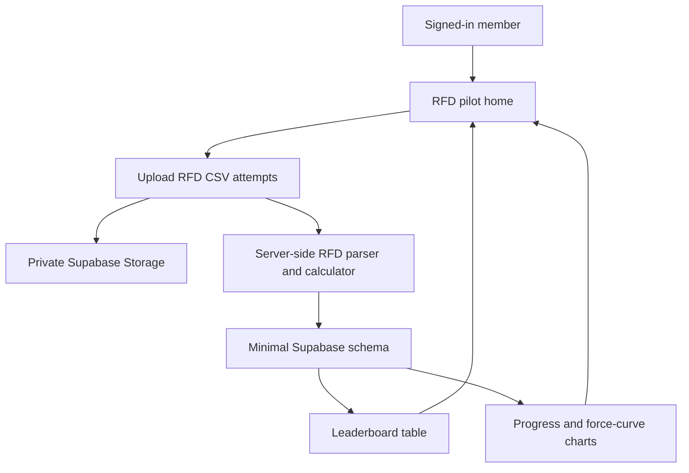
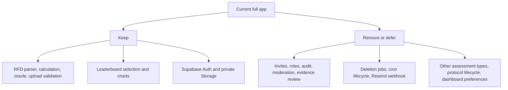

# Minimal RFD Pilot - Plan

## Goal Capsule

- **Objective:** Scale Cruxboard down to a maintainable pilot app where a small private group can upload Tindeq RFD CSVs, publish validated results, compare a leaderboard, and inspect charts without the current admin, lifecycle, and multi-assessment machinery.
- **Means:** Keep the existing Next.js, Supabase, private Storage, RFD parser/calculator, leaderboard selection, and chart components, while replacing broad product workflows with one RFD-first pilot path (KD1, KD2, KTD1).
- **Authority:** The user's confirmed scope in this planning session outranks the older fuller plan; the older plan remains historical context only. Existing tested RFD calculation and chart behavior outrank cosmetic simplification.
- **Execution profile:** Refactor toward the smallest coherent vertical slice, with characterization tests around calculations, upload validation, leaderboard selection, and chart rendering before deleting adjacent features.
- **Stop conditions:** Stop before deleting data-bearing remote resources if any active Supabase data must be preserved; stop before enabling ranking if the RFD oracle or seed protocol cannot be represented clearly.
- **Tail ownership:** Finish with a clean local build/test pass, a resettable Supabase local schema, updated setup docs, and a Vercel preview or production deployment only when the project is intentionally active again.

---

## Product Contract

### Summary

The minimal app is an RFD-only pilot for a small private climbing group. Members authenticate, belong to the pilot group, upload one or more Tindeq RFD CSV attempts for a fixed protocol, and then view ranked results plus plots that show progress over time and normalized force curves.

The scale-down removes product surfaces that make sense for a later durable SaaS version but are too heavy now: multi-assessment capability gates, custom invitation email delivery, role management, moderation, audited evidence review, account deletion jobs, protocol cloning/archive workflows, and dashboard preference persistence.

### Problem Frame

The current app was built toward a full private leaderboard platform, but the immediate need is smaller: prove that the Tindeq data path and visual outputs are useful. The existing code already has valuable pieces for that path, especially RFD parsing, calculation tests, private upload handling, leaderboard selection, and accessible chart components.

Keeping every generalized state around those pieces makes the app harder to understand, test, deploy, and resume after the paused Supabase project is revived. The minimal version should make the core feedback loop obvious and leave future expansion as documented follow-up work rather than active complexity.

### Key Decisions

- KD1. **Charts remain core.** session-settled: user-directed - chosen over a leaderboard-only pilot because plots are a key output metric. Governs R6, R11, AE2.
- KD2. **RFD-only pilot.** session-settled: user-approved - chosen over retaining all assessment adapters because the app needs a smaller first surface. Governs R2, R3, R8.
- KD3. **Resettable pilot data posture.** session-settled: user-approved - chosen over remote-data-preserving migration first because the linked Supabase project is paused and this plan targets simplification before reactivation. Governs R9, R10.

### Requirements

**Core pilot flow**

- R1. A signed-in user can reach the pilot app without managing multiple groups, roles, invitations, or account deletion flows.
- R2. The app supports only the RFD assessment type in the active product surface.
- R3. The app provides one seeded default RFD protocol path. If the seed is missing, signed-in members see a setup-required empty state rather than an owner/admin protocol builder.
- R4. A member can upload one or more Tindeq RFD CSV attempts with hand, test time, optional body weight, and protocol adherence confirmation.
- R5. A valid upload stores private source evidence, parsed trace data, a deterministic RFD 20-80 score, and an optional body-weight-relative score.
- R6. Published results appear in an RFD leaderboard and in charts for progress over time and force curves.
- R14. Ranked leaderboard and chart output require an approved RFD oracle manifest. Before approval, valid uploads may be stored privately and shown only as non-ranked inspection state.

**Privacy and comparability**

- R7. Source CSVs remain private and are never exposed through public URLs.
- R15. Raw CSV evidence is write/process-only in the minimal product: other members cannot download it, admins have no review download path, and owner re-download is deferred unless a server-authorized owner-only route is deliberately added.
- R16. Published self-attested results record uploader identity, protocol-adherence confirmation, source hash, parser/device metadata when available, and rejection reasons. Fabricated CSVs and off-protocol attempts are an accepted private-pilot risk until human verification returns in a later product version.
- R8. Maximum pull, critical force, repeaters, manual entries, moderation, admin verification, audit browsing, and long-running deletion jobs are not part of the minimal product.
- R9. The minimal schema keeps only the authorization and data relationships needed for one private pilot group, RFD sessions, attempts, traces, metrics, and leaderboard reads.
- R10. The downsizing work may reset local and preview data. Any production data preservation requirement must be raised before applying destructive remote schema changes.
- R17. Remote-destructive schema work requires a technical safety gate: separate local/preview reset commands from production commands, document Supabase project IDs, and require explicit written approval plus backup/export confirmation before a production reset or destructive migration can run.

**Experience**

- R11. The first protected screen prioritizes the active RFD protocol, upload action, leaderboard, and charts rather than a broad management dashboard.
- R12. Empty, pending, processing, partial-success, duplicate, rejected, oracle-blocked, published, best-attempt-selected, and relative-score-unavailable states remain explicit enough for a pilot member to know what happened and what to retry.
- R13. The README and deployment notes explain the minimal scope, the paused Supabase status, and the resettable pilot database assumption.

### Key Flows

- F1. Pilot onboarding
  - **Trigger:** A signed-in pilot member opens the app.
  - **Actors:** Member, app server, Supabase Auth.
  - **Steps:** Resolve the active profile and seeded pilot group; confirm the member has active membership; confirm the seeded default RFD protocol exists; route the member to the RFD home or setup-required/no-access state.
  - **Outcome:** The member sees upload, leaderboard, and charts without navigating admin-only setup surfaces.
- F2. RFD upload and publication
  - **Trigger:** A member uploads one or more Tindeq RFD CSVs.
  - **Actors:** Member, app server, private Storage, Postgres.
  - **Steps:** Validate file descriptors; create pending attempts; upload CSVs to private Storage; parse and calculate RFD; persist trace and metrics; publish the best eligible attempt.
  - **Outcome:** Oracle-approved results are visible in the leaderboard and chart data while the raw CSV remains private; unapproved valid attempts remain private with an oracle-blocked state.
- F3. Compare results visually
  - **Trigger:** A member opens the leaderboard or chart view.
  - **Actors:** Member, app server, Postgres.
  - **Steps:** Load eligible RFD results; choose absolute or relative basis; render ranking, progress-over-time chart, force-curve chart, and accessible tables.
  - **Outcome:** The pilot group can understand standings and performance shape from the same trusted result set.

### Acceptance Examples

- AE1. Given a signed-in pilot member, a seeded RFD protocol, and an approved RFD oracle manifest, when they upload a valid RFD CSV, then the attempt reaches ready state, publishes a score, and appears in the leaderboard.
- AE2. Given a valid RFD upload with trace samples, when the member opens charts, then the progress chart and force-curve chart render the matching result and include equivalent tabular data.
- AE3. Given an invalid CSV or a file over the configured size limit, when upload processing runs, then the result is rejected with a retryable user-facing state and no leaderboard row is published.
- AE4. Given a member without body weight, when leaderboards use relative scoring, then that session is omitted from relative rankings while remaining eligible for absolute ranking.
- AE5. Given an unauthenticated visitor, when they request protected pilot pages or source evidence, then access is denied.
- AE6. Given the minimal app build, when navigation is inspected, then moderation, audit, invitation management, account deletion, multi-assessment setup, and protocol archive/clone flows are absent from the active UI.
- AE7. Given the RFD oracle manifest is not approved, when a member uploads a valid RFD CSV, then the attempt is stored privately with an oracle-blocked state and does not appear as ranked leaderboard or chart output.
- AE8. Given any member other than the uploader, when they try to access another member's raw CSV evidence, then the app provides no download route and Storage access is denied.

### Success Criteria

- A fresh local Supabase reset can seed the minimal pilot group and default RFD protocol without manual SQL editing.
- A pilot member can complete the RFD loop from sign-in to upload to leaderboard to charts in one session.
- Existing RFD calculation, upload validation, leaderboard selection, and chart utility tests remain green or are replaced by narrower equivalents with the same behavioral coverage.
- The route and feature tree is visibly smaller, with removed product surfaces reflected in docs and tests.

### Scope Boundaries

#### Release 1 Minimal Pilot

- Supabase email/password authentication using the existing SSR client pattern.
- One private pilot group path with RFD-only sessions, private CSV evidence, RFD metric runs, leaderboard rows, progress chart, and force-curve chart.
- Minimal deployment configuration for Vercel and Supabase preview/local use.

#### Deferred to Follow-Up Work

- Custom Resend invitation emails, delivery webhooks, token fragment flows, role management, ownership transfer, member removal, audit pages, moderation pages, evidence review downloads, and account deletion jobs.
- Maximum pull, critical force, repeaters, manual entries, admin verification, trust filters, protocol cloning, protocol archiving, dashboard home preferences, and multi-group switching.
- Production data migration from the fuller schema. If real pilot data needs preservation, write a separate data-migration plan before applying the minimal schema remotely.

### Sources / Research

- Current fuller product plan: `docs/plans/2026-07-28-001-feat-tindeq-group-leaderboard-plan.md`.
- App routes and surfaces: `src/app/groups`, `src/app/dashboard/page.tsx`, `src/app/api/cron/lifecycle/route.ts`, `src/app/api/evidence/[reviewId]/route.ts`, `src/app/api/webhooks/resend/route.ts`.
- RFD upload and calculation path: `src/features/assessments/upload/actions.ts`, `src/features/assessments/parsers/rfd.ts`, `src/features/assessments/calculations/rfd.ts`.
- Leaderboard and chart path: `src/features/leaderboards/queries.ts`, `src/features/leaderboards/selection.ts`, `src/components/charts/progress-chart.tsx`, `src/components/charts/force-curve-chart.tsx`.
- Schema complexity to collapse: `supabase/migrations/20260729100605_accounts_groups_invitations.sql`, `supabase/migrations/20260729100735_protocols.sql`, `supabase/migrations/20260729102000_assessment_sessions_attempts_storage.sql`, `supabase/migrations/20260729102500_leaderboards_moderation_audit.sql`, `supabase/migrations/20260729104500_account_lifecycle_jobs.sql`.

---

## Planning Contract

### Key Technical Decisions

- KTD1. **Contraction over rewrite.** Keep the existing Next.js App Router, Supabase SSR clients, RFD parser/calculator, selection helpers, and chart components. Delete or bypass the surrounding generalized product machinery only after tests cover the retained RFD path.
- KTD2. **Fresh minimal schema baseline.** For this resettable pilot branch, replace the historical migration directory with one timestamped minimal baseline plus any seed/storage-policy migration needed for local and preview resets. Do not apply it to remote production; preserve old migrations in git history rather than keeping them active in this branch.
- KTD3. **One active seeded RFD protocol.** Use a seeded default RFD protocol instead of user-managed protocol lifecycle states. Keep protocol fields that affect comparability, such as grip, edge depth, hand, minimum duration, minimum peak force, and body-weight basis.
- KTD3a. **Single pilot home information architecture.** The protected landing page is the RFD home: protocol summary and upload action first, then leaderboard, progress chart, and force curves as anchored sections or compact tabs using the same filter state. After upload, return to this home with the published result state visible.
- KTD4. **Self-attested publishing only.** Remove moderation and admin verification from the active model. Eligibility comes from successful parsing, protocol validation, current membership/profile authorization, and oracle approval.
- KTD5. **Charts read from the same published result set as the leaderboard.** Keep progress and force-curve charts coupled to leaderboard eligibility so visual output cannot drift from ranking output.
- KTD6. **Private evidence stays private without review workflows.** Keep private Storage and server-authorized processing. Remove audited admin evidence downloads in the minimal product.
- KTD7. **Technical reset safety before docs.** Because the plan allows local/preview data resets, command shape and environment checks must make accidental production destruction difficult; documentation reinforces the gate but is not the only protection.

### Bootstrap Decisions

- **Pilot group:** Seed one default pilot group during local/preview database reset. A signed-in user reaches the RFD home only if they have active membership in that group; otherwise they see a no-access state.
- **Pilot protocol:** Seed one default RFD protocol tied to the pilot group. It is not edited through the UI in the minimal product.
- **Nil or empty state:** If the group or protocol seed is missing, protected pages show setup-required copy and do not expose upload, leaderboard, or protocol-builder controls.
- **Oracle state:** Ranked output ships only when `rfd-oracle-manifest.json` is approved for the parser and algorithm versions in use. Until then, the upload path can validate and store attempts privately but must present an oracle-blocked state.
- **Remote safety:** Remote Supabase project IDs for preview and production must be documented before deployment work. Any destructive remote command requires an explicit backup/export confirmation and written approval outside the command's default path.

### High-Level Technical Design

### System-Wide Impact

This refactor touches product scope, persistent schema, routing, tests, and deployment documentation. The largest operational impact is that the minimal schema is reset-oriented; production preservation must be decided before applying it to an active remote Supabase project. The most important user-facing impact is that charts become more prominent, not less, while admin and operations pages disappear.

### Risks & Dependencies

- **Risk 1. Data loss:** Replacing the migration baseline can destroy existing remote data if applied carelessly. Mitigation: keep the plan scoped to local/preview reset first, separate reset commands from production commands, document project IDs, and require backup/export plus written approval before destructive remote schema work.
- **Risk 2. Over-pruning:** Removing protocol fields or eligibility checks can make results less comparable. Mitigation: keep the minimal protocol fields that directly affect RFD comparability.
- **Risk 3. Visualization drift:** If chart queries diverge from leaderboard queries, charts may show unranked results. Mitigation: keep shared selection/query helpers and test the same result set across leaderboard and chart paths.
- **Risk 4. Oracle gate:** The current app intentionally blocks ranking until the RFD oracle manifest is approved. Mitigation: retain the oracle concept and make the seed/demo path explicit; do not silently rank unapproved calculations.

---

## Implementation Units

### U1. Freeze the Minimal Product Surface

- **Goal:** Make the active route tree reflect the RFD pilot and remove links into deferred admin and operations flows.
- **Requirements:** R1, R2, R8, R11, R13, AE5, AE6.
- **Dependencies:** None.
- **Files:** `src/app/dashboard/page.tsx`, `src/features/dashboard/components/dashboard-panels.tsx`, `src/components/app-shell.tsx`, `src/app/groups/page.tsx`, `src/app/groups/[groupId]/page.tsx`, `src/app/groups/[groupId]/audit/page.tsx`, `src/app/groups/[groupId]/moderation/page.tsx`, `src/app/api/cron/lifecycle/route.ts`, `src/app/api/evidence/[reviewId]/route.ts`, `src/app/api/webhooks/resend/route.ts`, `tests/e2e/smoke.spec.ts`, `README.md`.
- **Approach:** Reframe the protected experience around one RFD pilot home. Put protocol summary and upload action first, then leaderboard, progress chart, and force curves as anchored sections or compact tabs using the same filter state. Remove or redirect audit, moderation, evidence review, lifecycle cron, and Resend webhook routes from the active product. Keep enough group/profile resolution to gate access, but avoid presenting group administration as a core workflow.
- **Execution note:** Start with a smoke or route-availability characterization so the implementation can prove removed surfaces are actually gone from navigation.
- **Patterns to follow:** Existing server-rendered pages in `src/app/dashboard/page.tsx`; existing shell composition in `src/components/app-shell.tsx`.
- **Test scenarios:**
  - A signed-in member with pilot state reaches the RFD home and sees upload, leaderboard, and chart entry points.
  - A signed-in member with no seeded protocol sees a setup-required empty state with no owner/admin protocol builder.
  - A signed-in member does not see moderation, audit, invite management, account deletion, or protocol archive/clone actions in primary navigation.
  - A direct request to a deferred admin route either returns not found, redirects to the pilot home, or displays a clear out-of-scope state.
  - An unauthenticated request to a protected pilot route still redirects through the existing auth boundary.
- **Verification:** The app has one obvious protected pilot path and no visible links into deferred admin/operations flows.

### U2. Replace the Data Model with a Minimal RFD Baseline

- **Goal:** Collapse the schema to the tables, policies, functions, and views needed for one private RFD pilot group with private evidence, traces, metrics, and leaderboard reads.
- **Requirements:** R2, R3, R5, R7, R15, R9, R10, R17, R13, AE1, AE3, AE4, AE5, AE8.
- **Dependencies:** U1.
- **Files:** `supabase/migrations`, `supabase/config.toml`, `supabase/tests/database/schema.test.sql`, `src/lib/supabase/admin.ts`, `src/lib/supabase/server.ts`, `src/lib/supabase/proxy.ts`, `src/lib/env.ts`, `src/lib/server-env.ts`, `.env.example`, `docs/operations/deployment.md`.
- **Approach:** Replace the active historical migration set with one timestamped minimal baseline plus any seed/storage-policy migration needed for local and preview resets. Keep `profiles`, a minimal pilot group/membership model, one seeded RFD protocol representation, `assessment_sessions`, `assessment_attempts`, `force_traces`, `metric_runs`, and a leaderboard/trace read view. Remove active schema requirements for invitations, delivery status, group role management beyond what authorization needs, audit projections, source reviews, lifecycle jobs, dashboard preferences, and non-RFD capabilities. Keep production remote reset out of scope unless a separate preservation plan is written.
- **Execution note:** Treat this as schema-sensitive work. Verify local reset and RLS behavior before changing application code that depends on removed objects.
- **Patterns to follow:** Current RLS helper intent in `supabase/migrations/20260729100605_accounts_groups_invitations.sql`; current leaderboard and trace views in `supabase/migrations/20260729102500_leaderboards_moderation_audit.sql`.
- **Test scenarios:**
  - Local database reset creates the minimal tables, views, functions, and Storage bucket/policies required by upload and leaderboard reads.
  - Local database reset seeds the pilot group, default RFD protocol, and required capability/oracle state.
  - A signed-in member can read only their pilot group data and cannot read another member's private source evidence directly.
  - Raw CSV objects have no member-to-member download path; any owner re-download route is absent unless deliberately added with owner-only authorization.
  - Publishing chooses the best valid ready attempt for a session and omits rejected attempts.
  - Relative leaderboard rows omit sessions without body weight while absolute rows remain eligible.
  - Removed objects such as invitation delivery, source reviews, audit projections, and lifecycle jobs are no longer required by app code.
  - Schema tests no longer assert removed objects such as dashboard preferences, invitation delivery, or source review flows.
- **Verification:** `supabase db reset` succeeds locally and the schema test covers authorization, publication, and chart read paths.

### U3. Simplify RFD Upload and Publication

- **Goal:** Keep the private CSV upload path but make it RFD-only, pilot-protocol-only, and easier to reason about.
- **Requirements:** R3, R4, R5, R14, R7, R16, R12, AE1, AE3, AE4, AE7.
- **Dependencies:** U2.
- **Files:** `src/features/assessments/upload/actions.ts`, `src/features/assessments/components/session-upload.tsx`, `src/features/assessments/upload/state.ts`, `src/features/assessments/upload/status.ts`, `src/features/assessments/upload/validation.ts`, `src/features/assessments/upload/status.test.ts`, `src/features/assessments/upload/validation.test.ts`, `src/features/assessments/parsers/rfd.ts`, `src/features/assessments/calculations/rfd.ts`, `src/features/assessments/calculations/rfd.test.ts`, `src/features/assessments/calculations/rfd-oracle-manifest.json`.
- **Approach:** Remove generic assessment capability plumbing from the active upload path. Keep validation, signed Storage upload, parsing, RFD calculation, oracle approval, trace persistence, and best-attempt publication. Record uploader identity, protocol-adherence confirmation, source hash, parser/device metadata when available, and rejection reasons for every processed attempt. Simplify data states, but keep user-facing messages for partial multi-file outcomes, duplicate detection, valid attempts not selected as best, oracle-blocked publishing, and relative ranking being unavailable when body weight is missing.
- **Patterns to follow:** Current upload action flow in `src/features/assessments/upload/actions.ts`; current validation tests in `src/features/assessments/upload/validation.test.ts`; current RFD calculation tests in `src/features/assessments/calculations/rfd.test.ts`.
- **Test scenarios:**
  - Valid RFD CSV input parses, calculates, persists trace/metric data, and publishes when the oracle gate permits ranking.
  - Valid RFD CSV input stays private and unranked with an oracle-blocked state when the oracle manifest is not approved.
  - Oversized, empty, malformed, and unsupported files are rejected before or during finalization with retryable status.
  - A duplicate source hash does not create a second ranked result for the same owner.
  - Multi-attempt upload selects the highest eligible RFD attempt for the session score.
  - Mixed multi-file outcomes explain which attempts published, which failed, and which valid attempt was not selected as best.
  - Oracle-blocked uploads store the attempts privately and explain that ranking is disabled until approval.
  - Missing body weight leaves absolute ranking available and explains why relative ranking omits the session.
  - Upload UI reports progress and final status without exposing internal claim tokens or object paths.
- **Verification:** The retained upload flow can be understood as one RFD path from selected files to published leaderboard row.

### U4. Preserve Leaderboards and Make Charts First-Class

- **Goal:** Keep leaderboard, progress, and force-curve outputs as the primary result experience.
- **Requirements:** R4, R5, R6, R14, R11, AE2, AE4, AE7.
- **Dependencies:** U2, U3.
- **Files:** `src/features/leaderboards/queries.ts`, `src/features/leaderboards/selection.ts`, `src/features/leaderboards/types.ts`, `src/components/leaderboard-table.tsx`, `src/components/leaderboard-filter-form.tsx`, `src/components/charts/chart-utils.ts`, `src/components/charts/chart-utils.test.ts`, `src/components/charts/progress-chart.tsx`, `src/components/charts/force-curve-chart.tsx`, `src/features/leaderboards/queries.test.ts`, `src/features/leaderboards/selection.test.ts`, `src/app/groups/[groupId]/protocols/[protocolId]/leaderboard/page.tsx`, `src/app/groups/[groupId]/protocols/[protocolId]/progress/page.tsx`.
- **Approach:** Keep shared query and selection helpers so leaderboard and chart views consume the same eligibility rules. Put leaderboard, progress, and force curves into the pilot home as anchored sections or compact tabs; keep the chart components and their accessible tables.
- **Execution note:** Preserve chart behavior with component/unit tests before changing route composition.
- **Patterns to follow:** Current `ProgressChart` and `ForceCurveChart` accessible SVG plus table pattern; current selection tests for best/latest and score basis behavior.
- **Test scenarios:**
  - Best-result leaderboard ranks one row per member for the selected hand and score basis.
  - Progress entries are chronological and include all eligible published results for the chosen basis.
  - Force curves load only for attempts in the selected progress result set.
  - Chart utilities handle one-point-like ranges, equal score ranges, and downsampling without producing non-finite SVG coordinates.
  - Chart sections include stable headings, SVG accessible names, keyboard-reachable series or points, and table equivalents for plotted values.
  - At narrow mobile widths, chart/table content remains readable without overlapping the upload or leaderboard controls.
- **Verification:** A pilot user can move from leaderboard to progress and force curves without encountering deferred admin/product concepts.

### U5. Remove Deferred Feature Code and Tighten Dependencies

- **Goal:** Delete or isolate code for features outside the minimal product and remove dependencies that are no longer needed.
- **Requirements:** R8, R13, AE6.
- **Dependencies:** U1, U2, U3, U4.
- **Files:** `src/features/assessments/moderation/actions.ts`, `src/features/assessments/moderation/queries.ts`, `src/features/audit/queries.ts`, `src/features/email/invitation.ts`, `src/features/groups/actions.ts`, `src/features/groups/invitations.ts`, `src/features/groups/schemas.ts`, `src/features/lifecycle/worker.ts`, `src/features/dashboard/actions.ts`, `src/features/dashboard/preferences.ts`, `src/features/dashboard/actions.test.ts`, `src/features/dashboard/preferences.test.ts`, `src/features/groups/invitations.test.ts`, `src/features/groups/schemas.test.ts`, `package.json`, `package-lock.json`.
- **Approach:** After retained flows are green, remove unused action modules, tests, route handlers, Resend dependency usage, dashboard preference persistence, lifecycle worker code, and group-management actions. Keep group query helpers only if the pilot auth boundary still needs them.
- **Patterns to follow:** Use TypeScript and lint failures as the deletion checklist; remove code only after the retained route tree no longer imports it.
- **Test scenarios:**
  - Typechecking fails before cleanup if a removed module is still imported, and passes after all dead references are removed.
  - Package metadata no longer includes dependencies used only by deferred features.
  - Tests for deleted features are removed or replaced by tests for the minimal pilot path, not left failing or skipped.
- **Verification:** The source tree no longer advertises inactive features as implemented, and the dependency graph matches the minimal app.

### U6. Update Documentation and Deployment Posture

- **Goal:** Make the repo explain the minimal pilot accurately and prevent accidental remote destructive changes.
- **Requirements:** R10, R17, R13.
- **Dependencies:** U1, U2, U5.
- **Files:** `README.md`, `docs/operations/deployment.md`, `docs/operations/data-lifecycle.md`, `docs/calculation-contract.md`, `.env.example`, `vercel.json`.
- **Approach:** Rewrite setup and operations docs around the minimal RFD pilot. Mark the fuller SaaS features as deferred, state that the linked Supabase project may be paused, and document that local/preview DB reset is expected. Document preview and production Supabase project IDs when known, and require backup/export confirmation plus written approval before any destructive remote schema operation. Keep the RFD calculation contract if it remains accurate; slim data lifecycle docs that only described deleted deletion/audit machinery.
- **Patterns to follow:** Existing README stack and quality command section; existing deployment runbook structure.
- **Test scenarios:** Test expectation: none - documentation-only unit, verified by reviewer reading and by links matching actual scripts/files.
- **Verification:** A new implementer can set up the minimal app locally and understand what is intentionally absent.

---

## Verification Contract

| Gate | Applies To | Done Signal |
|---|---|---|
| `npm test` | RFD calculation, upload validation/status, leaderboard selection, chart utilities | Unit tests cover retained behavior and no deleted-feature tests remain as false obligations. |
| `npm run typecheck` | All units | Removed modules have no remaining imports and Supabase result types still line up with the minimal query shape. |
| `npm run lint` | All units | The reduced app has no dead imports, unused variables, or route/component lint failures. |
| `npm run build` | Route and deployment readiness | Next.js builds the simplified route tree without references to deferred pages or missing env vars. |
| `npx supabase db reset` | U2 | Local schema applies from scratch, seeds the pilot group/protocol state, and schema tests pass against the minimal baseline. |
| `npm run test:e2e` | U1, U3, U4 | Smoke coverage proves sign-in/protected routing, upload entry, leaderboard, and chart views are reachable in the minimal app. |

Manual verification should use a fresh local database with the minimal seed state, one valid RFD fixture, and one invalid CSV. Confirm that the valid upload appears in leaderboard and charts, the invalid file does not publish, and deferred admin/operations links are not visible.

---

## Definition of Done

- The active product surface is an RFD-only pilot with upload, leaderboard, progress chart, and force-curve chart as first-class flows.
- Deferred admin, moderation, audit, invitation delivery, account deletion lifecycle, protocol lifecycle, non-RFD assessment, and dashboard preference surfaces are removed from active routing and imports.
- The minimal Supabase schema can be reset locally and supports auth, private evidence, RFD attempts, traces, metrics, and leaderboard/chart reads.
- RFD parser/calculation behavior and chart/leaderboard selection behavior remain covered by automated tests.
- Documentation clearly states the minimal scope, reset-oriented database posture, paused Supabase context, and future-work boundaries.
- Production-destructive schema work is blocked by process and command separation until backup/export and written approval are explicit.
- No abandoned experimental code, skipped deleted-feature tests, or stale docs remain in the diff.
