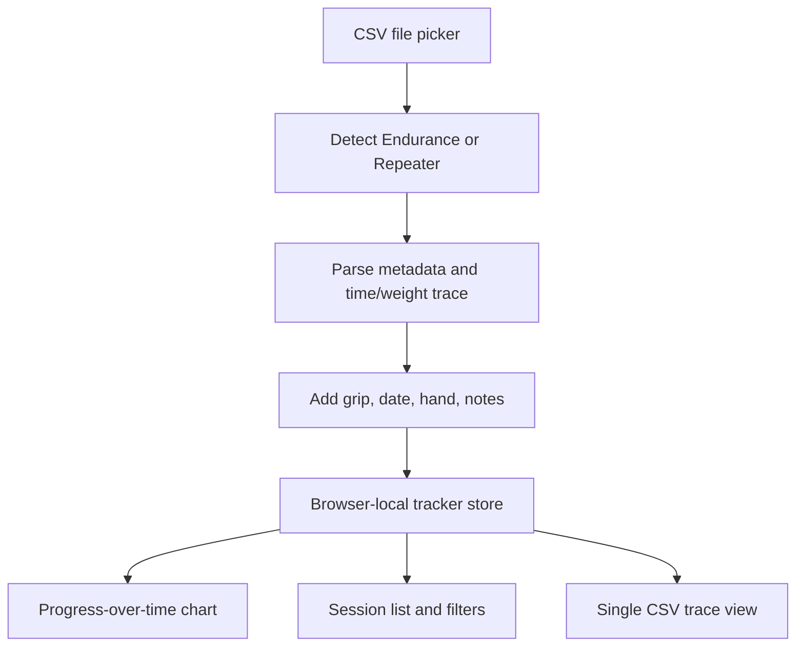
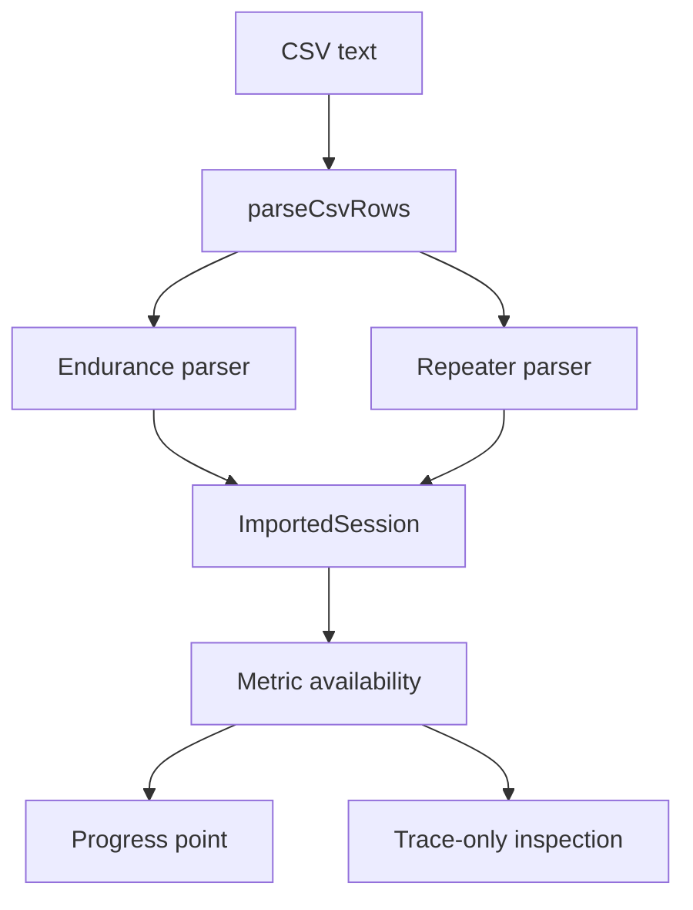

# Personal Tindeq Tracker - Plan

## Goal Capsule

- **Objective:** Replace the current group leaderboard direction with a bare-bones personal Tindeq CSV tracker that works well on mobile, imports Endurance and Repeater exports, records grip/test context per file, and shows progress over time as the primary output.
- **Means:** Keep the existing Next.js app, CSV parsing helper, force unit conversion, chart utility patterns, and Tindeq fixtures, but build a local-first personal dashboard instead of extending Supabase, auth, groups, leaderboards, or moderation.
- **Authority:** The user's confirmed personal tracker scope outranks the older fuller leaderboard and RFD pilot plans. Existing tested parser/chart utilities are reusable only when they support the simpler product shape.
- **Execution profile:** Characterize the Tindeq CSV shapes and chart data model first, then replace product routes with one mobile-first local app surface.
- **Stop conditions:** Stop before adding cloud sync, group comparison, account flows, public sharing, or generalized protocol management. Stop before claiming a metric is comparable if the parser cannot derive it reliably from the supported export shape.
- **Tail ownership:** Finish with focused parser/storage/chart tests, a mobile smoke pass, and docs that describe the local-only data posture.

---

## Product Contract

### Summary

This plan creates a personal training log for Tindeq CSV exports. The app accepts Endurance and Repeater CSVs, lets the user attach grip type and basic test context to each imported file, derives a small set of comparable metrics, and plots those metrics over time by test mode and grip type.

The main screen is not a leaderboard. It is a mobile-first progress dashboard: import files, filter the visible series, inspect the progress plot, and open any imported session to see the full trace from that CSV.

### Problem Frame

The existing project kept growing toward a private group platform with authentication, Supabase storage, publication rules, and trust machinery. That is more product than the immediate use case needs. The immediate need is one person reviewing their own Tindeq exports, mostly from a mobile device, with enough metadata to compare like with like.

The valuable old pieces are small: CSV row parsing, kilograms-force to newtons conversion, parser test style, SVG chart utilities, and sample exports. The rest should be historical context, not the shape of the next app.

### Key Decisions

- KD1. **Personal local tracker.** session-settled: user-directed - chosen over another group/leaderboard pilot. Governs R1, R2, R9, R10.
- KD2. **Endurance and Repeater first.** session-settled: user-directed - chosen over retaining all Tindeq assessment types. Governs R3, R4, R5, R11, R12.
- KD3. **Progress plot is the primary output.** session-settled: user-directed - chosen over raw trace browsing as the main experience. Governs R6, R7, R8.
- KD4. **Strict anti-bloat boundary.** session-settled: user-directed - chosen over evolving the prior implementation in place. Governs R9, R10, R13, R14.

### Requirements

**Import and metadata**

- R1. The first usable screen works for a single personal user without sign-in, groups, roles, invitations, moderation, or cloud setup.
- R2. The app accepts one or more CSV files exported from the Tindeq app in a browser file picker.
- R3. Each imported CSV is classified as Endurance or Repeater by parser detection when possible, with a clear manual override when detection is ambiguous.
- R4. Each imported CSV requires user-editable context before it becomes part of progress tracking: grip type, test date, optional hand/side, and optional notes.
- R5. Grip type is a lightweight user-facing label, not a managed protocol entity. Common presets are helpful, but custom text remains available.

**Progress and inspection**

- R6. The primary output is a progress-over-time chart that can display multiple series across test modes and grip types.
- R7. The progress chart can filter or distinguish series by test mode, grip type, and hand/side so unlike tests are not silently merged.
- R8. Each imported CSV can be opened on its own full-data view showing the full force trace and derived summary metrics for that file.

**Scope control**

- R9. Data is local to the browser for the initial application. No Supabase persistence, server upload, user accounts, group sharing, public URLs, or evidence review flows are part of this plan.
- R10. The active UI removes old leaderboard, group, auth, invite, dashboard-management, protocol-management, moderation, audit, webhook, and lifecycle surfaces.
- R13. If a CSV is unsupported, incomplete, or only partly calculable, the app still allows full trace inspection but marks unsupported metrics unavailable instead of inventing them.
- R14. The app exposes simple delete/reset controls for local records so the user can recover from bad imports without database operations.

**Mode-specific metrics**

- R11. Endurance imports track at least critical force, repetition count, work/rest timing when present, and the raw force trace.
- R12. Repeater imports track at least average active force, peak force, completed repetition count when detectable, fatigue/drop-off when detectable, and the raw force trace.

### Key Flows

- F1. Import a file
  - **Trigger:** The user selects one or more Tindeq CSV exports on mobile or desktop.
  - **Steps:** The app reads each file locally, detects the export shape, previews parsed metadata and trace availability, asks for missing grip/test context, and saves valid records locally.
  - **Outcome:** Each supported or inspectable CSV becomes a local session with enough context to appear in filters and trace inspection.
- F2. Track progress
  - **Trigger:** The user opens the app after importing sessions.
  - **Steps:** The app loads local sessions, applies selected test/grip/hand filters, derives chart series, and renders progress over time with a compact tabular fallback.
  - **Outcome:** The user can see whether a chosen grip/test combination is improving.
- F3. Inspect one CSV
  - **Trigger:** The user taps an imported session.
  - **Steps:** The app shows summary metrics, metadata, notes, and a full force-over-time plot for that CSV.
  - **Outcome:** The user can verify what happened in the original test instead of relying only on the aggregate progress point.

### Acceptance Examples

- AE1. Given an Endurance CSV with critical force metadata and a time/weight trace, when it is imported with a grip type and date, then the session is saved locally and the progress chart includes a critical-force point for that grip.
- AE2. Given a Repeater CSV with an `Overall Avg` summary and time/weight trace, when it is imported with a grip type and date, then the session is saved locally and the progress chart includes the derived repeater metric that the parser can support.
- AE3. Given two Endurance sessions and two Repeater sessions with different grip labels, when all are selected, then the progress chart distinguishes the series rather than flattening them into one line.
- AE4. Given any imported session, when the user opens it, then the full available trace is plotted and the same sampled values are available in a table or equivalent accessible representation.
- AE5. Given a partial or unsupported CSV, when it has a readable time/weight trace, then the session can be saved for inspection while unavailable progress metrics are visibly excluded from aggregate progress.
- AE6. Given a bad import or test record, when the user deletes it or resets local data, then it is removed from the progress chart and session list without requiring server state.

### Success Criteria

- A fresh local run opens directly into the personal tracker experience, not a marketing page or authenticated group dashboard.
- Representative Endurance and Repeater fixtures import through parser tests and produce stable local domain records.
- The progress chart supports multiple test/grip series and remains readable on a phone-sized viewport.
- A single-session detail view plots the full available trace from the CSV.
- No active route or primary navigation path depends on Supabase, authentication, group membership, leaderboards, moderation, audit, invitations, or protocol management.

### Scope Boundaries

#### Release 1 Personal Tracker

- Mobile-first web app running inside the existing Next.js project.
- Browser-local imports and persistence.
- Endurance and Repeater CSV parsing.
- User-provided grip labels, test date, optional hand/side, and notes.
- Progress-over-time chart, local session list, and per-session full trace view.

#### Deferred to Follow-Up Work

- Cloud sync, accounts, backup accounts, multi-device reconciliation, sharing, exports to other apps, and installed native mobile wrappers.
- Reintroducing group leaderboards, trust/moderation, private evidence storage, invitations, roles, or Supabase-backed persistence.
- RFD, maximum force, critical force ranking formulas beyond the Endurance support needed here, custom protocol builders, and body-weight-normalized comparisons.
- Advanced analytics such as trend lines, training load, fatigue modeling, PR detection, or automatic grip taxonomy cleanup.

### Sources / Research

- Prior broad plan: `docs/plans/2026-07-28-001-feat-tindeq-group-leaderboard-plan.md`.
- Prior RFD pilot plan: `docs/plans/2026-08-19-1137-refactor-minimal-rfd-pilot-plan.md`.
- Shared Tindeq CSV helpers: `src/features/assessments/parsers/tindeq.ts`.
- Existing parser pattern: `src/features/assessments/parsers/rfd.ts`, `src/features/assessments/parsers/types.ts`, `src/features/assessments/calculations/rfd.test.ts`.
- Existing chart patterns: `src/components/charts/progress-chart.tsx`, `src/components/charts/force-curve-chart.tsx`, `src/components/charts/chart-utils.ts`, `src/components/charts/chart-utils.test.ts`.
- Fixtures for the new scope: `tests/fixtures/tindeq/critical-force/critical-force.csv`, `tests/fixtures/tindeq/repeaters/partial-two-reps.csv`.

---

## Planning Contract

### Key Technical Decisions

- KTD1. **Local-first browser app.** Implement storage in the browser, preferably IndexedDB through a small project-local wrapper, so full traces do not need Supabase and do not risk localStorage size limits. This instantiates KD1 and KD4.
- KTD2. **New personal domain model, not renamed leaderboard types.** Create tracker-specific types for imported sessions, test modes, grip labels, metrics, and trace samples instead of adapting `ProgressEntry` or leaderboard publication types.
- KTD3. **Parser registry stays tiny.** Add Endurance and Repeater parsers behind a two-entry detection function. Do not revive the old assessment capability registry.
- KTD4. **Calculable metrics are explicit.** A record can have a full trace and still have unavailable progress metrics. This prevents partial Repeater exports or unknown Endurance variants from polluting the aggregate chart.
- KTD5. **Charts become personal-series charts.** Reuse low-level chart helpers where practical, but adapt components around local session series: test mode plus grip plus optional hand, not member identity or trust status.
- KTD6. **Route surface is replaced, not incrementally hidden.** The active app should collapse to a small personal tracker route set. Old auth/group/leaderboard routes can be removed, redirected, or left unreachable only if no primary navigation points to them and tests prove the personal path does not depend on them.

### Assumptions

- "Group type" in the prompt means grip type, based on the surrounding Tindeq/climbing context.
- The initial mobile target can be a responsive mobile web app. Native iOS/Android packaging is deferred.
- Browser-local data loss is acceptable for the first version as long as reset/delete behavior is explicit. Cloud backup is deferred.
- The existing `critical-force` fixture represents the Endurance export shape the user wants to import.
- Release 1 should remain responsive with at least 150 saved sessions and 5,000 samples per session on a phone-sized viewport. Session lists and progress charts read summary metrics first; full traces are loaded for single-session inspection rather than scanned for every chart render.

### High-Level Technical Design





### System-Wide Impact

This change deliberately changes the product identity of the repository. It turns the app from a group leaderboard platform into a personal local analysis tool. That means many existing files become candidates for deletion or quarantine, and the verification focus moves away from Supabase/database behavior toward parser correctness, local persistence, responsive UI, and chart legibility.

### Risks & Dependencies

- **Risk 1. Browser storage fragility:** Local IndexedDB data can be cleared by the browser or unavailable in some private modes. Mitigation: keep the first release honest about local-only storage and defer cloud backup rather than half-adding sync.
- **Risk 2. Repeater metric ambiguity:** The partial Repeater fixture exports zero summary values and only two repetitions, so automatic completed-rep and fatigue metrics may be uncertain. Mitigation: support trace inspection even when aggregate metrics are unavailable, and gate each derived metric independently.
- **Risk 3. Hidden old dependencies:** Old pages may still import Supabase or leaderboard code. Mitigation: replace the route surface early and run typecheck/build to expose stale imports.
- **Risk 4. Mobile chart density:** Multi-series traces can become unreadable on small screens. Mitigation: keep filters prominent, use compact legends, preserve tables, and verify phone-sized screenshots.

---

## Output Structure

Expected shape, subject to small implementation discoveries:

```text
src/app/
  page.tsx
src/features/tracker/
  calculations/
  components/
  parsers/
  storage/
  types.ts
src/components/charts/
  chart-utils.ts
  tracker-progress-chart.tsx
  tracker-trace-chart.tsx
tests/fixtures/tindeq/
  critical-force/
  repeaters/
```

---

## Implementation Units

### U1. Define the Personal Tracker Domain

- **Goal:** Establish the small local data model that replaces leaderboard publication concepts.
- **Requirements:** R1, R3, R4, R5, R9, R13, R14, KD1, KD4.
- **Dependencies:** None.
- **Files:** `src/features/tracker/types.ts`, `src/features/tracker/types.test.ts`.
- **Approach:** Define tracker-specific types for test mode, grip label, imported session metadata, normalized trace, metric availability, and locally persisted session records. Keep the model independent of Supabase IDs, group IDs, member IDs, protocols, publication status, and trust labels. Represent unsupported or unavailable metrics explicitly so UI and charts can exclude them without losing the trace.
- **Patterns to follow:** The readonly data style in `src/features/assessments/parsers/types.ts`; the small helper boundaries in `src/components/charts/chart-utils.ts`.
- **Test scenarios:**
  - A complete Endurance domain record can contain critical force, reps, work/rest timing, grip type, date, optional hand, notes, and trace samples.
  - A Repeater record can contain trace samples with some unavailable derived metrics without becoming invalid.
  - A record without grip type or date fails validation before it is stored.
  - Local IDs do not require Supabase-shaped UUIDs or remote ownership fields.
- **Verification:** Domain types make old leaderboard/auth concepts unnecessary for tracker code.

### U2. Add Endurance and Repeater CSV Parsers

- **Goal:** Parse the supported Tindeq export shapes into local tracker records and metric candidates.
- **Requirements:** R2, R3, R11, R12, R13, AE1, AE2, AE5.
- **Dependencies:** U1.
- **Files:** `src/features/tracker/parsers/tindeq-shared.ts`, `src/features/tracker/parsers/endurance.ts`, `src/features/tracker/parsers/repeater.ts`, `src/features/tracker/parsers/detect.ts`, `src/features/tracker/parsers/endurance.test.ts`, `src/features/tracker/parsers/repeater.test.ts`, `src/features/tracker/parsers/detect.test.ts`, `tests/fixtures/tindeq/critical-force/critical-force.csv`, `tests/fixtures/tindeq/repeaters/partial-two-reps.csv`.
- **Approach:** Reuse or move the generic CSV row parser and `KGF_TO_NEWTONS` conversion from `src/features/assessments/parsers/tindeq.ts`. The Endurance parser should recognize metadata rows like `critical force`, `reps`, `Rest time`, `Work time`, optional repetition medians, threshold rows, and the `time,weight` trace. The Repeater parser should recognize the `Overall Avg` summary block plus the `time,weight` trace, treating exported zero summaries cautiously and deriving only metrics the parser can justify from the trace.
- **Execution note:** Start with characterization tests against the existing fixtures before refining derived metrics.
- **Patterns to follow:** Error clarity and trace normalization in `src/features/assessments/parsers/rfd.ts`; fixture-driven parser tests in `src/features/assessments/calculations/rfd.test.ts`.
- **Test scenarios:**
  - The Endurance fixture is detected as Endurance and yields critical force, repetition count, work/rest timing, trace samples, and normalized force values.
  - The Repeater fixture is detected as Repeater and yields trace samples plus only supported summary metrics.
  - A file with a `time,weight` trace but unknown metadata returns an inspectable unsupported result instead of crashing the whole import batch.
  - Non-monotonic time values, non-finite weights, malformed CSV quotes, and missing trace headers produce user-actionable parser errors.
  - Detection ambiguity produces a result that the import UI can resolve with a manual mode selection.
- **Verification:** Parser tests prove both target export shapes are importable without the old assessment capability system.

### U3. Build Browser-Local Persistence

- **Goal:** Store imported sessions and full traces locally in the browser with simple read, update, delete, and reset operations.
- **Requirements:** R1, R8, R9, R14, AE4, AE6.
- **Dependencies:** U1, U2.
- **Files:** `src/features/tracker/storage/local-store.ts`, `src/features/tracker/storage/local-store.test.ts`, `src/features/tracker/storage/use-tracker-store.ts`.
- **Approach:** Implement a minimal IndexedDB wrapper for sessions and traces, with a graceful in-memory fallback for tests or unsupported environments. Keep storage operations client-only and versioned enough to tolerate one initial schema. Support saving a parsed import, listing sessions sorted by test date, reading one session with its trace, deleting one session, and clearing all tracker data.
- **Patterns to follow:** Existing small validation tests in `src/features/assessments/upload/validation.test.ts`; avoid server actions and Supabase clients for this feature.
- **Test scenarios:**
  - Saving a complete parsed session persists metadata, metrics, and trace samples and returns it in date order.
  - Deleting one session removes it from the list and from chart inputs.
  - Resetting local data clears all sessions.
  - Unsupported IndexedDB environments use the fallback without breaking rendering tests.
  - Storage version mismatch or read failure produces a recoverable UI state rather than a blank app.
  - Listing sessions and building progress inputs use persisted summary metrics without loading every trace sample.
- **Verification:** Tracker data survives a reload in normal browser storage and never calls server upload or Supabase code.

### U4. Replace the Active UI with a Mobile-First Tracker

- **Goal:** Make the app open directly into the bare-bones personal tracker experience.
- **Requirements:** R1, R2, R4, R5, R9, R10, R14, F1, AE6.
- **Dependencies:** U1, U2, U3.
- **Files:** `src/app/page.tsx`, `src/app/layout.tsx`, `src/app/globals.css`, `src/features/tracker/components/import-panel.tsx`, `src/features/tracker/components/session-list.tsx`, `src/features/tracker/components/session-editor.tsx`, `tests/e2e/smoke.spec.ts`.
- **Approach:** Replace the landing/marketing flow with the usable tracker as the first screen. Provide a file picker, per-file context controls, import preview/errors, a compact session list, and delete/reset actions. Remove primary navigation into sign-in, groups, dashboards, protocol pages, leaderboards, moderation, audit, invitation, webhook, and lifecycle surfaces. Use mobile-first spacing and controls because the expected use is mostly from a phone.
- **Patterns to follow:** Current CSS simplicity in `src/app/globals.css`; current upload form ergonomics in `src/features/assessments/components/session-upload.tsx` only where it remains lightweight.
- **Test scenarios:**
  - A fresh app load shows the tracker import/progress surface without requiring sign-in.
  - Selecting multiple CSVs presents one editable context row per file before saving.
  - A missing grip type or date blocks save with an inline error.
  - Deleting a session removes it from the list and progress chart.
  - Resetting local data requires confirmation and then clears all sessions.
  - Primary navigation no longer links to old auth, group, leaderboard, moderation, audit, invite, or protocol flows.
  - On a phone-sized viewport, import controls, filters, and session rows do not overlap or require horizontal scrolling outside tables/charts.
- **Verification:** The app feels like a personal mobile tracker on first load, not a scaled-down group SaaS.

### U5. Create Progress and Trace Charts for Tracker Data

- **Goal:** Render the main progress-over-time chart and the per-session full trace view from local tracker records.
- **Requirements:** R6, R7, R8, R11, R12, R13, F2, F3, AE1, AE2, AE3, AE4, AE5.
- **Dependencies:** U1, U2, U3, U4.
- **Files:** `src/components/charts/tracker-progress-chart.tsx`, `src/components/charts/tracker-trace-chart.tsx`, `src/components/charts/chart-utils.ts`, `src/components/charts/tracker-progress-chart.test.tsx`, `src/components/charts/tracker-trace-chart.test.tsx`, `src/features/tracker/components/progress-filters.tsx`, `src/features/tracker/components/session-detail.tsx`.
- **Approach:** Adapt chart utilities to group series by test mode, grip type, and optional hand. The progress chart should plot only sessions with an available selected metric and should make excluded trace-only sessions visible in the surrounding UI. The trace chart should plot the full sampled force curve for one session, using downsampling only for rendering while preserving accessible tabular data or a table summary.
- **Execution note:** Verify chart behavior with small synthetic data sets before tuning visual styling.
- **Patterns to follow:** Accessible SVG plus equivalent table pattern in `src/components/charts/progress-chart.tsx` and `src/components/charts/force-curve-chart.tsx`; downsampling helper in `src/components/charts/chart-utils.ts`.
- **Test scenarios:**
  - Multiple grips and test modes render as distinct progress series with stable labels.
  - Filtering to one grip/test pair updates chart points and session list consistently.
  - Sessions with unavailable aggregate metrics are excluded from the progress plot but remain reachable for trace inspection.
  - A single-point series renders without divide-by-zero or missing-axis behavior.
  - Full trace charts render force against elapsed time and provide equivalent accessible values.
  - Dense traces downsample for SVG path size without mutating stored samples.
  - Progress rendering remains responsive with the release-one storage budget and does not load full traces unless the user opens a session detail view.
- **Verification:** The progress chart is the dominant useful output, and the full trace view validates individual CSVs.

### U6. Prune Legacy Product Dependencies and Update Docs

- **Goal:** Remove the old platform assumptions from the active code path and document the new local-only scope.
- **Requirements:** R9, R10, R13, R14, KD4.
- **Dependencies:** U4, U5.
- **Files:** `README.md`, `docs/operations/deployment.md`, `docs/operations/data-lifecycle.md`, `src/lib/supabase`, `src/features/leaderboards`, `src/features/groups`, `src/features/protocols`, `src/features/assessments/upload`, `src/app/sign-in/page.tsx`, `src/app/sign-up/page.tsx`, `src/app/dashboard/page.tsx`, `src/app/groups`, `src/app/api/webhooks/resend/route.ts`, `src/app/api/cron/lifecycle/route.ts`, `src/app/api/evidence/[reviewId]/route.ts`, `tests/e2e/smoke.spec.ts`.
- **Approach:** Remove, quarantine, or leave unreachable the old backend/product modules after the personal tracker is working. Prefer deletion when imports are gone and tests no longer rely on the code. Keep only genuinely shared utilities such as CSV parsing or chart helpers. Update README and operations docs so they no longer describe Supabase setup as required for the initial app.
- **Execution note:** Use typecheck/build as the pressure test for stale imports after each pruning pass.
- **Patterns to follow:** The prior minimal RFD plan's scope boundary, but apply it more aggressively: this is personal/local, not a smaller private group product.
- **Test scenarios:**
  - Build/typecheck no longer requires Supabase environment variables for the primary tracker path.
  - Smoke tests open the tracker and exercise import/chart basics without authentication.
  - Old protected routes are absent, redirected, or otherwise outside primary navigation.
  - Documentation describes local-only data, supported CSV modes, and current limitations accurately.
- **Verification:** The repository no longer asks a future implementer to understand group leaderboards before changing the personal tracker.

---

## Verification Contract

| Gate | Applies to | Done signal |
|---|---|---|
| Parser and domain unit tests via `npm test` | U1, U2, U3, U5 | Endurance and Repeater fixtures parse, local records validate, storage behavior is covered, and chart data grouping is stable. |
| Static checks via `npm run typecheck` and `npm run lint` | U1-U6 | Tracker code has no stale Supabase/leaderboard type dependencies in the active path. |
| Production build via `npm run build` | U4-U6 | The app builds without Supabase environment variables for the personal tracker route. |
| Mobile browser smoke via Playwright or manual responsive check | U4, U5 | Phone-sized viewport can import fixture data, filter progress, open a session, and view trace output without layout overlap. |
| Local data budget check | U3, U5 | A synthetic local dataset at the release-one budget can list sessions and render progress without loading every full trace. |

Manual verification should use at least one Endurance fixture, one Repeater fixture, and one malformed or unsupported CSV. Confirm that supported metrics appear in progress, unsupported metrics are excluded without losing trace inspection, and local delete/reset changes are reflected immediately.

---

## Definition of Done

- The app opens to the personal Tindeq tracker with no sign-in requirement.
- Endurance and Repeater CSV imports are supported by parser tests using representative fixtures.
- Every saved session has grip type and date context, and records with unavailable metrics are handled honestly.
- The main progress chart can show multiple test/grip series over time and remains usable on mobile.
- Each imported CSV can be inspected through its full-data trace view.
- Local persistence supports list, read, save, delete, and reset.
- Old group/auth/Supabase/leaderboard product surfaces are absent from primary navigation and not required by the personal tracker path.
- README and operations docs describe the new local-only scope and deferred cloud/group features.
- Abandoned code from superseded approaches is removed or clearly quarantined so the initial app stays small.
