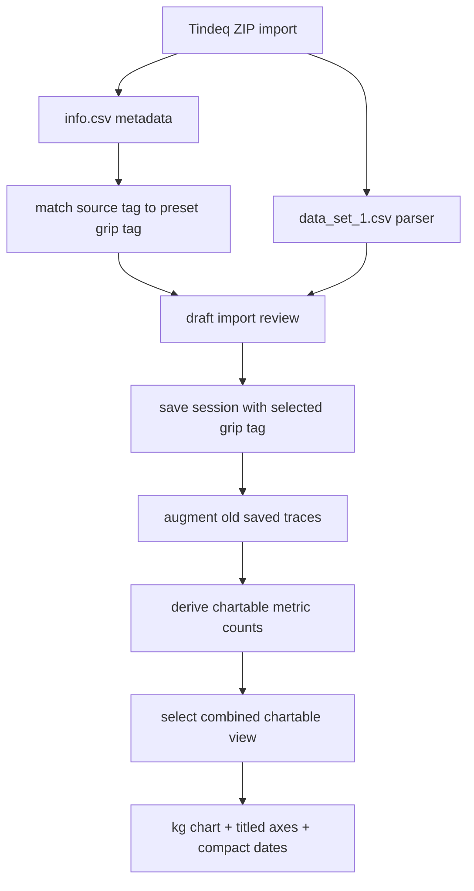

# Tracker Tags and Charting - Plan

## Goal Capsule

- **Objective:** Make imported Tindeq sessions easier to classify and make the progress chart understandable once Repeater ZIP sessions are saved.
- **Means:** Replace free-text grip entry with selectable grip tags, derive usable Repeater average and peak force metrics from the trace when Tindeq summary rows are blank or zero, and make the progress panel default to a visible chart with clean kg-based labels.
- **Authority:** The personal local tracker remains the product direction. This plan extends the existing ZIP import, local storage, and SVG chart work without adding accounts, sync, group features, or generalized analytics.
- **Execution profile:** Start with model and parser tests for chartable metric availability, then update the import controls and progress panel in the current single-page tracker UI.
- **Stop conditions:** Stop before adding cloud taxonomy management, custom protocol builders, trend modeling, or cross-device settings sync.
- **Tail ownership:** Finish with focused tracker tests, chart component tests, typecheck, lint, build, and a mobile browser smoke pass.

---

## Product Contract

### Summary

The next iteration makes the tracker feel less like raw CSV plumbing. Grip type becomes a pre-selected tag choice instead of a typed field. The progress section becomes self-explanatory by showing which saved sessions can produce chart points, choosing an actually visible chart by default, and labeling the chart with simple kg units and compact dates.

The current implementation already stores Repeater ZIP sessions. The chart can still look empty or incomplete because the "All chartable" path is not visible to the user and the chart may render only max force while Repeater average force remains absent. The sample Tindeq Repeater export includes `Avg,0.0` and `Peak,0.0` summary rows even though the raw force trace contains meaningful data, so the app needs to derive estimated Repeater average and trace-derived peak force from the trace, update already-saved local sessions when possible, and plot both when the user wants the overall view.

### Problem Frame

Three sources of friction now block the user's main workflow. First, every import asks for a typed grip label even though the useful values are a small personal taxonomy. Second, charting is technically present but not product-visible: the app does not expose the combined chart view clearly, and the default metric can point at an empty or partial series. Third, the chart labels use force internals rather than the units and labels the user needs when checking progress on a phone.

### Key Decisions

- KD1. **Grip type is a tag choice.** session-settled: user-directed - chosen over repeated free-text entry because the user wants a pre-selected list. Governs R1, R2, R3.
- KD2. **Chart from available metrics first.** session-settled: user-directed - chosen over keeping the current static metric default because saved Repeater sessions need an obvious chart. Governs R4, R5, R6, R9.
- KD3. **Derive Repeater metrics from the trace when summaries are zero or blank.** session-settled: user-directed - chosen because the sample Repeater export reports zero summary values while raw data contains meaningful force. Governs R7, R8, R9.
- KD4. **Use kg-facing chart labels.** session-settled: user-directed - chosen because the user's progress comparisons are easier to read in kg than Newtons. Governs R11, R12.
- KD5. **Keep the first analytics simple.** session-settled: user-approved - chosen over adding trend lines or advanced fatigue models before the core chart is readable. Governs R13, R14.
- KD6. **Grip tags describe the grip, not the load.** session-settled: plan-review - chosen over copying full Tindeq tags directly because load-specific tags would fragment long-term progress series. Governs R1, R2, R3, R13.

### Requirements

**Grip Tags**

- R1. The import review form uses a pre-selected grip tag list instead of a free-text grip input.
- R2. The initial tag list includes the user's current practical grip names as grip taxonomy only, for example `rehab half crimp` rather than `rehab half crimp 1.5kg`, and remains easy to edit in code.
- R3. Imported Tindeq `info.csv` tag values can preselect a matching grip tag when the grip portion matches a known option, and otherwise preserve the full source tag as source metadata or notes while requiring the user to choose a preset grip.

**Chartability**

- R4. The progress panel exposes an "All chartable" or equivalent combined view that is visible in the UI and plots every chartable metric for the current filters.
- R5. The progress panel defaults to a visible chart state for the current filters, preferring the combined chart view when multiple Repeater force metrics are available.
- R6. The metric selector shows available metrics clearly and either hides unavailable metrics or marks them with a count and reason.
- R7. Repeater sessions with exported `Avg` equal to zero or blank derive estimated `repeaterAverageForceN` from active raw trace samples when trace samples are available.
- R8. Repeater sessions with exported `Peak` equal to zero or blank derive `peakForceN` from validated raw trace samples when trace samples are available.
- R9. Already-saved local Repeater sessions whose metrics were parsed before this derivation exists are augmented from their stored trace on load when enough trace data is present; if augmentation is not possible, the UI asks for re-import instead of failing silently.
- R10. Empty chart states explain whether no sessions exist, no sessions match the filters, the selected metric has no available points, or old sessions need re-import.

**Progress View**

- R11. Force values are displayed in kg or kgf-facing labels in chart labels, summaries, axes, tooltips or tables, and selector labels; Newtons remain an internal storage/calculation detail unless explicitly needed for debugging.
- R12. The chart has clean titles and axis labels, including a y-axis unit label and compact date labels such as `22/8` rather than full timestamp strings.
- R13. The chart keeps grouping series by mode, grip tag, optional hand, and metric so unlike tests are not merged.
- R14. The progress section includes a compact summary of the current series and latest value so a two-session chart still has a readable interpretation.

### Acceptance Examples

- AE1. Given a Repeater ZIP import whose `info.csv` tag is `rehab half crimp 1.5kg`, when the grip portion matches the `rehab half crimp` preset, then the draft import preselects that grip without typing and preserves the full source tag.
- AE2. Given a Repeater ZIP import whose `info.csv` tag does not match any preset, when the draft appears, then the grip selector starts blank, the user must pick a preset, and the original tag is preserved in source metadata or notes.
- AE3. Given two saved Repeater sessions where Tindeq exports `Avg,0.0` and `Peak,0.0` but the trace contains force samples, when the user opens the tracker, then the progress panel shows both derived Repeater average force and peak force in the combined chart view.
- AE4. Given the user selects Repeater average force, when matching sessions have trace samples but zero exported `Avg`, then the chart plots the derived active-average force rather than showing an unavailable empty state.
- AE5. Given a Repeater progress chart, when the chart renders on mobile, then the y-axis and values use kg-facing labels and the x-axis uses compact dates such as `22/8`.
- AE6. Given a Repeater session saved before derived metrics were added, when it still has stored trace data, then the app augments the session metrics locally and includes it in the average/peak progress chart.
- AE7. Given sessions with different grip tags, when the user filters by one tag, then the chart and summary only use sessions with that selected tag.

### Success Criteria

- New imports can be saved without typing a grip label.
- Two current or newly imported Repeater ZIP sessions produce an immediate visible progress chart with both estimated average and peak Repeater force when both can be derived from traces.
- The progress panel makes unavailable metrics visible and understandable.
- Progress chart labels use kg-facing units, titles, and compact dates.
- The update does not add remote state, authentication, or new product surfaces.

### Scope Boundaries

#### In Scope

- A fixed, code-owned grip tag preset list for the next iteration.
- Import-review controls that use selectable tags.
- Progress metric availability summaries and smarter default selection.
- Derived Repeater average and peak force metrics from raw trace samples when Tindeq summary rows are zero or blank.
- Local augmentation of already-saved Repeater sessions from stored trace data when old metrics are missing.
- kg-facing chart labels and compact date axes.
- Chart empty states that explain the user's current data.
- Focused tests for tag selection and chartable Repeater sessions.

#### Deferred to Follow-Up Work

- User-editable tag management persisted across devices.
- Cloud sync or backup for tag preferences.
- Trend lines, rolling averages, fatigue modeling, or PR detection.
- Retrofitting old saved sessions if a tag label changes.
- Cross-session calibration of the estimated Repeater average threshold beyond the current simple active-sample rule.

### Sources / Research

- Existing tracker UI and import flow: `src/features/tracker/components/tracker-app.tsx`.
- Current progress chart grouping and data table: `src/components/charts/tracker-progress-chart.tsx`.
- Current metric availability model: `src/features/tracker/types.ts`.
- Current Repeater parser behavior for `Avg`, `Peak`, and trace-derived force metrics: `src/features/tracker/parsers/repeater.ts`.
- Prior tracker plan: `docs/plans/2026-08-22-1520-feat-personal-tindeq-tracker-plan.md`.

---

## Planning Contract

### Key Technical Decisions

- KTD1. **Use a code-owned grip tag catalog first.** Keep tags as a local constant or small module, not a persisted settings feature. This satisfies R1 and R2 while preserving the anti-bloat boundary.
- KTD2. **Separate imported source tag from selected grip tag.** The Tindeq ZIP `info.csv` tag can help preselect a grip, but the saved session should use the selected app tag as the comparable chart key and preserve the original Tindeq tag separately. This satisfies R3 and prevents load-specific or typo-specific source labels from splitting series.
- KTD3. **Compute metric availability from saved sessions before rendering controls.** The progress panel should derive available point counts by metric after mode and grip filters are applied. This satisfies R4, R5, R6, and R10.
- KTD4. **Derive Repeater average as estimated active trace average.** When Tindeq exports `Avg` as zero or blank, compute `repeaterAverageForceN` from raw trace samples at or above a conservative active-force threshold such as 50% of trace peak, and label it as estimated/trace-derived in session details. This avoids averaging rests into the metric while keeping the rule simple enough to explain. It is acceptable for this first version because the user needs a directional personal progress signal, not a claim that the value exactly matches Tindeq's unavailable summary average. This satisfies R7.
- KTD5. **Derive Repeater peak from validated trace samples.** When Tindeq exports `Peak` as zero or blank, compute `peakForceN` from finite, non-negative raw trace samples after the existing parser validation. Keep the metric labelled as trace-derived where useful, and do not add smoothing until real sample data shows spike artifacts. This keeps peak and average available from the same source data without turning the first version into a signal-processing project. This satisfies R8.
- KTD6. **Augment old local sessions from stored traces.** Because saved tracker sessions include raw trace arrays, add a small local normalization step that detects Repeater sessions missing derived average or peak metrics, recomputes those metrics from the stored trace, and saves the augmented session back through the existing local store. If a session lacks enough trace data, surface a re-import notice. This satisfies R9.
- KTD7. **Convert force presentation to kg at the chart boundary.** Keep the existing metric keys and stored values in Newtons if that is the current data model, but convert labels and plotted display values to kgf in chart formatting helpers. This limits churn while satisfying the user's unit preference.
- KTD8. **Keep the SVG chart and table, add interpretation around it.** The chart component already groups series and renders an accessible table. The plan should improve inputs, defaults, labels, axis titles, compact date labels, and summary context rather than replace the chart library.

### Assumptions

- The immediate preset list can be code-owned and changed by editing the app.
- Initial grip tags should include the current defaults plus the grip taxonomy seen in real uploads, such as `rehab half crimp`; load values like `1.5kg` belong in session metadata or notes, not in the comparable grip key.
- Existing saved sessions already contain selected `grip` strings. The implementation can display them as-is and apply the preset control to future imports first.
- A line chart with two points is acceptable as long as the table and latest-value summary make it readable.
- Existing saved Repeater sessions should be augmented from stored trace data before asking for re-import, because local sessions store full trace arrays as well as metric arrays.

### High-Level Technical Design

### Risks & Dependencies

- **Risk 1. Source tag drift:** Tindeq tags may include weights, typos, or session-specific notes. Mitigation: preserve the source tag in notes when it does not match the preset list.
- **Risk 2. Metric confusion:** A user may wonder why Repeater average differs from Tindeq's zero summary row. Mitigation: keep parser warnings concise and state that the app derives active-average force from trace samples when Tindeq exports zero.
- **Risk 3. Single-session charts:** One saved session cannot show a trend. Mitigation: still show the point, latest value, and table; reserve trend claims until two or more points exist.
- **Risk 4. Unit mismatch:** Internal Newton storage can leak into UI labels. Mitigation: centralize metric display formatting so chart labels, axes, summaries, and tables all convert force values consistently to kg-facing values.
- **Risk 5. Old local data remains stale:** Sessions saved before the parser change can keep old metric arrays. Mitigation: add a local augmentation pass from stored traces and show a re-import notice only when trace data is missing.

---

## Implementation Units

Suggested execution order is U1, U4, U5, U2, then U3. The U-IDs stay stable, but parser derivation and shared formatting should land before the chart UI consumes them.

### U1. Add Grip Tag Catalog and Selection Controls

- **Goal:** Replace free-text grip entry in draft imports with a preset tag selector.
- **Requirements:** R1, R2, R3, AE1, AE2, KD1, KD6.
- **Dependencies:** None.
- **Files:** `src/features/tracker/components/tracker-app.tsx`, `src/features/tracker/components/tracker-app.test.ts`, `tests/e2e/smoke.spec.ts`.
- **Approach:** Move `gripPresets` toward an app-owned tag catalog and render draft grip input as a `select` or segmented-style selector that saves one known grip tag. Include `rehab half crimp` in the initial list and map source tags like `rehab half crimp 1.5kg` to that grip when the grip portion matches. When import metadata supplies an unknown tag, keep the selector blank, require an explicit preset choice before save, and preserve the full source tag in source metadata or notes.
- **Patterns to follow:** Existing draft update helpers in `src/features/tracker/components/tracker-app.tsx`; current ZIP `info.csv` metadata parsing in the same file.
- **Test scenarios:**
  - A draft with a known metadata tag containing load text preselects the matching grip-only tag and preserves the full source tag.
  - A draft with an unknown metadata tag starts with no selected grip and does not create a new chart grouping label silently.
  - Saving without selecting a tag still fails validation.
  - The smoke test finds the ZIP picker and the grip selector on the import flow after a fixture upload where practical.
- **Verification:** New imports no longer require typing a grip label.

### U2. Derive Chartable Metric Availability

- **Goal:** Make the app know which progress metrics can produce chart points for the current saved sessions and filters.
- **Requirements:** R4, R5, R6, R9, R10, AE3, AE4, AE6.
- **Dependencies:** U4, U5.
- **Files:** `src/features/tracker/types.ts`, `src/features/tracker/types.test.ts`, `src/features/tracker/components/tracker-app.tsx`, `src/features/tracker/components/tracker-app.test.ts`.
- **Approach:** Add or update a small helper that summarizes available point counts and unavailable reasons by `TrackerMetricKey` after mode and grip filters apply, assuming parser and saved-session augmentation have already produced the derived metrics. Treat the combined chart state as a first-class selector value, not just an implicit `undefined` code path, so "All chartable" or its final label is visible and testable. Use this helper to choose the selected metric when the current metric has zero points. Keep the selector focused on chartable metrics plus the combined view; show unavailable metric counts and reasons in compact helper text below the selector rather than as selectable dead options.
- **Execution note:** Add helper tests before changing the UI, because this is the behavior that determines whether the chart appears for the user's two Repeater sessions.
- **Patterns to follow:** Existing `progressPointsForSession` behavior in `src/features/tracker/types.ts`; existing unavailable metric shape on `TrackerMetric`.
- **Test scenarios:**
  - Two Repeater sessions with derived `repeaterAverageForceN` and `peakForceN` produce counts for both metrics.
  - The default selection resolves to the combined chart view when average and peak Repeater force are both available.
  - The visible selector includes the combined chart view and does not silently hide it behind internal state.
  - Unavailable metrics are summarized with reasons outside the selector and cannot be chosen as dead options.
  - Mode and grip filters change the availability summary.
- **Verification:** The progress panel can pick a chartable metric without hard-coding Repeater-only behavior.

### U3. Improve the Progress Panel UX

- **Goal:** Make the chart output legible and self-explanatory for small personal datasets.
- **Requirements:** R4, R5, R6, R10, R11, R12, R13, R14, AE3, AE4, AE5, AE7, KD2, KD4, KD5.
- **Dependencies:** U2, U5.
- **Files:** `src/features/tracker/components/tracker-app.tsx`, `src/components/charts/tracker-progress-chart.tsx`, `src/components/charts/tracker-progress-chart.test.tsx`, `src/app/globals.css`.
- **Approach:** Use the availability summary to drive the metric selector labels, default metric choice, and empty states. Add a compact summary above or below the chart that names the selected metric or combined metric set, number of charted sessions, latest value, and series grouping. Keep the current SVG line chart and table, but make the graph itself readable: add a short chart title, y-axis label with kg-facing units, compact x-axis dates such as `22/8`, and simple metric labels like "Estimated avg repeater force" and "Peak force". On mobile, stack filters above the chart, keep the summary before the SVG, reduce x-axis tick count, let the table scroll horizontally if needed, and keep legends/series labels wrapping rather than overlapping. Preserve the existing accessible SVG/table relationship with a descriptive chart label, table caption or heading, and helper text that screen readers can reach when unavailable metrics or trace-derived values are explained.
- **Patterns to follow:** Existing accessible SVG plus table pattern in `src/components/charts/tracker-progress-chart.tsx`; existing panel/filter layout in `src/features/tracker/components/tracker-app.tsx`.
- **Test scenarios:**
  - With two Repeater sessions, the combined view renders both Repeater average force and peak force series, table rows, and latest-value summary.
  - Force values in the chart, summary, and table display in kg-facing units rather than Newtons.
  - The chart renders a title, y-axis unit label, and compact date labels.
  - On a narrow viewport, controls stack, date ticks reduce, and legend/table content does not overlap the chart.
  - The combined chart has an accessible name and the backing table remains discoverable by screen readers.
  - With one point, the chart renders a point and states that more sessions are needed for trend direction.
  - With no points for the selected metric, the empty state names the selected metric and the reason if known.
  - Filtering by grip changes the chart and summary counts.
- **Verification:** A user with two uploaded Repeater ZIP sessions can see a progress chart without knowing which metric to choose.

### U4. Parser and Detail Copy for Repeater Metrics

- **Goal:** Make Repeater metric limitations clear wherever a single session is inspected.
- **Requirements:** R7, R8, R9, R11, AE3, AE4, AE6.
- **Dependencies:** None.
- **Files:** `src/features/tracker/parsers/repeater.ts`, `src/features/tracker/parsers/repeater.test.ts`, `src/features/tracker/components/tracker-app.tsx`, `src/features/tracker/storage/local-store.ts`, `src/features/tracker/storage/local-store.test.ts`.
- **Approach:** Keep the parser conservative but useful: when exported `Avg` or `Peak` are positive, preserve them; when either is zero or blank, derive the corresponding metric from the raw trace. For average, use active trace samples at or above the chosen threshold from KTD4 and label the metric as estimated/trace-derived in warnings or detail copy. For peak, use finite, non-negative validated trace samples from KTD5. Add a local augmentation path that detects already-saved Repeater sessions missing these derived metrics, recomputes them from stored trace data, and persists the augmented session through the local store. If an old session lacks enough trace data, show a re-import notice instead of silently omitting it.
- **Patterns to follow:** Current parser warning pattern in `src/features/tracker/parsers/repeater.ts`; current metric list rendering in `src/features/tracker/components/tracker-app.tsx`.
- **Test scenarios:**
  - A Repeater export with `Avg,0.0` or blank Avg records estimated trace-derived `repeaterAverageForceN`.
  - A Repeater export with `Peak,0.0` or blank Peak records trace-derived `peakForceN`.
  - A Repeater export with a positive `Avg` records both average and peak where possible.
  - Detail UI renders trace-derived average and peak copy without blocking save or charting.
  - An old saved Repeater session with trace data but missing derived metrics is augmented and persisted locally.
- **Verification:** The app can chart both Repeater average force and peak force for the user's sample ZIP shape.

### U5. Add Shared kg Metric Formatting

- **Goal:** Prevent Newton labels from leaking into the chart, selector, summary, or data table.
- **Requirements:** R11, R12, AE5, KD4.
- **Dependencies:** U4.
- **Files:** `src/components/charts/chart-utils.ts`, `src/components/charts/tracker-progress-chart.tsx`, `src/components/charts/tracker-progress-chart.test.tsx`, `src/features/tracker/types.ts`, `src/features/tracker/components/tracker-app.tsx`.
- **Approach:** Add a shared formatter that converts force metrics from Newtons to kgf for display while leaving internal metric keys and stored values unchanged. Use the same formatter for y-axis tick labels, latest-value summaries, chart table values, and selector/helper labels. Add a compact date formatter for chart ticks and tables that uses day/month without full timestamps.
- **Patterns to follow:** Existing chart utility helpers in `src/components/charts/chart-utils.ts`; current metric label definitions in `src/features/tracker/types.ts`.
- **Test scenarios:**
  - A known Newton value displays as the expected kg-facing value with sensible precision.
  - Progress chart table rows use the same kg-facing formatter as plotted labels.
  - Date labels render as compact day/month strings.
- **Verification:** The progress chart reads cleanly on a phone and no primary progress labels show `N` for force metrics.

---

## Verification Contract

| Gate | Scope | Expected Signal |
|---|---|---|
| Typecheck | Tracker types, component props, chart helper changes | `tsc --noEmit` passes |
| Focused tests | Tracker domain helpers, import metadata, Repeater parser, old-session augmentation, chart component, kg/date formatters | Tracker-related Vitest tests pass |
| Lint | Changed TSX/CSS paths | ESLint passes |
| Build | Next.js app route and client bundle | Production build passes |
| Mobile smoke | iOS Safari or responsive browser viewport | ZIP import path is clear, tag selection works, and two Repeater sessions show average and peak force in kg on a titled chart with non-overlapping labels |

---

## Definition of Done

- Grip selection on import uses the preset tag list and includes grip-only tags such as `rehab half crimp`, while preserving full Tindeq source tags separately.
- Unknown source tags from Tindeq metadata do not silently create new chart series.
- The progress metric defaults to a visible combined chart when multiple chartable metrics exist for the current filters.
- Existing locally saved Repeater sessions are augmented from stored trace data when possible, or clearly marked for re-import when not.
- Repeater sessions with zero or blank exported average and peak force can still chart trace-derived average and peak force.
- Force chart values display in kg-facing units across the chart, summary, selector, and table.
- Progress graphs include clean titles, axis unit labels, and compact date labels.
- Empty states explain the difference between no sessions, no filtered sessions, and no available selected-metric points.
- The chart, summary, and table are readable on mobile and retain accessible labels/table context.
- Tests cover the tag-selection path, chartable metric availability, Repeater zero-average/zero-peak behavior, old-session augmentation, kg/date formatting, and progress chart rendering.
- No Supabase, auth, group, leaderboard, or cloud-sync behavior is added.
