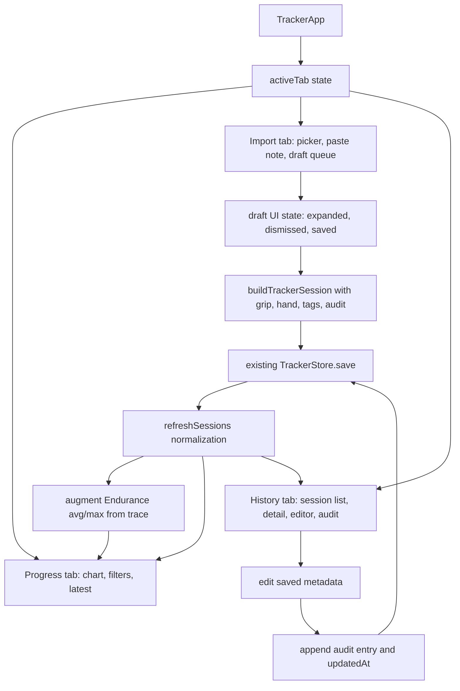

# Tracker Tabs, Editable Imports, and Custom Tags - Plan

## Goal Capsule

- **Objective:** Make the personal Tindeq tracker stay clean after real imports by turning the current long page into distinct mobile-friendly tabs, making import feedback dismissible, allowing saved sessions to be edited and audited after upload, and ensuring Endurance files plot average and max force over time.
- **Means:** Keep the existing parser, chart, local store, and Supabase store; add a small tracker metadata layer for custom tags and audit entries, replace anchor navigation with tab state, and move draft/import status into collapsible or dismissible UI (KTD1, KTD2, KTD3).
- **Authority:** The personal tracker workflow, successful ZIP import path, and charting decisions from `docs/plans/2026-08-22-1626-feat-tracker-tags-charting-plan.md` outrank the older group leaderboard direction. This plan supersedes that plan's deferred custom-tag boundary.
- **Execution profile:** Protect stored data first, then add editable metadata helpers, then split the app shell into real tabs and compact import/history surfaces.
- **Stop conditions:** Stop before rewriting parsers, adding a new routing framework, storing raw ZIP files remotely, or adding multi-user admin/tag management.
- **Tail ownership:** Finish with focused Vitest coverage, typecheck, lint, production build, and a mobile browser smoke pass that imports sessions, edits metadata, and switches tabs without layout overlap.

---

## Product Contract

### Summary

The tracker currently works once files are imported, but the page becomes noisy because every detected/saved import remains as a large card, status output stays in the main flow, and the bottom navigation jumps to anchors inside one long document. The next iteration should make the app feel like a small personal mobile app: Progress, Import, and History are true tabs; import results can be collapsed or dismissed; and saved files can be audited and corrected later.

The user also needs a personal tag workflow. Grip remains the primary chart grouping value, but saved sessions can carry additional custom tags such as rehab, effort, block weight, injury context, or setup notes. Tags should be addable from import and edit screens without turning the app into a taxonomy-management product.

Endurance imports should also become first-class progress data. In addition to any critical-force metric already parsed from Tindeq metadata, the app should plot average force and max force from Endurance traces in the same practical style used for Repeater average and peak force.

### Problem Frame

The current implementation optimizes for getting CSVs into the app, which was the right first milestone. Once several ZIPs are uploaded, the same import plumbing occupies the screen that should be showing progress. Because metadata is fixed after save, any wrong hand, grip, tag, date, or note turns into either bad chart grouping or a delete/reimport chore. The navigation looks like tabs but behaves like anchor links, so it does not isolate workflows or prevent old import output from crowding the chart.

### Key Decisions

- KD1. **Real app tabs.** session-settled: user-directed - chosen over anchor navigation because each primary button should open a clean workflow surface. Governs R1, R2, R3.
- KD2. **Dismissible import output.** session-settled: user-directed - chosen over keeping every import card in the page because real use leaves the app cluttered after successful imports. Governs R4, R5, R6.
- KD3. **Post-import editing.** session-settled: user-directed - chosen over delete/reimport correction because the user needs to fix hand, grip, tags, notes, and dates after upload. Governs R7, R8, R9, R10.
- KD4. **Primary grip plus custom tags.** session-settled: user-directed - chosen over one freeform label because charts need one stable grip key while personal context needs flexible tags. Governs R11, R12, R13, R14.
- KD5. **JSON-backed audit first.** Use the existing session JSON rather than new audit tables because this is a private single-user app and Supabase already persists the full session payload. Governs R15, R16, R17.

### Requirements

**Navigation and Layout**

- R1. The primary navigation has true app tabs for Progress, Import, and History instead of links to fixed points on a single long page.
- R2. Only the active tab's main workflow is visible in the body, while shared header, weekly target, and auth/private-data status remain compact and do not crowd the active view.
- R3. The bottom mobile navigation uses buttons with active state, does not obscure page content, and switches tabs without scroll jumps.

**Import Output Cleanup**

- R4. Pending import drafts remain reviewable before save, but each draft can be collapsed, expanded, or dismissed.
- R5. Saved draft output collapses automatically into a compact "recently imported" confirmation or can be removed from the import tab without deleting the saved session.
- R6. Status and error messages are closable or self-contained, and successful remote/local save copy reflects the active store instead of always saying "Saved locally."

**Session Editing and Audit**

- R7. Each saved session can be opened from History and edited for primary grip, hand, tested date/time, notes, and custom tags.
- R8. Editing a session updates the saved record through the existing store so Progress, History, and Session Detail reflect the change without reimporting.
- R9. Editing primary grip, hand, or date updates chart grouping/filtering immediately after save.
- R10. Deleting a session remains available but is not the only way to correct metadata mistakes.

**Tags**

- R11. Primary grip remains a single required value from the preset/custom grip list and continues to drive chart grouping.
- R12. Sessions support additional custom tags as a small editable list independent of the primary grip.
- R13. Custom tags can be created during import review or saved-session editing, and recently used tags appear as selectable chips.
- R14. Tag suggestions come from defaults plus tags already present in saved sessions; a separate cloud settings table is deferred.

**Audit**

- R15. Each saved session exposes audit details: original filename, parser version, source summary, Tindeq metadata, created time, updated time, and edit history.
- R16. Audit history records meaningful metadata changes with timestamp and changed field names; it does not need to store raw ZIP binaries.
- R17. Existing saved sessions without audit fields continue to load and gain normalized metadata on the next save or edit.

**Endurance Charting**

- R18. Endurance imports expose a chartable average-force metric derived from the raw trace samples.
- R19. Endurance imports expose a chartable max-force metric from the raw trace samples, reusing the existing peak/max metric where appropriate.
- R20. The combined progress chart can show Endurance average force and Endurance max force together for the current grip/hand filters, matching the Repeater average/peak plotting pattern.
- R21. Existing saved Endurance sessions are augmented from stored traces when average or max force metrics are missing; if trace data is insufficient, the UI shows a compact re-import or unavailable-metric reason.

### Acceptance Examples

- AE1. Given the app is open on mobile, when the user taps Progress, Import, or History in the bottom nav, then the active tab changes and the page does not jump to a buried section.
- AE2. Given three imported ZIPs were saved, when the user returns to Progress, then saved import cards no longer fill the page.
- AE3. Given a pending import draft, when the user collapses it, then the filename and key validation status remain visible and the metadata form is hidden.
- AE4. Given a saved import confirmation, when the user dismisses it, then only the confirmation disappears and the saved session remains in History and Progress.
- AE5. Given a saved session has the wrong hand, when the user edits it in History and saves `right`, then the progress chart uses the updated hand grouping.
- AE6. Given a saved session needs a rehab tag, when the user adds `rehab` as a custom tag, then the tag appears on the session detail and as a suggestion for later sessions.
- AE7. Given a saved session has been edited, when the user opens its audit details, then the app shows original source details and a concise edit history.
- AE8. Given older sessions from the current production app, when the updated app loads, then they still appear without migration errors and can be edited.
- AE9. Given two saved Endurance sessions with trace samples, when the user opens the combined Progress chart, then Endurance average force and Endurance max force both appear as chartable kg-facing series.
- AE10. Given an older saved Endurance session missing the new average-force metric but retaining trace data, when the updated app loads, then the session is augmented and contributes to the average-force chart.

### Success Criteria

- The default post-import experience is clean enough that Progress remains the main output after several uploaded ZIPs.
- Tab controls behave like tabs, not section anchors, on desktop and mobile.
- A saved session's grip, hand, date, notes, and tags can be corrected after import and the chart reflects those changes.
- Endurance files produce average-force and max-force progress plots in the same combined chart style as Repeater files.
- Custom tags are easy to add and reuse without introducing a settings-heavy management surface.
- Audit information is visible enough to answer "what file was this, what did it parse as, and what did I change later?"

### Scope Boundaries

#### In Scope

- App-local tab state for Progress, Import, and History.
- Collapsible/dismissible draft and status output on the Import tab.
- Session metadata editing for grip, hand, tested date/time, notes, and tags.
- Session-level audit metadata stored inside the existing `TrackerSession` JSON shape.
- Custom tag chips and suggestions derived from defaults and saved sessions.
- Endurance average-force derivation and old-session augmentation from stored trace data.
- Focused responsive CSS fixes for bottom navigation, tab panels, forms, and import result cards.

#### Deferred to Follow-Up Work

- Dedicated tag settings page, tag renaming across all sessions, or tag deletion rules.
- Cloud-synced tag preferences separate from sessions.
- Storing raw ZIP files or uploaded CSV blobs in Supabase Storage.
- Advanced audit filters, exportable audit reports, or immutable compliance-grade logs.
- URL-addressable tab routing unless the simple tab state proves insufficient.

### Sources / Research

- Current tracker shell, drafts, navigation, auth, weekly target, import, progress, and history UI: `src/features/tracker/components/tracker-app.tsx`.
- Current tracker domain model and progress point projection: `src/features/tracker/types.ts`.
- Current local store upsert/delete/list behavior: `src/features/tracker/storage/local-store.ts`.
- Current Supabase upsert/list/delete behavior and JSON session persistence: `src/features/tracker/storage/supabase-store.ts`.
- Current progress chart grouping and kg-facing display: `src/components/charts/tracker-progress-chart.tsx`.
- Current Endurance parser, which already parses critical force and trace-derived peak force: `src/features/tracker/parsers/endurance.ts`.
- Current responsive bottom navigation and draft styles: `src/app/globals.css`.
- Prior chart/tag implementation plan: `docs/plans/2026-08-22-1626-feat-tracker-tags-charting-plan.md`.

---

## Planning Contract

### Key Technical Decisions

- KTD1. **State tabs inside `TrackerApp`.** Use `activeTab: "progress" | "import" | "history"` and tab buttons rather than adding routes or hash navigation. This satisfies R1-R3 with the smallest route-surface change.
- KTD2. **Keep store methods and use `save()` as update.** Both IndexedDB and Supabase stores already use put/upsert semantics, so editing saved sessions should call the existing `save(updatedSession)` path and refresh sessions. This satisfies R8-R10 without a new repository abstraction.
- KTD3. **Extend `TrackerSession` with optional metadata fields.** Add optional `tags`, `updatedAt`, and `auditLog` fields so old records stay valid and new records carry editability/audit details. This satisfies R15-R17.
- KTD4. **Keep grip separate from tags.** Primary `grip` remains required and chartable; `tags` are supplemental labels. This prevents custom labels from fragmenting chart series while still supporting personal organization.
- KTD5. **Derive tag suggestions from observed data.** Build suggestions from the existing grip presets, existing session tags, and tags typed during the current session. Persisting a separate tag catalog is deferred unless reuse across devices becomes painful.
- KTD6. **Treat import cards as a queue.** Draft imports get UI state such as expanded/collapsed/dismissed and saved/imported status, separate from `TrackerSession`. Dismissing a draft removes it from the queue only; it never deletes stored sessions.
- KTD7. **Audit is descriptive, not forensic.** Record edit timestamps, changed fields, and before/after summaries for metadata fields. Do not attempt immutable audit guarantees or raw-file retention for this private tracker.
- KTD8. **Endurance average is trace-derived.** Add a chartable Endurance average-force metric from finite, non-negative trace samples and keep the existing trace-derived peak/max force metric as the Endurance max-force series. Preserve critical force as a separate Endurance metric rather than replacing it.

### Assumptions

- The user is the only operator for now, so optimistic client-side editing with a simple save confirmation is acceptable.
- Supabase persistence is already configured for `tracker_sessions`, and the `session` JSONB payload can carry new optional fields without a migration.
- Existing sessions may lack `tags`, `updatedAt`, or `auditLog`; normalization should handle missing fields rather than forcing an IndexedDB version bump.
- The active tab does not need to survive reload for the first implementation.
- Charts should continue grouping by mode, grip, hand, and metric; tags are displayed and editable but do not become chart filters in this pass.
- Endurance average force can be a simple whole-trace average for this pass unless implementation discovers Tindeq exports explicit work/rest segmentation that should obviously be reused.

### High-Level Technical Design

### Data Shape

- `TrackerSession.tags?: readonly string[]` stores supplemental custom tags.
- `TrackerSession.updatedAt?: string` stores the last metadata update timestamp and defaults to `createdAt` for old records when displayed.
- `TrackerSession.auditLog?: readonly TrackerSessionAuditEntry[]` stores session creation and metadata edit entries.
- `TrackerSessionAuditEntry` should include `id`, `type`, `createdAt`, and a compact `changes` collection naming changed metadata fields.
- `ImportContext` accepts `tags?: readonly string[]` so imports and edits use the same validation helpers.

### UI Shape

Progress is the first-class landing tab. It shows weekly target, latest activity, progress filters, chart, and compact chart notices. Import shows only import actions and the draft/recent-import queue. History shows saved sessions, session detail, metadata edit controls, custom tags, full trace, and audit details.

Shared elements stay compact. Auth/private-data status and weekly target can remain near the top of Progress or in a small shared header area, but they should not force every tab to start with several full panels.

### Risks & Mitigations

- **Risk 1. Editing changes chart grouping unexpectedly:** Mitigation: show primary grip and hand together in the edit form and refresh chart/session state immediately after save.
- **Risk 2. Tags become another bloated settings feature:** Mitigation: keep tag creation inline and derive suggestions from saved data; defer bulk tag management.
- **Risk 3. Existing sessions fail TypeScript/runtime expectations:** Mitigation: make new fields optional and add normalization helpers tested against old-session fixtures.
- **Risk 4. Draft dismissal is confused with deletion:** Mitigation: use separate labels such as "Dismiss import card" for draft UI and keep "Delete session" only in History.
- **Risk 5. Bottom nav still overlays content:** Mitigation: convert anchors to buttons, add active styling, and give mobile tab panels enough bottom padding for Safari browser chrome and the fixed nav.

---

## Implementation Units

Suggested execution order is U1, U3, U2, U4, U5, U6, U7, then U8. The storage compatibility unit depends on the Endurance metric helper because normalization should use the same parser/domain logic as new imports.

### U1. Add Editable Session Metadata and Audit Helpers

- **Goal:** Extend tracker domain types so imports and saved sessions can carry tags, update timestamps, and edit history without breaking old records.
- **Requirements:** R7, R8, R9, R11, R12, R15, R16, R17, AE5, AE6, AE7, AE8, KD3, KD4, KD5.
- **Dependencies:** None.
- **Files:** `src/features/tracker/types.ts`, `src/features/tracker/types.test.ts`.
- **Approach:** Extend `ImportContext` and `TrackerSession` with optional `tags`, `updatedAt`, and `auditLog`. Add helpers to normalize tag strings, validate metadata edits, build creation audit entries, compare metadata fields, append edit audit entries, and return an updated session with a preserved `id`, parsed metrics, trace, source metadata, and `createdAt`.
- **Test scenarios:**
  - Building a new session with tags trims, deduplicates, and stores the tags.
  - Building a new session records a creation audit entry with source filename and selected metadata.
  - Editing hand, grip, notes, tested date, and tags returns the same session id with `updatedAt` changed and an audit entry naming changed fields.
  - Editing with no actual metadata changes does not add a noisy audit entry.
  - Old sessions without `tags`, `updatedAt`, or `auditLog` normalize to safe display defaults.
- **Verification:** Domain helpers allow saved metadata correction while old production data remains loadable.

### U2. Preserve Store Compatibility for Updates

- **Goal:** Use existing local and Supabase stores for saved-session edits and normalized metadata.
- **Requirements:** R8, R9, R15, R16, R17, R21, AE5, AE7, AE8, AE10, KD2, KD3, KD7.
- **Dependencies:** U1, U3.
- **Files:** `src/features/tracker/storage/local-store.ts`, `src/features/tracker/storage/local-store.test.ts`, `src/features/tracker/storage/supabase-store.ts`, `src/features/tracker/storage/supabase-store.test.ts`, `src/features/tracker/components/tracker-app.tsx`.
- **Approach:** Keep the `TrackerStore` interface unchanged. Confirm `save()` remains upsert/update in memory, IndexedDB, and Supabase. Ensure Supabase row projection derives `grip`, `mode`, and `tested_at` from edited session metadata and writes the full updated session JSON. Add a refresh-time normalization pass that tolerates older records, augments Repeater and Endurance sessions from stored traces where possible, and optionally persists normalized records only when necessary.
- **Test scenarios:**
  - Saving a session with an existing id replaces it in the memory store and preserves sort order by edited `testedAt`.
  - Supabase row projection includes edited `grip` and `tested_at` values while retaining the full session JSON with tags and audit log.
  - Refreshing old sessions without metadata extensions does not throw and does not fabricate destructive changes.
  - Refreshing an old Endurance session with trace data and missing average force augments the metric and persists the normalized session.
  - Editing a session updates chart-visible grouping data after `refreshSessions`.
- **Verification:** Metadata edits use the same persistence channel as imports, locally and in Supabase.

### U3. Add Endurance Average and Max Progress Metrics

- **Goal:** Make Endurance files contribute average-force and max-force series to the same progress chart model used by Repeater files.
- **Requirements:** R18, R19, R20, R21, AE9, AE10, KTD8.
- **Dependencies:** None.
- **Files:** `src/features/tracker/types.ts`, `src/features/tracker/types.test.ts`, `src/features/tracker/parsers/endurance.ts`, `src/features/tracker/parsers/endurance.test.ts`, `src/features/tracker/parsers/repeater.ts`, `src/components/charts/tracker-progress-chart.tsx`, `src/features/tracker/components/tracker-app.tsx`.
- **Approach:** Add a chartable Endurance average-force metric, either as a distinct metric key such as `enduranceAverageForceN` or a clearly mode-aware average-force key if that fits the existing chart labels better. Compute it from finite, non-negative Endurance trace samples. Continue exposing trace-derived `peakForceN` as the Endurance max-force metric. Update metric option labels and progress grouping so the combined chart can show Endurance average and max together without hiding critical force or Repeater average/peak.
- **Test scenarios:**
  - Parsing an Endurance fixture records critical force, average force, and peak/max force when trace samples exist.
  - An Endurance fixture with no usable trace samples marks average and max force unavailable with compact reasons.
  - `progressPointsForSession` emits both Endurance average-force and max-force points for a saved Endurance session.
  - The combined chart view includes both Endurance force series for matching filters.
  - Existing Repeater average/peak charting continues to work after any metric-key additions.
- **Verification:** Endurance sessions can be compared over time by average force and max force, in kg-facing chart output.

### U4. Replace Anchor Navigation with Real Tabs

- **Goal:** Turn Progress, Import, and History into tabbed workflows that do not leave every panel on screen at once.
- **Requirements:** R1, R2, R3, AE1, AE2, KD1.
- **Dependencies:** None.
- **Files:** `src/features/tracker/components/tracker-app.tsx`, `src/app/globals.css`, `tests/e2e/smoke.spec.ts`.
- **Approach:** Add `activeTab` state and replace top-nav, quick-action, and bottom-nav anchors with buttons using `aria-selected` or an equivalent tab pattern. Render or reveal only the active major panel. Move Progress-related panels into the Progress tab, import controls and draft queue into Import, and saved list/detail/edit into History. Add mobile bottom padding and active nav styling so fixed nav never covers tab content.
- **Test scenarios:**
  - Tapping each primary nav button changes visible content without changing the URL hash.
  - Progress is visible by default and import drafts are not visible on Progress after save.
  - The bottom nav has one active item and remains usable on a phone-width viewport.
  - Quick actions switch tabs using the same handler as top and bottom nav.
  - Keyboard focus can move through tab buttons and the active panel without hidden inactive controls being reachable.
- **Verification:** Navigation behaves like a mobile app shell, not a long anchor page.

### U5. Make Import Drafts Collapsible and Dismissible

- **Goal:** Keep import review useful while preventing successful imports and status messages from taking over the app.
- **Requirements:** R4, R5, R6, R10, R13, AE2, AE3, AE4, KD2, KD6.
- **Dependencies:** U1, U4.
- **Files:** `src/features/tracker/components/tracker-app.tsx`, `src/features/tracker/components/tracker-app.test.ts`, `src/app/globals.css`.
- **Approach:** Extend draft UI state with `expanded` and `dismissed` flags. Default new unsaved drafts to expanded and saved drafts to collapsed recent confirmations. Add per-draft controls to collapse/expand, dismiss a saved or invalid draft card, and dismiss all saved confirmations. Replace full-width persistent "Saved locally" boxes with compact closable notices that say either saved locally or saved to Supabase based on `authState`.
- **Test scenarios:**
  - New parsed drafts appear expanded with metadata controls.
  - Collapsing a draft hides controls but leaves filename, mode, and key metric availability visible.
  - Saving a draft collapses it into a compact confirmation and does not remove the saved session.
  - Dismissing a saved draft removes the import card while the session still appears in History.
  - Invalid draft errors are dismissible and do not block other drafts in the same ZIP batch.
  - The status notice can be closed and does not reappear until a new import/save event.
- **Verification:** Multiple imports no longer create a permanent stack of large cards.

### U6. Add Custom Tag Controls to Import and History

- **Goal:** Allow custom session tags to be created and reused without confusing them with the primary grip field.
- **Requirements:** R11, R12, R13, R14, AE6, KD4, KD5.
- **Dependencies:** U1, U5.
- **Files:** `src/features/tracker/components/tracker-app.tsx`, `src/features/tracker/components/tracker-app.test.ts`, `src/app/globals.css`.
- **Approach:** Add a small tag editor control that can render selected tag chips, remove a tag, and add a new tag from an input. Reuse it in draft imports and saved-session editing. Build suggestions from default personal tags, tags already present on sessions, and tags in current drafts. Keep primary grip as its own required chip/select control and label tags as supplemental.
- **Test scenarios:**
  - Adding `rehab` to a draft stores it on the saved session.
  - Adding the same tag with different casing or whitespace deduplicates to one normalized tag.
  - Removing a tag from a saved session records an audit entry and updates the detail view.
  - A tag added to one session appears as a suggestion on another import/edit form.
  - Empty tag input does not create blank chips.
- **Verification:** Custom tags are flexible enough for personal use without becoming chart grouping by accident.

### U7. Build Saved Session Edit, Detail, and Audit UI

- **Goal:** Let History function as the place to inspect, correct, and audit imported files after the fact.
- **Requirements:** R7, R8, R9, R10, R15, R16, R17, AE5, AE6, AE7, AE8, KD2, KD3, KD4, KD7.
- **Dependencies:** U1, U2, U4, U6.
- **Files:** `src/features/tracker/components/tracker-app.tsx`, `src/features/tracker/components/tracker-app.test.ts`, `src/app/globals.css`.
- **Approach:** Add an edit mode to the selected session detail panel. The read view shows metrics, trace, grip, hand, date, notes, tags, source filename, parser version, source summary, and vendor metadata. The edit view uses the same grip, hand, date/time, notes, and tag controls as import where possible. Saving calls the domain edit helper and `store.save`, refreshes sessions, keeps the edited session selected, and shows a closable success/error notice. Add a compact audit section that can be expanded for source metadata and edit history.
- **Test scenarios:**
  - Opening History shows saved sessions and a selected detail panel without requiring import output to be visible.
  - Editing hand from blank to `right` saves through the store and updates the selected detail.
  - Editing grip changes the Progress filter options and chart grouping after tab switch.
  - Audit details show source filename, parser version, created time, updated time, and an edit entry after save.
  - Canceling edit mode leaves the stored session unchanged.
  - Deleting a session still removes it from History and Progress, with copy distinct from dismissing import cards.
- **Verification:** Bad metadata can be corrected without deleting or reimporting files.

### U8. Responsive Polish and Regression Verification

- **Goal:** Prove the cleaned-up app works on mobile after imports and does not regress the existing chart/import flow.
- **Requirements:** R1-R21, AE1-AE10.
- **Dependencies:** U1, U2, U3, U4, U5, U6, U7.
- **Files:** `src/app/globals.css`, `tests/e2e/smoke.spec.ts`, tracker-related unit tests as touched.
- **Approach:** Tighten mobile spacing for the fixed bottom nav, tab panels, draft cards, editor forms, tag chips, and history/detail layout. Add or update smoke coverage around a realistic imported session set. Keep the app visually quiet: no new landing page, no nested-card pileups, no large explanatory text blocks.
- **Test scenarios:**
  - Mobile viewport starts on Progress with no import card clutter.
  - Import tab accepts fixture ZIP/CSV inputs, saves sessions, collapses confirmations, and can dismiss them.
  - History tab edits a session's hand and tags, then Progress reflects the edited hand grouping.
  - Bottom nav does not overlap the last visible control or browser URL bar area on a phone-sized viewport.
  - Existing chart units, compact dates, Repeater average/peak plotting, and Endurance average/max plotting remain intact.
- **Verification:** The app is usable after repeated imports, which is the failure mode shown in the screenshot.

---

## Verification Contract

| Gate | Scope | Expected Signal |
|---|---|---|
| `npm run test` | Tracker types, import draft helpers, Endurance/Repeater parsers, stores, chart helpers/components, app behavior where covered by Vitest | New metadata, audit, tag, draft, Endurance average/max, and existing chart tests pass |
| `npm run typecheck` | Optional session fields, edited session save paths, TSX props/state | TypeScript accepts old and new `TrackerSession` shapes |
| `npm run lint` | Changed TS/TSX/CSS files | No unused state, inaccessible controls, or lint violations |
| `npm run build` | Next.js client bundle and production route | Production build completes with the current Supabase env setup |
| `npm run test:e2e` or targeted Playwright smoke | Mobile tab/import/edit/chart workflow | Progress, Import, and History tabs work; saved import output can be dismissed; editing metadata updates visible chart/history state; Endurance average/max and Repeater average/peak remain chartable |
| Manual mobile check on iOS Safari | Real device behavior | Bottom nav does not obscure content, file picker remains usable, and post-import screens stay clean |

---

## Definition of Done

- Progress, Import, and History are true tabs with active state and no hash-jump behavior.
- Import drafts can be collapsed and dismissed, and saved confirmations no longer accumulate as large permanent cards.
- Status messages are closable and accurately distinguish local vs Supabase save state.
- Saved sessions can be edited for grip, hand, tested date/time, notes, and custom tags.
- Edited session metadata persists through the active store and immediately updates Progress and History.
- Primary grip remains the chart grouping value, while custom tags are supplemental and reusable.
- Session detail exposes source/audit information without overwhelming the default History view.
- Old saved sessions continue to load, display, and become editable even without new optional fields.
- The bottom mobile nav and tab content do not overlap on phone-sized viewports.
- Existing ZIP import, Repeater average/peak charting, kg labels, compact date axes, weekly target, local mode, and Supabase sync behavior remain intact.
- Endurance imports plot average force and max force over time, with old trace-backed sessions augmented where possible.
- The final diff contains no unrelated parser rewrite, route overhaul, or cloud settings table.
