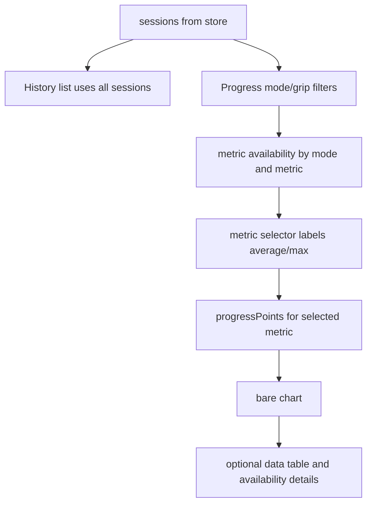

# Tracker Progress Chart Cleanup - Plan

## Goal Capsule

- **Objective:** Make Progress and History behave as separate workflows: History always lists every saved session, while Progress shows a sparse, useful chart for Repeater and Endurance force metrics.
- **Means:** Split History from plot filters, reduce the progress chart to the visible essentials, move detail rows into an optional disclosure, and make Repeater max force plus Endurance average/max force first-class metric choices.
- **Authority:** This plan follows the personal tracker direction in `docs/plans/2026-08-24-1720-feat-tracker-tabs-editable-imports-plan.md` and narrows the earlier “all chartable” output into a cleaner phone-first plot.
- **Execution profile:** Fix data selection first, then metric availability/defaults, then chart presentation and regression coverage.
- **Stop conditions:** Stop before adding trend models, new chart libraries, tag-based analytics, or settings-heavy chart configuration.
- **Tail ownership:** Finish with focused unit/component tests, typecheck, lint where applicable, production build, and a browser smoke pass for `/progress` and `/history`.

## Product Contract

### Summary

The History page must always show all saved sessions. It should not inherit the mode, metric, or grip filters used by the Progress chart.

The Progress chart should become bare bones. The first view should resemble the Tindeq app’s force-over-time chart: one clean plot, simple axes, compact dates, and only the current salient metric series. Extra details such as full point tables, unavailable metric explanations, and verbose series labels should move behind a disclosure.

Repeater maximum force and Endurance average/max force must remain available. These metrics already exist in the parser/domain direction, but the current UI makes them hard to select or easy to lose behind mode/filter availability.

### Problem Frame

The current Progress panel is technically informative but too busy for the tracker’s core job. It shows a long “not charting yet” sentence, summary copy, stat tiles, legend copy, and a full table under the chart. That crowds the chart and makes the app feel more like a debug page than a training tracker.

The History page currently uses `filteredSessions` from the chart filters. That couples a review/audit workflow to a plotting workflow and can hide sessions unexpectedly.

### Key Decisions

- KD1. **History ignores plot filters.** session-settled: user-directed - chosen over reusing Progress filters because History is an audit/list surface, not a chart subset. Governs R1, R2, R3.
- KD2. **Progress defaults to one salient metric family.** session-settled: user-directed - chosen over rendering every chartable series because the current chart is too dense. Governs R4, R5, R6.
- KD3. **Detail lives behind disclosure.** session-settled: user-directed - chosen over always-visible tables and unavailable-metric prose because secondary detail should not clutter the primary plot. Governs R7, R8, R9.
- KD4. **Max force remains a supported plot.** session-settled: user-directed - chosen over average-only plotting because the user explicitly wants to keep maximum Repeater force and Endurance max force. Governs R10, R11, R12, R13.

### Requirements

**History Independence**

- R1. The History page lists all saved sessions regardless of the current Progress metric, mode, or grip filters.
- R2. The History detail fallback uses all saved sessions when no selected session is active.
- R3. Deleting or editing a session from History keeps working without applying Progress filters.

**Progress Chart Simplicity**

- R4. The Progress chart defaults to a single clear metric choice instead of “All chartable” when multiple metrics exist.
- R5. The visible chart area shows only the active series, the y-axis unit, compact x-axis dates, and point values or tooltips needed to read the plot.
- R6. The Progress panel keeps filters compact and avoids long always-visible “not charting yet” or series-key prose.
- R7. The full point table moves behind a disclosure control such as “Show data”.
- R8. Unavailable metric reasons move behind a disclosure control such as “Metric availability”.
- R9. The chart remains useful when no data exists, one point exists, or multiple points exist.

**Metric Availability**

- R10. Repeater average force and Repeater max force are both selectable and chartable when present.
- R11. Endurance average force and Endurance max force are both selectable and chartable when present.
- R12. The `peakForceN` metric is labeled in the UI as max force when that is clearer for chart selection.
- R13. Metric availability is computed from saved session metrics after only the relevant Progress filters are applied, and it does not hide valid Endurance or Repeater max plots.

### Acceptance Examples

- AE1. Given the Progress page is filtered to Repeater, when the user opens History, then Endurance sessions still appear in the saved-session list.
- AE2. Given the Progress page is filtered to one grip, when the user opens History, then sessions from every grip appear.
- AE3. Given saved Repeater sessions have `repeaterAverageForceN` and `peakForceN`, when the user opens Progress, then both “Repeater average force” and “Repeater max force” are available chart choices.
- AE4. Given saved Endurance sessions have `enduranceAverageForceN` and `peakForceN`, when the user filters to Endurance, then “Endurance average force” and “Endurance max force” are available chart choices.
- AE5. Given Progress renders with chartable sessions, when the chart first appears, then it shows a clean plot without an always-visible data table under it.
- AE6. Given the user needs exact point data, when they open the chart data disclosure, then the compact table appears with date, test, grip, metric, and kg value.
- AE7. Given unavailable metrics exist for the current filters, when the user opens the metric availability disclosure, then they can see the unavailable reasons without cluttering the default chart.

### Success Criteria

- History reliably shows every saved session.
- Progress presents a sparse plot as the primary artifact.
- Repeater max force is visible and selectable.
- Endurance average force and Endurance max force are visible and selectable when matching sessions exist.
- Secondary chart detail is available but not always on screen.

### Scope Boundaries

#### In Scope

- Decoupling History session selection from Progress filters.
- Revising metric option labels and availability logic.
- Simplifying `TrackerProgressChart` default output.
- Moving full data and unavailable metric detail behind disclosure controls.
- Focused CSS adjustments for chart, filter, and disclosure layout.
- Tests for History independence and chart metric availability.

#### Deferred to Follow-Up Work

- Time-range segmented controls such as “All Time” and “Last Year”.
- Per-hand color legends that overlay left/right lines in one mode-specific chart.
- Trend deltas such as “Left +7.69 kg”.
- Share/export controls for the chart.
- Replacing the current SVG chart with a third-party chart library.

### Sources / Research

- Current Progress and History wiring: `src/features/tracker/components/tracker-app.tsx`.
- Current progress projection and metric keys: `src/features/tracker/types.ts`.
- Current chart rendering, legend, and full table: `src/components/charts/tracker-progress-chart.tsx`.
- Current chart formatting helpers: `src/components/charts/chart-utils.ts`.
- Current Repeater metric derivation: `src/features/tracker/parsers/repeater.ts`.
- Current Endurance average/max derivation: `src/features/tracker/parsers/endurance.ts`.
- Prior tracker tabs/editing plan: `docs/plans/2026-08-24-1720-feat-tracker-tabs-editable-imports-plan.md`.
- Prior chart/tag plan: `docs/plans/2026-08-22-1626-feat-tracker-tags-charting-plan.md`.

## Planning Contract

### Key Technical Decisions

- KTD1. **Use `sessions` for History and `filteredSessions` for Progress.** This implements KD1 without adding a second store query or separate route-level state.
- KTD2. **Make max-force labeling context-aware.** Keep the stored key as `peakForceN`, but present it as “Repeater max force” or “Endurance max force” in chart controls and summaries based on mode. This implements KD4 while avoiding a storage migration.
- KTD3. **Prefer explicit metric presets over “All chartable” as the default.** Set the default selected metric to the most salient available metric for the current mode, and keep “All chartable” as an optional advanced choice only if it remains useful after cleanup.
- KTD4. **Keep detail accessible, not primary.** The chart component should still expose its table for accessibility and inspection, but the visual UI should put it inside a native disclosure so the first view stays sparse.

### Assumptions

- The existing parser output already includes Repeater average, Repeater peak/max, Endurance average, and Endurance peak/max where trace data is available.
- If implementation finds stored sessions that predate Endurance metric augmentation, the existing refresh augmentation path should continue to backfill them.
- The chart can continue to use the existing SVG implementation.
- A single selected metric is enough for the default Progress view.

### High-Level Technical Design

## Implementation Units

### U1. Decouple History From Progress Filters

- **Goal:** History always lists and selects from all saved sessions.
- **Requirements:** R1, R2, R3, AE1, AE2.
- **Dependencies:** None.
- **Files:** `src/features/tracker/components/tracker-app.tsx`, `tests/e2e/smoke.spec.ts`.
- **Approach:** Keep `filteredSessions` for Progress only. Introduce a History-specific list derived from `sessions`, sorted in the same order as current storage output. Make `selectedSession` fall back to the first saved session, not the first filtered session.
- **Patterns to follow:** Current `sessions`, `filteredSessions`, `selectedSession`, and delete/edit handlers in `src/features/tracker/components/tracker-app.tsx`.
- **Test scenarios:**
  - Given Repeater and Endurance sessions are saved, when Progress is filtered to Repeater and History opens, then both modes appear in History.
  - Given sessions from two grips are saved, when Progress is filtered to one grip and History opens, then both grips appear in History.
  - Given a History-visible session is deleted while Progress filters exclude it, then deletion succeeds and the next available session is selected.
- **Verification:** History content remains stable while changing Progress filters.

### U2. Normalize Chart Metric Labels and Availability

- **Goal:** Repeater max and Endurance average/max are available in chart controls with clear labels.
- **Requirements:** R10, R11, R12, R13, AE3, AE4.
- **Dependencies:** None.
- **Files:** `src/features/tracker/components/tracker-app.tsx`, `src/components/charts/chart-utils.ts`, `src/features/tracker/types.test.ts`, `src/features/tracker/parsers/endurance.test.ts`, `src/features/tracker/parsers/repeater.test.ts`.
- **Approach:** Keep `peakForceN` as the storage key. Build display labels from metric key plus active mode so the same key can appear as Repeater max force or Endurance max force. Ensure availability checks do not collapse `peakForceN` across modes in a way that hides one mode’s valid max-force plot.
- **Patterns to follow:** Existing `metricOptions`, `summarizeMetricAvailability`, `metricValue`, and `formatProgressMetricLabel` helpers.
- **Test scenarios:**
  - Given Repeater sessions with `peakForceN`, when mode is Repeater, then the selector includes Repeater max force.
  - Given Endurance sessions with `enduranceAverageForceN` and `peakForceN`, when mode is Endurance, then both Endurance average force and Endurance max force are selectable.
  - Given no matching sessions for a metric, then the metric availability disclosure explains why without removing valid metrics for other modes.
- **Verification:** Metric selectors expose all valid average/max force plots for the selected mode.

### U3. Simplify the Progress Chart Surface

- **Goal:** Make the default chart output sparse and phone-friendly.
- **Requirements:** R4, R5, R6, R7, R8, R9, AE5, AE6, AE7.
- **Dependencies:** U2.
- **Files:** `src/components/charts/tracker-progress-chart.tsx`, `src/components/charts/tracker-progress-chart.test.tsx`, `src/app/globals.css`, `src/features/tracker/components/tracker-app.tsx`, `tests/e2e/smoke.spec.ts`.
- **Approach:** Remove or hide the always-visible series key and full data table from the primary chart view. Put the table behind a `details` disclosure. Move unavailable metric text into a compact disclosure near the selector. Keep y-axis `Force (kg)`, compact date ticks, and point tooltips.
- **Patterns to follow:** Existing SVG chart markup and table output in `src/components/charts/tracker-progress-chart.tsx`; existing audit/source `details` pattern in `src/features/tracker/components/tracker-app.tsx`.
- **Test scenarios:**
  - Given chartable points, when Progress renders, then the SVG chart is visible and the full data table is not expanded by default.
  - Given the chart data disclosure is opened, then the table rows are visible and contain compact dates plus kg values.
  - Given unavailable metrics exist, then their reasons appear only after opening the availability disclosure.
  - Given only one chart point exists, then the chart renders a readable point and does not crash on equal min/max axis values.
- **Verification:** The Progress panel resembles a bare force-over-time chart before any disclosure is opened.

### U4. Regression Smoke for the Combined Progress Workflow

- **Goal:** Prove the cleaned workflow works with realistic saved Repeater and Endurance data.
- **Requirements:** AE1, AE3, AE4, AE5.
- **Dependencies:** U1, U2, U3.
- **Files:** `tests/e2e/smoke.spec.ts`, existing fixtures under `tests/fixtures/tindeq/`.
- **Approach:** Extend the route smoke to import or seed sessions for both modes, then check `/progress` and `/history`. Use existing fixture upload patterns where possible. If no Endurance fixture covers average/max, add a minimal fixture alongside existing Tindeq fixtures.
- **Test scenarios:**
  - Given Repeater fixture sessions are present, when Progress filters to Repeater, then average and max force plot options are visible.
  - Given Endurance fixture sessions are present, when Progress filters to Endurance, then average and max force plot options are visible.
  - Given plot filters are changed, when History opens, then all saved sessions remain visible.
  - Given the chart renders on desktop and mobile widths, then there is no horizontal overflow.
- **Verification:** The browser smoke proves the user-facing workflow, not only helper-level data shape.

## Verification Contract

- Run the focused tracker parser/domain/component tests that cover U1-U3.
- Run the route-level browser smoke for `/progress` and `/history`.
- Run `tsc --noEmit`.
- Run the repository lint command for changed TypeScript and TSX files.
- Run `next build` before shipping.

## Definition of Done

- History ignores Progress filters and lists every saved session.
- Repeater max force, Repeater average force, Endurance max force, and Endurance average force are selectable when matching sessions exist.
- The default Progress chart view is sparse, with full data and metric detail available behind disclosures.
- Existing local and Supabase sessions continue to load.
- Desktop and mobile smoke checks show no chart or filter overflow.
