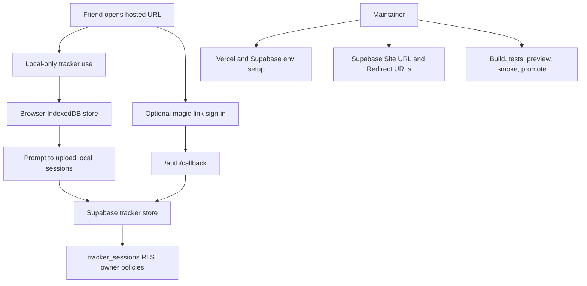

# Friend Ready Packaging - Plan

## Goal Capsule

- **Objective:** Friends can use the Personal Tindeq Tracker from a hosted web URL with clear local-only behavior, safe optional private sync, and a maintainer release path that can be repeated without guesswork.
- **Means:** Prepare the hosted web app, environment configuration, Supabase guardrails, documentation, and smoke tests for a friend-ready release.
- **Target branch:** `codex/ship-friend-ready-packaging`.
- **Authority hierarchy:** User-confirmed scope, current local-first product docs, current codebase behavior, official Supabase and Vercel docs.
- **Execution profile:** Standard, security-sensitive packaging and release-readiness work.
- **Stop conditions:** Stop before native app packaging, public/group leaderboard behavior, open signup, destructive remote Supabase operations, or any auth change that could orphan existing synced tracker rows.
- **Tail ownership:** The implementer owns the branch changes, validation evidence, and release checklist updates; the maintainer owns real production credentials, friend account creation, and final promotion.

---

## Product Contract

### Summary

This plan makes the existing tracker friend-ready without changing its product identity.
The app remains a local-first personal tracker for Tindeq ZIP/CSV exports.
Hosted access is the primary distribution path, and Supabase remains an optional private sync layer for pre-created users.

### Problem Frame

The app already works as a personal Next.js tracker, but “send this to friends” adds new failure modes.
A friend needs to know whether their data is only in the browser, when it uploads to Supabase, and why sign-in may fail if their account is not pre-created.
The maintainer needs a repeatable deployment path that does not expose secrets, misconfigure magic links, or risk remote data.

### Key Decisions

- **Hosted web first.** Use a Vercel-hosted app plus documented local/self-host setup, not native mobile or desktop packaging. Governs R1, R2, R9.
- **Private sync stays invite-style.** Keep magic-link sign-in restricted to pre-created Supabase users rather than opening public signup. Governs R4, R5, R7.
- **Local-to-Supabase upload requires consent.** When local sessions exist after sign-in, keep browser data active until the user chooses whether to upload those sessions to Supabase or leave them local. Governs R3, R5.

### Requirements

**Friend Access**

- R1. A friend can open the hosted app and use import, progress, history, and trace inspection without installing a native app or cloning the repo.
- R2. A friend can use local-only storage without Supabase credentials, and the app explains that local data is tied to the browser/device.
- R3. The app tells users after sign-in, before upload, that existing local sessions can be uploaded to their Supabase account or left local to the browser.

**Private Sync And Auth**

- R4. Supabase sync stays private and owner-scoped, with no public leaderboard, ranking, shared visibility, or invitation workflow added.
- R5. Magic-link auth works for the hosted URL, preview URLs when used, and local development callback path.
- R6. Reset and delete copy matches the active store so a signed-in user is not told they are deleting only local data when Supabase rows will be affected.
- R7. Friend onboarding assumes the maintainer pre-creates allowed Supabase users, disables public signup where the Supabase environment permits it, and explains the expected failure mode for unknown emails.
- R8. The maintainer's existing synced tracker sessions remain accessible after any auth-flow change, either because the same Supabase `auth.users.id` continues to own those rows or because the branch includes an approved account-link/data-migration path.

**Maintainer Packaging**

- R9. The repo documents three setup paths: hosted user, local-only demo/dev, and self-host with Supabase sync.
- R10. Environment documentation separates browser-safe public values from server-only secrets.
- R11. Deployment documentation includes release order, Supabase Auth URL configuration, migration posture, smoke tests, and production data safety.
- R12. Release validation covers local-only usage, private sync guardrails, current UI smoke behavior, import, history editing, trace inspection, and existing-data access for the maintainer account.

### Scope Boundaries

#### In Scope

- Hosted web distribution readiness.
- Local-only and self-host setup documentation.
- Supabase Auth redirect and invite-style onboarding documentation/config.
- Privacy copy for local storage, consented sync, reset, and delete behavior.
- RLS behavior tests and release smoke coverage.

#### Deferred to Follow-Up Work

- Custom domain polish beyond documenting where it fits in the Vercel setup.
- Automated creation of Supabase users for friends.
- Export/import migration between different hosted instances.

#### Outside This Product's Identity

- Native iOS, Android, or desktop packaging.
- Public group leaderboard, ranking, invites, moderation, social sharing, or evidence-download workflows.
- Open public signup for arbitrary users.

### Acceptance Examples

- AE1. Given a first-time friend opens the hosted app, when they import a valid Tindeq CSV and save it without signing in, then the session appears in progress/history and the UI makes clear that the data is local to that browser.
- AE2. Given a friend has local sessions and signs in with a pre-created Supabase user, when the magic link returns through `/auth/callback`, then the app asks whether to upload those local sessions before writing them to that user's owner-scoped Supabase rows.
- AE3. Given a signed-in user chooses reset, when the confirmation appears, then the copy names synced Supabase sessions for that account rather than local-only browser data.
- AE4. Given an unauthenticated or different authenticated Supabase user queries `tracker_sessions`, when they try to read, insert, update, or delete another user's row, then the operation is blocked or returns no unauthorized rows.
- AE5. Given the maintainer follows the deployment runbook, when preview and production env values and Supabase redirect URLs are configured, then magic-link sign-in works from the deployed URL.
- AE6. Given the maintainer has existing Supabase-backed tracker sessions before the auth-flow change, when the new auth flow is used after deployment, then those sessions still appear under the maintainer account without requiring a destructive reset or re-import.

### Success Criteria

- The hosted app is safe to share as a URL with friends who can either stay local-only or use private sync if pre-created.
- Maintainer docs are sufficient to rebuild, deploy, smoke-test, and explain the app without relying on memory.
- Supabase privacy is proven by behavior tests, not only by policy-name assertions.
- Existing synced tracker data remains reachable for the maintainer account after auth changes.
- The plan does not add social or public leaderboard scope.

---

## Planning Contract

### Key Technical Decisions

- KTD1. **Use the existing local-first storage split.** Keep `IndexedDB` as the default store and Supabase as the signed-in store because `src/features/tracker/storage/local-store.ts` and `src/features/tracker/storage/supabase-store.ts` already implement that boundary for the product.
- KTD2. **Keep invite-style magic links.** Preserve `shouldCreateUser: false` and align Supabase signup settings, docs, and runbooks around pre-created users, because friend access should be controlled without adding account-management UI.
- KTD3. **Fix callback configuration around the app's actual route.** Align Supabase local config and runbook guidance with `/auth/callback` because app code builds magic links to that route and the current config still references `/api/auth/confirm`.
- KTD4. **Prove RLS with behavior tests.** Extend database tests to assert owner isolation, unauthenticated denial, spoofed insert rejection, and `user_id` reassignment rejection, matching current Supabase guidance that policies should be tested in the same change.
- KTD5. **Treat docs as part of the package.** Update README, deployment, and data-lifecycle docs in the same branch because the release artifact is a hosted app plus setup/runbook knowledge.
- KTD6. **Use smoke-first release proof for packaging work.** Keep unit/database tests for security and helpers, then rely on Playwright and a manual hosted Supabase checklist for end-to-end confidence.
- KTD7. **Preserve account identity for existing data.** Treat Supabase `auth.users.id` as the owner key for existing synced tracker rows; any auth-flow change that would issue a different user id for the maintainer must include an explicit, backed-up migration or account-link plan before release.

### High-Level Technical Design

### Assumptions

- Local-to-Supabase upload after sign-in requires explicit user choice.
- The maintainer will pre-create friend accounts in Supabase Auth for synced use.
- Hosted local-only use is acceptable for friends who do not need cross-device sync.
- Production Supabase data may already exist by the time this branch ships, so remote destructive commands remain out of scope.
- Existing synced tracker rows are keyed by Supabase `auth.users.id`; keeping access means preserving that identity or migrating row ownership intentionally.

### System-Wide Impact

- Auth, storage, docs, and release validation all become user-facing distribution surfaces.
- Supabase env and redirect configuration become part of the app contract, not only local developer setup.
- The privacy posture remains personal and owner-scoped; no cross-user product surface is introduced.

### Risks & Dependencies

- **Magic-link misconfiguration:** Supabase Auth must allow the exact callback URLs used by production, previews, and local development.
- **Secret exposure:** `SUPABASE_SECRET_KEY` must remain server-only; only publishable Supabase values can be browser-facing.
- **Silent privacy surprise:** Signing in must not upload local sessions to Supabase until the user chooses that path. UI and docs must make that clear.
- **False release confidence:** Existing Playwright smoke selectors may be stale against the current UI and must be refreshed before use as a release gate.
- **Remote data damage:** Production migrations and resets must follow the existing backup/approval posture in `docs/operations/deployment.md`.
- **Existing data orphaning:** A changed auth provider, signup path, or account-linking flow could create a new Supabase user id for the maintainer and leave old `tracker_sessions` rows hidden by RLS.

### Sources & Research

- `README.md` describes the current local setup and optional Supabase sync baseline.
- `docs/operations/deployment.md` defines the current Vercel/Supabase release order and remote reset safety.
- `docs/operations/data-lifecycle.md` defines local-first storage, owner-scoped Supabase rows, and no group leaderboard/public ranking.
- `src/features/tracker/components/tracker-app.tsx` owns auth copy, local-to-Supabase sync on sign-in, reset behavior, and route-backed tabs.
- `src/lib/env.ts`, `src/lib/server-env.ts`, and `.env.example` define public and server env boundaries.
- `supabase/config.toml` currently references stale `/api/auth/confirm` redirect paths while the app uses `/auth/callback`.
- `supabase/migrations/20260822000100_personal_tracker_sessions.sql` and `supabase/tests/database/schema.test.sql` define the current table, policy, and schema test baseline.
- Supabase docs consulted on 2026-08-26: Row Level Security, Securing your API, Redirect URLs, Passwordless email logins, and SSR package guidance.
- Vercel docs consulted on 2026-08-26: Deployments overview and Environment variables.

---

## Implementation Units

### U1. Distribution Mode And Auth Configuration

- **Goal:** Make environment and Supabase Auth configuration explicit for local-only, hosted, and self-host private-sync modes.
- **Requirements:** R5, R7, R8, R9, R10, R11.
- **Dependencies:** None.
- **Files:** `.env.example`, `src/lib/env.ts`, `src/lib/env.test.ts`, `src/app/auth/callback/route.test.ts`, `supabase/config.toml`, `docs/operations/deployment.md`.
- **Approach:**
  1. Keep `NEXT_PUBLIC_LOCAL_DEMO=true` as the documented no-Supabase mode.
  2. Clarify placeholder env values so a self-hoster can choose local-only or private sync without accidentally shipping placeholder Supabase config.
  3. Align `supabase/config.toml` redirect URLs with `/auth/callback` and keep localhost coverage.
  4. Align local Supabase signup settings with invite-style synced access.
  5. Document hosted Supabase Auth settings for production URL, preview URL pattern, local URL, disabled public signup where available, and pre-created users.
  6. If auth behavior changes beyond redirect/copy/config, document whether the maintainer keeps the same Supabase user id or needs an approved ownership migration.
- **Execution note:** This is packaging/config work; prefer env validation and auth redirect smoke proof over broad refactors.
- **Patterns to follow:** `src/lib/env.ts` Zod validation; `src/app/auth/callback/route.test.ts` allowlist tests; `docs/operations/deployment.md` release-order style.
- **Test scenarios:**
  - `src/lib/env.test.ts`: local demo mode succeeds without Supabase URL/key and returns placeholder-safe values.
  - `src/lib/env.test.ts`: non-demo mode fails clearly when Supabase URL/key are absent or placeholders are invalid.
  - `src/app/auth/callback/route.test.ts`: callback path still allows only tracker routes in the `next` parameter.
  - Manual config check: Supabase local config and deployment runbook both name `/auth/callback` as the app callback path.
  - Manual config check: local config and runbook do not present open public signup as the friend-sync path.
  - Manual config check: any new auth path names how existing maintainer-owned `tracker_sessions` rows remain visible.
- **Verification:** Env docs and validation describe both modes, magic-link redirect configuration no longer points to the stale `/api/auth/confirm` path, and existing-data ownership is not changed accidentally.

### U2. Friend-Facing Privacy And Store-State UX

- **Goal:** Make local-only storage, automatic sync, sign-in eligibility, reset, and delete behavior understandable for friends.
- **Requirements:** R1, R2, R3, R4, R6, AE1, AE2, AE3.
- **Dependencies:** U1.
- **Files:** `src/features/tracker/components/tracker-app.tsx`, `src/features/tracker/components/tracker-app.test.ts`, `tests/e2e/smoke.spec.ts`.
- **Approach:**
  1. Keep the existing tabs and main `TrackerApp` structure.
  2. Add or adjust copy around local browser mode, signed-out private sync, and sign-in so users understand local sessions upload after sign-in.
  3. Make reset confirmation and status copy depend on active store state.
  4. Keep sign-out behavior as a return to local browser data, and make that visible.
- **Execution note:** Implement copy and state changes with focused tests before widening Playwright coverage.
- **Patterns to follow:** Existing `authTitle`, `authDescription`, `saveDestinationLabel`, and status-message helper style in `tracker-app.tsx`.
- **Test scenarios:**
  - `src/features/tracker/components/tracker-app.test.ts`: auth description for local mode states that sessions stay in the browser.
  - `src/features/tracker/components/tracker-app.test.ts`: signed-out sync copy states that pre-created Supabase users can enable private sync and that local sessions will upload.
  - `src/features/tracker/components/tracker-app.test.ts`: reset confirmation copy names local browser sessions when unsigned or local-only.
  - `src/features/tracker/components/tracker-app.test.ts`: reset confirmation copy names synced Supabase sessions when signed in.
  - `tests/e2e/smoke.spec.ts`: hosted/local-only flow shows local storage copy, imports a fixture, saves locally, and sees the session in history.
- **Verification:** A friend can tell where data is stored and what reset/sign-in will do before taking the action.

### U3. Supabase Privacy Guardrail Tests

- **Goal:** Prove owner-scoped Supabase behavior with database tests that exercise policies, not just policy names.
- **Requirements:** R4, R8, R12, AE4, AE6.
- **Dependencies:** U1.
- **Files:** `supabase/tests/database/schema.test.sql`, `supabase/migrations/20260822000100_personal_tracker_sessions.sql`, `supabase/migrations/20260826101705_allow_peak_force_tracker_sessions.sql`, `docs/operations/data-lifecycle.md`.
- **Approach:**
  1. Keep the current RLS policy shape unless tests reveal a real gap.
  2. Add pgTAP coverage for unauthenticated access denial.
  3. Add owner-isolation coverage for select, update, and delete.
  4. Add insert/update checks that prevent a user from spoofing or reassigning `user_id`.
  5. Add a preservation check or documented manual proof that a known pre-existing maintainer row remains visible after the chosen auth flow.
  6. Document the resulting tested privacy and existing-data guarantee in data lifecycle docs.
- **Execution note:** Treat policy behavior as security-sensitive; write failing database assertions before changing policies.
- **Patterns to follow:** Existing `supabase/tests/database/schema.test.sql` pgTAP structure; Supabase RLS guidance to use explicit `TO authenticated`, grants, `USING`, and `WITH CHECK`.
- **Test scenarios:**
  - `supabase/tests/database/schema.test.sql`: unauthenticated role cannot read or write `tracker_sessions`.
  - `supabase/tests/database/schema.test.sql`: user A can select only user A rows.
  - `supabase/tests/database/schema.test.sql`: user A cannot update or delete user B rows.
  - `supabase/tests/database/schema.test.sql`: user A cannot insert a row with user B's `user_id`.
  - `supabase/tests/database/schema.test.sql`: user A cannot update an owned row to user B's `user_id`.
  - Manual or database-backed preservation check: a row owned by the maintainer's existing Supabase user id remains readable after the auth-flow change.
- **Verification:** Database tests fail on a permissive policy, pass with owner-scoped CRUD behavior, and do not mask existing-data orphaning.

### U4. Friend And Maintainer Documentation Package

- **Goal:** Turn README and operations docs into a usable package for friends and for the maintainer who ships the hosted app.
- **Requirements:** R1, R2, R3, R7, R8, R9, R10, R11.
- **Dependencies:** U1, U2, U3.
- **Files:** `README.md`, `docs/operations/deployment.md`, `docs/operations/data-lifecycle.md`, `.env.example`.
- **Approach:**
  1. Add a hosted-user quickstart: open URL, import Tindeq export, stay local-only or sign in if invited.
  2. Add local-only developer setup using `NEXT_PUBLIC_LOCAL_DEMO=true`.
  3. Add self-host setup with Supabase project, migrations, Auth redirect URLs, disabled public signup where available, pre-created users, and Vercel env values.
  4. Add a friend-ready release checklist that separates preview validation from production promotion.
  5. Keep data posture docs explicit that there is no group leaderboard, public ranking, social sharing, or cross-user visibility.
  6. Add an auth-change data preservation note that explains why the same Supabase user id matters and what approval is required before migrating row ownership.
- **Execution note:** Keep docs concrete and short enough that a friend can use the top-level README while maintainer details live in operations docs.
- **Patterns to follow:** Existing README brevity; `docs/operations/deployment.md` runbook tone; `docs/operations/data-lifecycle.md` data posture framing.
- **Test scenarios:**
  - Documentation review: README contains hosted-user, local-only, and self-host paths without mixing friend and maintainer responsibilities.
  - Documentation review: env docs identify `NEXT_PUBLIC_SUPABASE_URL` and `NEXT_PUBLIC_SUPABASE_PUBLISHABLE_KEY` as browser-exposed and `SUPABASE_SECRET_KEY` as server-only.
  - Documentation review: deployment runbook includes Supabase Site URL, redirect URLs, preview/prod envs, migration posture, smoke tests, and rollback/promotion notes.
  - Documentation review: data lifecycle doc states that sign-in uploads local sessions to the signed-in account and that synced rows are owner-scoped.
  - Documentation review: maintainer release checklist includes a pre/post auth-change check for existing synced tracker sessions.
- **Verification:** A new reader can choose the correct setup path and identify which secrets, URLs, Supabase settings, and data-preservation checks are required before deployment.

### U5. Release Smoke Coverage

- **Goal:** Make release validation trustworthy for the current UI and friend-ready flows.
- **Requirements:** R1, R2, R5, R6, R8, R12, AE1, AE2, AE3, AE5, AE6.
- **Dependencies:** U1, U2, U3, U4.
- **Files:** `tests/e2e/smoke.spec.ts`, `playwright.config.ts`, `package.json`, `docs/operations/deployment.md`.
- **Approach:**
  1. Refresh existing smoke selectors to match the current UI.
  2. Cover direct hosted routes, local-only import/save/history, progress chart visibility, and trace inspection.
  3. Cover signed-out auth panel expectations without requiring real email delivery in automated e2e.
  4. Add a manual hosted Supabase smoke checklist to the deployment runbook for magic-link email, callback, local-session upload, and signed-in reset copy.
  5. Add a manual existing-data smoke check using the maintainer account before and after auth-flow changes.
  6. Keep CI commands aligned with existing scripts rather than adding a new release script unless repeated validation needs it.
- **Execution note:** Use automated Playwright for deterministic local flows and a manual checklist for external email/Supabase provider behavior.
- **Patterns to follow:** Existing `tests/e2e/smoke.spec.ts` fixture import flow; `package.json` quality scripts; deployment runbook smoke-test list.
- **Test scenarios:**
  - `tests/e2e/smoke.spec.ts`: `/`, `/progress`, `/import`, and `/history` render the expected current headings and navigation state.
  - `tests/e2e/smoke.spec.ts`: local-only import saves a valid fixture and shows it in history.
  - `tests/e2e/smoke.spec.ts`: progress view renders the current chart/filter UI without stale selector assumptions.
  - `tests/e2e/smoke.spec.ts`: history flow can select a session, inspect trace content, edit metadata, and delete/reset with mode-aware copy.
  - Manual hosted smoke: pre-created user receives magic link, returns to `/auth/callback`, syncs local sessions, signs out, and sees local browser data again.
  - Manual existing-data smoke: maintainer signs in after the auth-flow change and sees a known pre-existing session without re-importing it.
- **Verification:** CI and the deployment runbook cover the flows a friend will exercise and prove the maintainer's existing synced data remains reachable before the URL is shared.

---

## Verification Contract

| Gate | Applies To | Done Signal |
|---|---|---|
| `npm test` | U1, U2, U3 | Unit and database-adjacent helper tests pass. |
| `npm run typecheck` | U1, U2, U5 | TypeScript accepts env, UI, and test updates. |
| `npm run lint` | U1, U2, U5 | ESLint accepts implementation and test changes. |
| `npm run build` | U1, U2, U4 | Next.js production build succeeds for configured env mode. |
| `npm run test:e2e` | U2, U5 | Playwright smoke covers current UI and local-only friend flows. |
| Supabase database tests | U3 | pgTAP proves owner isolation and `user_id` spoof/reassignment rejection. |
| Manual hosted Supabase smoke | U1, U2, U4, U5 | Magic-link sign-in, callback, sync, sign-out, and reset copy work on the deployed URL. |
| Existing-data preservation smoke | U1, U3, U4, U5 | A known maintainer-owned session that existed before the auth-flow change remains visible after deployment. |

---

## Definition of Done

- The branch is based on the current repo and uses a name in the `codex/` prefix family.
- Hosted web access, local-only mode, and self-host private sync are documented as separate paths.
- Friend-facing UI explains local storage, private sync, automatic local-session upload, sign-out, and reset behavior.
- Supabase Auth redirect config and docs match `/auth/callback` for local and hosted environments.
- RLS behavior tests prove owner-scoped privacy for `tracker_sessions`.
- Existing Supabase-backed tracker sessions for the maintainer account remain visible after any auth-flow change, or an approved backup and ownership migration has run.
- Playwright smoke tests reflect the current UI and cover the local-only friend flow.
- Deployment docs include preview/prod env setup, Supabase Auth URL setup, smoke validation, and production data safety.
- No native packaging, group leaderboard, public ranking, social sharing, or open signup behavior is added.
- Abandoned experimental code or dead documentation introduced during implementation is removed before handoff.
