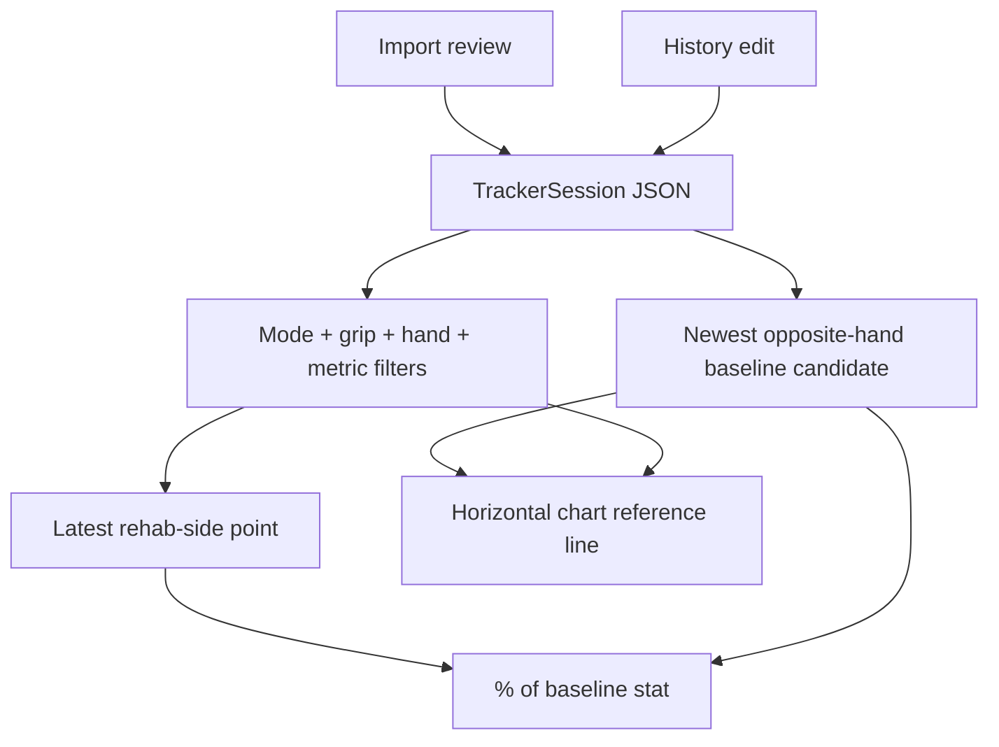

# Healthy Hand Baselines - Plan

## Goal Capsule

- **Objective:** Let the tracker compare a rehabbing hand against healthy-hand reference measurements for the same test mode, grip, and metric.
- **Means:** Add an optional healthy-hand baseline role to tracker sessions, expose it in import and history editing, derive chart reference lines from eligible opposite-hand baselines, and show a percentage-to-baseline readout.
- **Authority:** The personal tracker remains local-first with optional private Supabase sync. Existing saved sessions must keep loading, and force calculations keep using Newtons internally with kg-facing display.
- **Execution profile:** Implement the session metadata contract first, then wire import/history controls, then chart baseline derivation and rendering, finishing with focused unit/component tests and one browser smoke flow.
- **Stop conditions:** Stop before adding rehab-side onboarding, target programming, alerts, baseline trend models, public sharing, or destructive Supabase schema changes.
- **Tail ownership:** Finish with tracker unit tests, chart component tests, typecheck, lint, production build, and a mobile-oriented browser check of import, history edit, and progress chart behavior.

---

## Product Contract

### Summary

The tracker will support marking a saved Tindeq session as a healthy-hand baseline. When the user filters a chart to a single rehab hand and a single metric, the app can show the newest eligible opposite-hand baseline as a horizontal reference line and report the latest rehab-side value as a percentage of that baseline.

The feature keeps baseline selection understandable: baselines are explicit user-approved metadata, not inferred silently from filenames or hand labels. A baseline session remains normal chart data; the reference line is an additional overlay that can be toggled off.

### Problem Frame

The user is rehabbing the right hand and wants the left hand to act as a healthy reference. The existing chart can split left and right hand series, but it does not let one hand serve as a fixed target for the other, and it does not answer the more useful rehab question: "how close is the injured side to my healthy-side baseline?"

### Key Decisions

- KD1. **Baselines are explicit session metadata.** session-settled: user-directed - chosen over treating a free-text tag as authoritative because chart logic needs a reliable role. Governs R1, R2, R3, R4.
- KD2. **Percentage-to-baseline is in scope.** session-settled: user-directed - chosen over a chart-only baseline line because rehab progress needs a direct percentage readout. Governs R8, R9, R10.
- KD3. **No rehab-side setting in this iteration.** session-settled: user-approved - chosen over adding injury-side onboarding; the selected chart hand defines the side being compared. Governs R5, R6, R7, R11.

### Requirements

**Baseline Assignment**

- R1. The import review form lets the user mark a draft session as a healthy-hand baseline before saving.
- R2. The History edit form lets the user add or remove the healthy-hand baseline role from an already-saved session.
- R3. Baseline role changes are saved in the same local and Supabase session JSON as the rest of the tracker metadata.
- R4. Baseline role changes are included in the session audit log so later edits are visible like grip, hand, notes, and tags.

**Baseline Eligibility**

- R5. A chart baseline is eligible only when the chart is filtered to one concrete hand, `left` or `right`.
- R6. The app uses the opposite hand as the healthy reference for the selected hand.
- R7. A baseline candidate must match the selected mode, grip, and single selected metric, and must have a finite positive value for that metric.
- R8. When multiple eligible baselines exist, the newest by test date is used.
- R9. Sessions with unset hand or `both` hand are not used as opposite-hand healthy baselines.

**Chart and Readout**

- R10. The Progress chart exposes a baseline toggle chip near the existing plot controls, defaulting off.
- R11. When enabled and eligible, the chart draws the selected baseline as a horizontal reference line and includes the baseline value in the chart scale.
- R12. The baseline line appears in the legend, chart details, and accessible chart description.
- R13. The Progress view shows the latest matching rehab-side value as `% of baseline`, calculated from internal Newton values and displayed as a rounded percentage.
- R14. If the chart is in "All chartable" mode, has no concrete selected hand, or has no eligible baseline, the UI explains why no baseline comparison is shown rather than guessing.

### Acceptance Examples

- AE1. Given a left-hand peak-force import for `half crimp`, when the user marks it as a healthy-hand baseline and saves it, then the saved session keeps `hand: left` and the baseline role.
- AE2. Given a saved left-hand baseline and right-hand rehab sessions for the same mode, grip, and metric, when the user selects the right-hand chart, selects that single metric, and turns on Baseline, then the chart shows a horizontal left-hand baseline line.
- AE3. Given the latest right-hand value is 80 N and the selected left-hand baseline is 100 N, when baseline comparison is visible, then the Progress summary shows `80% of baseline`.
- AE4. Given two left-hand baselines match the selected chart, when Baseline is enabled, then the one with the newest test date is used.
- AE5. Given the chart is set to All chartable or Both hands, when the user looks for baseline comparison, then the UI asks for a single metric and concrete hand instead of rendering a misleading line.
- AE6. Given an old saved session without any baseline field, when the tracker loads it, then it remains valid and is treated as not a baseline.

### Success Criteria

- A user can mark a healthy-hand baseline during import without using free-text tags.
- A user can correct baseline status later from History.
- The right-hand chart can show the newest matching left-hand baseline line for a selected metric, and the inverse works for left-hand rehab.
- The Progress summary reports percentage-to-baseline for the latest matching rehab-side point.
- Existing local and synced sessions continue to load without migration errors.

### Scope Boundaries

#### In Scope

- Optional baseline/reference role on tracker sessions.
- Import and History UI controls for baseline assignment.
- Client-side baseline selection from already-loaded sessions.
- Horizontal chart overlay and legend/details support.
- Percentage-to-baseline summary for the current selected hand and metric.
- Tests for metadata normalization, audit logging, filtering, chart rendering, and browser smoke coverage.

#### Deferred to Follow-Up Work

- A persistent "injured hand" or rehab-side profile setting.
- Automatic baseline suggestions from filenames or historical usage.
- Unique-baseline enforcement that unsets older baselines when a new one is chosen.
- Baseline trend lines, target percentages, alerts, or rehab programming.
- Supabase query columns or indexes for baseline role unless dataset size later makes client-side filtering too slow.

### Sources / Research

- Existing tracker import, progress, and history UI: `src/features/tracker/components/tracker-app.tsx`.
- Session metadata and audit model: `src/features/tracker/types.ts`.
- Progress chart SVG and legend implementation: `src/components/charts/tracker-progress-chart.tsx`.
- Local tracker persistence: `src/features/tracker/storage/local-store.ts`.
- Supabase JSON-backed persistence: `src/features/tracker/storage/supabase-store.ts`.
- Product and data posture: `README.md`, `docs/operations/data-lifecycle.md`.
- Unit contract for force calculations: `docs/calculation-contract.md`.
- Existing browser smoke flow: `tests/e2e/smoke.spec.ts`.

---

## Planning Contract

### Key Technical Decisions

- KTD1. **Use a first-class optional role field.** Store a narrow optional session role such as `referenceRole: "healthy_hand_baseline"` instead of overloading `tags`. This preserves existing sessions, gives chart code a stable predicate, and avoids changing the Supabase table shape for the first implementation. Implements KD1.
- KTD2. **Select baselines client-side from loaded sessions.** The tracker already loads the owner's sessions before filtering charts, and Supabase stores full session JSON. Client-side selection keeps this change reversible and avoids a schema migration while data volume is small.
- KTD3. **Require a single metric and concrete hand for comparison.** Baseline percentage and horizontal line semantics are clear only when comparing one rehab hand and one metric against the opposite hand. This keeps "All chartable" from producing multiple reference lines that make the chart busy.
- KTD4. **Choose newest eligible baseline by test date.** Multiple baseline sessions are allowed; deterministic newest-by-test-date selection avoids destructive edits to older data and keeps baseline updates simple.
- KTD5. **Compute percentages from raw values.** Use the stored Newton metric values for `rehab / baseline * 100`, then format kg and percentage for display. This follows the calculation contract and avoids rounded-display drift.

### High-Level Technical Design



### Assumptions

- The selected chart hand is the rehab side for baseline comparison.
- Baseline toggle defaults off so existing chart behavior remains unchanged until the user asks for the overlay.
- A baseline session remains part of normal chart data if it matches visible chart filters; the reference line is additive.
- Baseline comparison is unavailable for `all`, `both`, or unspecified hand filters until a concrete hand is selected.

### System-Wide Impact

This touches personal tracker data shape, import review UI, History editing, Progress chart rendering, and tests. It should not require server routes, new authentication behavior, or remote schema changes because `tracker_sessions.session` already stores the complete session JSON for each user.

---

## Implementation Units

### U1. Add Baseline Metadata To Tracker Sessions

- **Goal:** Extend the session metadata contract so a session can be marked as a healthy-hand baseline while old sessions remain valid.
- **Requirements:** R1, R2, R3, R4, R9, AE1, AE6.
- **Dependencies:** None.
- **Files:** `src/features/tracker/types.ts`, `src/features/tracker/types.test.ts`, `src/features/tracker/storage/supabase-store.test.ts`.
- **Approach:** Add an optional baseline role field to `ImportContext` and `TrackerSession`. Include the role in `validateImportContext`, `buildTrackerSession`, `updateTrackerSessionMetadata`, and `normalizeStoredTrackerSession`. Extend `TrackerSessionAuditChange.field` so baseline status edits are auditable. Keep the Supabase row shape unchanged but test that the full session JSON carries the new field.
- **Execution note:** Start with type-level tests for old-session normalization and audit changes before wiring UI.
- **Patterns to follow:** Existing optional `hand`, `notes`, `tags`, `updatedAt`, and `auditLog` handling in `src/features/tracker/types.ts`.
- **Test scenarios:**
  - Valid import context with baseline role returns an ok context preserving that role.
  - Building a session from baseline context stores the role and records it in the created audit entry.
  - Updating a saved session from non-baseline to baseline records a metadata update with before/after role values.
  - Normalizing an old session without the role does not add invalid data and treats it as not a baseline.
  - Supabase row serialization includes the baseline role inside the `session` JSON without requiring a new query column.
- **Verification:** Session model tests pass and older fixture-like session objects remain accepted by normalization.

### U2. Add Baseline Controls In Import And History

- **Goal:** Give the user explicit control over baseline assignment when saving new imports and editing saved sessions.
- **Requirements:** R1, R2, R3, R4, AE1.
- **Dependencies:** U1.
- **Files:** `src/features/tracker/components/tracker-app.tsx`, `src/features/tracker/components/tracker-app.test.ts`, `src/app/globals.css`.
- **Approach:** Add a small binary control to draft import fields and session edit fields, using the existing compact form and chip/control styling. Ensure saving a draft passes the role through validation and `buildTrackerSession`. Ensure History edit preloads, saves, and clears the role through `updateTrackerSessionMetadata`. Surface baseline status in session metadata chips so the detail view is readable without editing.
- **Patterns to follow:** Current hand selector, tag editor, and session meta chip display in `TrackerApp`.
- **Test scenarios:**
  - Import draft marked as baseline saves a session with the baseline role.
  - Import draft left unmarked saves a normal session.
  - History edit can add baseline role to an existing session.
  - History edit can remove baseline role from an existing session.
  - Session detail shows a baseline chip/tag only when the saved session has the role.
- **Verification:** Import and History metadata flows behave the same as grip/hand/tags except for the new baseline role.

### U3. Derive Eligible Baselines And Percentage Comparisons

- **Goal:** Add pure selection and calculation helpers for chart baseline lookup and `% of baseline` summaries.
- **Requirements:** R5, R6, R7, R8, R9, R13, R14, AE2, AE3, AE4, AE5.
- **Dependencies:** U1.
- **Files:** `src/features/tracker/types.ts`, `src/features/tracker/components/tracker-app.tsx`, `src/features/tracker/components/tracker-app.test.ts`, `src/features/tracker/types.test.ts`.
- **Approach:** Build a baseline candidate from sessions that have the healthy-hand role, opposite concrete hand, matching mode and grip, and the selected metric available with a positive finite value. Pick the newest candidate by `testedAt`. Build a comparison summary from the latest matching selected-hand point and the selected baseline. Return an unavailable reason when comparison cannot run because hand, metric, point, or baseline is missing.
- **Technical design:** Directional helper shape:

```text
current chart filters + sessions
  -> if selected hand is left/right and selected metric is concrete
  -> newest baseline session with opposite hand, same mode/grip, metric value > 0
  -> latest rehab-side progress point
  -> percent = latest.value / baseline.value * 100
```

- **Patterns to follow:** Existing pure helpers such as `handOptionsForSessions`, `resolveHandFilter`, `latestComparableChange`, `bestProgressPoint`, and `progressPointsForSession`.
- **Test scenarios:**
  - Right-hand selected chart finds newest matching left-hand baseline for the same mode, grip, and metric.
  - Left-hand selected chart finds newest matching right-hand baseline.
  - Baseline candidate with the wrong grip, wrong mode, wrong metric availability, unset hand, `both` hand, zero value, or negative value is ignored.
  - Multiple eligible baselines choose the newest `testedAt`.
  - All-chartable metric selection returns a reason requiring a single metric.
  - All/both/unspecified hand selection returns a reason requiring a concrete hand.
  - Percentage calculation uses raw Newton values and rounds display only after calculation.
- **Verification:** Helper tests cover both eligible and unavailable states without needing browser interaction.

### U4. Render Baseline Toggle, Reference Line, And Summary

- **Goal:** Make baseline comparison visible on the Progress page without making the existing multi-line chart busier by default.
- **Requirements:** R10, R11, R12, R13, R14, AE2, AE3, AE5.
- **Dependencies:** U2, U3.
- **Files:** `src/features/tracker/components/tracker-app.tsx`, `src/components/charts/tracker-progress-chart.tsx`, `src/components/charts/tracker-progress-chart.test.tsx`, `src/app/globals.css`.
- **Approach:** Add a baseline toggle state in the Progress page, defaulting off. Show the chip near the existing plot chips, disabled or explanatory when baseline comparison is unavailable. Pass a reference-line object to `TrackerProgressChart` only when enabled and eligible. Extend chart scaling to include reference-line values and render a distinct horizontal line with clear legend/details text. Add or adapt a compact stat card showing baseline value and `% of baseline`.
- **Patterns to follow:** Existing chip rows in `TrackerApp`, hand color mapping and dash legend in `TrackerProgressChart`, and compact stat-card layout in the Progress section.
- **Test scenarios:**
  - With baseline disabled, chart markup does not include the baseline line or legend entry.
  - With baseline enabled and eligible, chart markup includes a horizontal reference line, legend entry, and data/details text.
  - Reference line value outside the visible point range expands the y-axis domain rather than disappearing.
  - Progress summary shows latest value, baseline value, and rounded percent for a concrete hand and metric.
  - Unavailable comparison states do not render a misleading percent.
- **Verification:** Component tests prove reference-line rendering and app tests prove chip/summary state selection.

### U5. Browser Smoke And Polish

- **Goal:** Verify the full user journey works on the real app surface and remains comfortable on phone-sized screens.
- **Requirements:** AE1, AE2, AE3, AE5.
- **Dependencies:** U4.
- **Files:** `tests/e2e/smoke.spec.ts`, `tests/fixtures/tindeq/max-force/peakforce-single.csv` or a new small fixture under `tests/fixtures/tindeq/`.
- **Approach:** Extend the existing smoke flow or add a focused smoke test that imports healthy-hand and rehab-hand samples, marks the healthy side as baseline, navigates to Progress, selects a concrete hand and metric, enables Baseline, and checks the chart and percentage readout. Use a narrow fixture rather than relying on downloaded user files.
- **Patterns to follow:** Existing Playwright navigation and import assertions in `tests/e2e/smoke.spec.ts`.
- **Test scenarios:**
  - Import a healthy-hand session, mark as baseline, save it, and confirm History displays the baseline marker.
  - Import a rehab-side session for the same grip/mode/metric, then enable baseline comparison in Progress.
  - Progress shows the baseline line and percentage readout after selecting the rehab hand and single metric.
  - On a mobile viewport, the new controls and stat text remain visible without overlap.
- **Verification:** Browser smoke passes locally against the dev server, plus the full production build succeeds.

---

## Verification Contract

| Gate | Coverage | Done Signal |
|---|---|---|
| Tracker model tests | U1, U3 | `src/features/tracker/types.test.ts` covers baseline metadata, normalization, audit, and calculation helpers. |
| Tracker app tests | U2, U3, U4 | `src/features/tracker/components/tracker-app.test.ts` covers import/history role wiring, baseline selection, and percent states. |
| Chart component tests | U4 | `src/components/charts/tracker-progress-chart.test.tsx` covers reference-line rendering, scale inclusion, legend, and details. |
| Storage mapping tests | U1 | `src/features/tracker/storage/supabase-store.test.ts` proves the role persists in session JSON without schema changes. |
| Browser smoke | U5 | `tests/e2e/smoke.spec.ts` covers the end-to-end import-to-progress baseline flow, including a mobile viewport check. |
| Whole-app quality | All units | Typecheck, lint, and production build pass after implementation. |

---

## Definition of Done

- Existing saved tracker sessions load normally and are treated as non-baseline unless explicitly marked.
- New imports and edited sessions can be marked or unmarked as healthy-hand baselines.
- Baseline comparison only appears when the current filters make the comparison meaningful: concrete hand, concrete metric, matching opposite-hand baseline.
- The chart includes a clear horizontal baseline line, legend/details entry, and accessible description when enabled.
- The Progress page shows a rounded `% of baseline` for the latest matching rehab-side point.
- Baseline calculations use internal Newton values and kg-facing display remains presentation-only.
- Tests named in the Verification Contract pass, and no unrelated data/schema changes are introduced.
- Abandoned implementation experiments or temporary fixtures are removed before shipping.
