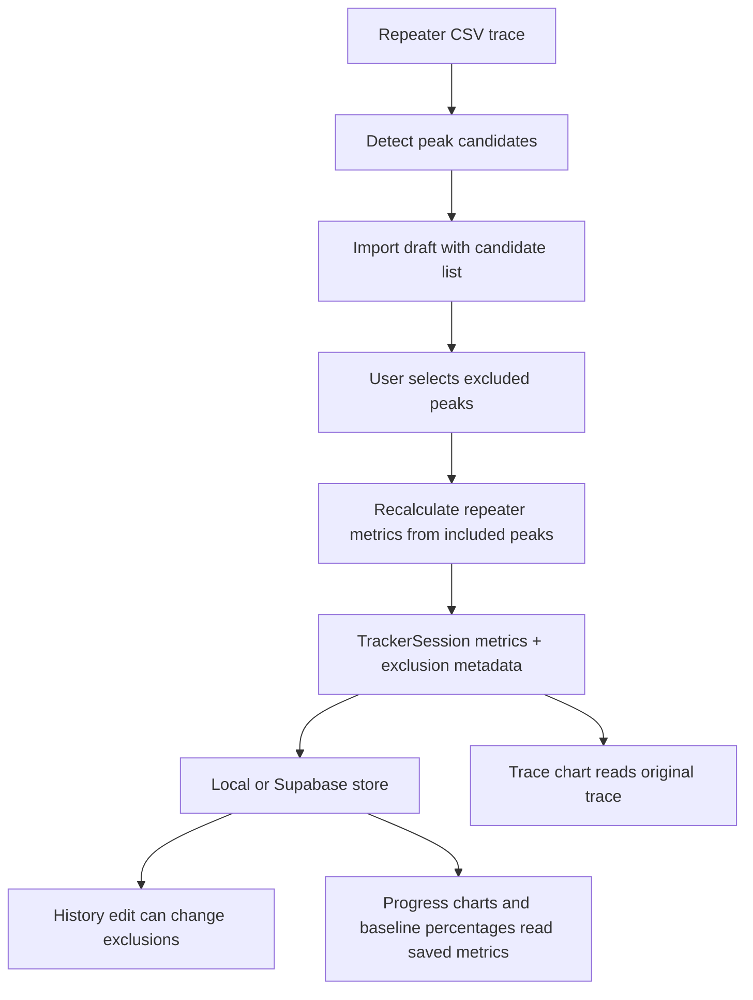

# Repeater Peak Exclusions - Plan

## Goal Capsule

| Field | Value |
|---|---|
| Objective | Users can exclude spurious repeater peaks from saved repeater statistics without removing trace data. |
| Means | Store auditable repeater exclusion metadata, derive recalculated repeater metrics from non-excluded detected peaks, and expose exclusion controls in import and history edit flows. |
| Authority | Product Contract requirements define behavior. Planning Contract decisions define implementation mechanics inside those requirements. |
| Execution profile | Standard code change with parser/model updates, UI controls, persistence compatibility, and chart/stat verification. |
| Stop conditions | Stop if detected repeater peaks cannot be made stable enough to persist across reloads, or if recalculation would require destructive trace mutation. |

---

## Product Contract

### Summary

This plan adds manual repeater peak exclusions to the tracker so spurious reps can be ignored by statistics while remaining visible in the trace. The user can choose one or more detected repeater peaks during import or later session editing, and each change is preserved in the session audit history.

### Problem Frame

Tindeq repeaters can include bad max spikes. The current app imports the trace and calculates repeater average force and max force from all samples or from exported summary values. That makes a single spurious peak contaminate the session's saved statistics and progress charts.

The Tindeq app lets users manually exclude individual reps from calculations. This app needs the same practical audit step for rehab tracking, because recent right-hand repeater data contains a spurious max value that should not count.

### Requirements

**Repeater Exclusion Behavior**

- R1. Repeater sessions expose a list of detected peak candidates that a user can inspect before choosing exclusions when trace-derived candidates are available.
- R2. Users can select zero, one, or many repeater peak candidates to exclude from calculated repeater metrics.
- R3. Excluded repeater peaks remain in the raw trace data and trace chart.
- R4. Repeater average force and repeater max force are recalculated from non-excluded peak candidates when exclusions exist.
- R5. Existing repeater sessions without exclusion metadata remain valid and keep their current statistics until edited or re-augmented.
- R5a. Existing repeater sessions without stored candidates regenerate candidates from stored trace data without mutating saved metrics until the user explicitly saves exclusion changes.

**Persistence And Audit**

- R6. Exclusion choices are stored in the `TrackerSession` JSON so local IndexedDB and Supabase storage preserve them without a database migration.
- R7. Import-created sessions record initial exclusion choices in the created audit entry.
- R8. History edits record exclusion additions and removals in the metadata audit log.
- R9. Non-repeater sessions do not display repeater exclusion controls and do not accept repeater exclusion metadata as meaningful state.

**User Interface**

- R10. The import review UI lets users choose excluded repeater peaks before saving a detected repeater CSV.
- R11. The history edit UI lets users add, remove, and review excluded repeater peaks on saved repeater sessions.
- R12. The session detail view shows when repeater peaks have been excluded and which candidates were excluded.
- R13. The progress page uses recalculated saved metrics, so charts and baseline percentages reflect excluded repeater peaks automatically.
- R14. Repeater exclusion controls use one shared checklist dropdown pattern with human-readable peak labels, selected counts, keyboard support, and mobile-safe layout.
- R15. When no candidates are available or all candidates are excluded, the UI explains the state and prevents confusing chart or baseline output.

### Success Criteria

- A user can import a repeater CSV, mark a spurious peak as excluded, save it, and see lower repeater max and average statistics without losing the trace.
- A user can edit an older repeater session, exclude a peak, save, reload, and see the exclusion and audit entry persist.
- Existing baseline, hand, grip, custom grip, and chart filtering behaviors continue to work with recalculated repeater metrics.
- Repeater average force remains comparable with existing sessions by preserving the current active-sample average semantics as far as possible.

### Scope Boundaries

- The plan does not remove samples from traces or alter the visual trace data.
- The plan does not add automatic outlier detection; exclusion is manual.
- The plan does not add exclusion support for endurance, peak-force, or RFD data.
- The plan does not require a Supabase table migration because full session JSON is already stored.

#### Deferred to Follow-Up Work

- Automatic spurious peak suggestions can be added later after manual exclusion behavior is stable.
- Trace-chart annotations for excluded peaks can be added later if the current detail text is not enough.
- Re-import reconciliation against existing session IDs is deferred until a broader import deduplication workflow exists.

### Key Flows

- F1. Import-time exclusion.
  - **Trigger:** A user imports a repeater CSV.
  - **Steps:** The app detects repeater peak candidates, shows them in the draft review, lets the user select exclusions, recalculates draft metrics, and saves the session with audit metadata.
  - **Covered by:** R1, R2, R4, R6, R7, R10, R13
- F2. History-time correction.
  - **Trigger:** A user opens an existing repeater session with a spurious peak.
  - **Steps:** The user edits details, selects one or more peak candidates to exclude, saves changes, and sees metrics, history, progress, and audit data update.
  - **Covered by:** R1, R2, R4, R6, R8, R11, R12, R13

### Acceptance Examples

- AE1. Given a repeater trace with three detected peaks, when the user excludes the highest peak during import, then saved `peakForceN` equals the highest remaining non-excluded peak.
- AE2. Given a repeater trace with three detected peaks, when the user excludes two peaks during history edit, then saved repeater average force is calculated from the remaining included peak candidates.
- AE3. Given an old repeater session without exclusion metadata, when the app loads it, then it remains valid and candidate detection does not change its saved metrics.
- AE4. Given a peak-force max summary file, when the user edits the session, then repeater peak exclusion controls are not shown.
- AE5. Given a repeater session with exclusions, when the user opens Source and audit, then the excluded candidates and audit change are visible.
- AE6. Given a repeater session where every detected candidate is excluded, when the user reviews draft or edit metrics, then repeater average and max force are unavailable and progress/baseline displays omit those unavailable points.
- AE7. Given a repeater session with no detectable candidates, when the user opens import or history edit, then the control says "No repeater peaks available to exclude" and the session remains saveable with unchanged metrics.

---

## Planning Contract

### Key Technical Decisions

- KTD1. **Persist exclusions as session JSON metadata.** Store current repeater candidates and excluded candidate IDs inside `TrackerSession`, not as a new Supabase query column, because local and remote stores already preserve the full session object and the feature is session-local. Governs R6, R7, R8.
- KTD2. **Use rich stable peak candidate identity.** Each candidate stores parser version, ordinal label, peak trace index, peak timestamp, peak force, and region start/end so selections survive reloads and audit display can show human-readable peak details. Governs R1, R2, R5, R5a, R12.
- KTD3. **Recalculate through one reusable repeater helper.** Parsing should detect candidates, while a pure recalculation helper applies excluded IDs to parsed or stored repeater data for import preview, save, history edit, and augmentation. Governs R2, R4, R7, R8, R13.
- KTD4. **Keep the trace immutable.** Exclusions affect derived metrics only, so trace rendering, source audit, and future recalculation all have access to the original data. Governs R3.
- KTD5. **Limit controls to repeater mode.** Non-repeater sessions should ignore the new metadata at display time to avoid implying unsupported calculations. Governs R9.
- KTD6. **Preserve average-force semantics.** Repeater average force should continue to mean active-sample average where possible, with exclusions applied by omitting excluded rep windows rather than changing the metric to average-of-peaks. Governs R4, R13.
- KTD7. **Saved metrics reflect saved exclusions.** A persisted session's `metrics` are authoritative for display and must match its saved exclusion metadata; normalization detects missing or drifted candidates but does not silently change historical metrics. Governs R5, R5a, R6, R13.
- KTD8. **Use a concrete checklist dropdown UI.** The exclusion control is a compact "Exclude peaks" dropdown that opens a checklist with rep number, peak force, timestamp, and selected count, applying changes immediately to preview metrics. Governs R10, R11, R12, R14, R15.

### High-Level Technical Design

### Assumptions

- The first implementation can use deterministic local peak detection from the force trace rather than reproducing Tindeq's exact internal rep segmentation.
- When all peak candidates are excluded, repeater metrics should become unavailable with a clear reason rather than using the excluded trace samples.
- If regenerated candidates drift from stored candidates after a future parser change, the app should preserve saved metrics and show a warning rather than remapping exclusions silently.

### System-Wide Impact

This change affects persistent user data, because saved sessions gain optional exclusion metadata and recalculated metric values. It also affects charts, baseline percentages, import review, history detail, audit display, and local-demo seed data when demo repeaters are used for smokechecks.

### Risks & Dependencies

| Risk | Mitigation |
|---|---|
| Peak IDs drift after parser changes. | Persist rich candidate identity and fall back to nearest timestamp/value only with a warning. |
| Average-force semantics diverge from Tindeq. | Preserve the current active-sample average semantics by excluding rep windows rather than averaging peak values. |
| Excluding all reps creates invalid statistics. | Return unavailable repeater metrics, omit progress/baseline points, and show "Keep at least one rep included to calculate repeater stats." |
| Stored old sessions fail normalization. | Treat missing exclusion metadata as an empty exclusion list. |

### Sources / Research

- `src/features/tracker/parsers/repeater.ts` currently derives repeater metrics from the full force trace or exported summary values.
- `src/features/tracker/types.ts` owns session metadata, import validation, session building, metadata updates, audit changes, and progress points.
- `src/features/tracker/components/tracker-app.tsx` owns import draft fields, history edit fields, session detail audit display, progress filtering, baseline percentages, and local-demo data.
- `src/features/tracker/storage/local-store.ts` and `src/features/tracker/storage/supabase-store.ts` preserve full `TrackerSession` JSON, so optional metadata can ride through existing storage.
- Existing tests in `src/features/tracker/parsers/repeater.test.ts`, `src/features/tracker/types.test.ts`, `src/features/tracker/components/tracker-app.test.ts`, and `tests/e2e/smoke.spec.ts` are the closest patterns to extend.

---

## Implementation Units

### U1. Add Repeater Peak Candidate And Exclusion Metadata

- **Goal:** Extend the tracker model so repeater sessions can carry detected peak candidates and selected exclusions.
- **Requirements:** R1, R2, R5, R5a, R6, R7, R8, R9, R12
- **Dependencies:** None
- **Files:** `src/features/tracker/types.ts`, `src/features/tracker/types.test.ts`, `src/features/tracker/storage/supabase-store.test.ts`
- **Approach:** Add optional repeater-specific metadata to parsed and stored sessions. Include candidate descriptors and excluded candidate IDs. Record before/after changes through the existing audit log only. Normalize old sessions to an empty exclusion state and allow candidate regeneration from stored trace without changing saved metrics. Keep non-repeater validation permissive but display logic repeater-scoped per KTD5.
- **Execution note:** Implement type and normalization tests before parser/UI changes so storage compatibility is protected.
- **Patterns to follow:** Existing `referenceRole`, `tags`, and `auditLog` handling in `src/features/tracker/types.ts`.
- **Test scenarios:**
  - Old sessions without exclusion metadata normalize successfully and expose no excluded peaks.
  - Old repeater sessions can derive candidate previews from stored trace without changing saved metrics.
  - Building a repeater session with exclusions preserves candidate IDs and excluded IDs.
  - Updating a repeater session from no exclusions to two exclusions records an audit change.
  - Updating a repeater session from two exclusions to one exclusion records before and after values.
  - Supabase serialization preserves the new metadata inside the stored `session` JSON.
- **Verification:** Session construction, normalization, audit updates, and Supabase row serialization all preserve exclusion metadata without requiring a migration.

### U2. Detect Repeater Peak Candidates And Recalculate Metrics

- **Goal:** Detect repeatable peak candidates from repeater traces and calculate repeater metrics from included candidates.
- **Requirements:** R1, R2, R3, R4, R5, R13, AE1, AE2, AE3
- **Dependencies:** U1
- **Files:** `src/features/tracker/parsers/repeater.ts`, `src/features/tracker/parsers/repeater.test.ts`, `tests/fixtures/tindeq/repeaters/partial-two-reps.csv`
- **Approach:** Extract candidate detection and exclusion application into pure helpers. Use the force trace to split active regions above the existing threshold, identify one peak per rep window, and assign rich stable candidate identity. Compute max force from included candidates. Compute repeater average force from active samples inside included rep windows so the metric remains comparable with current behavior. Preserve the original trace arrays unchanged per KTD4.
- **Execution note:** Add characterization tests around current repeater fixture metrics before changing calculation behavior.
- **Technical design:** Directional algorithm: identify active samples above threshold, split active regions into rep windows, pick one max sample per window, assign stable candidate IDs from parser version plus peak trace index, then filter windows by excluded IDs for metrics. The same recalculation helper should accept parsed drafts and saved sessions.
- **Patterns to follow:** Existing `repeaterMetricsFromTrace`, `averageActiveForce`, `validForceSamples`, and warning behavior in `src/features/tracker/parsers/repeater.ts`.
- **Test scenarios:**
  - Covers AE1. A trace with three candidates and one excluded highest candidate returns max force from the next-highest included candidate.
  - Covers AE2. A trace with three candidates and two exclusions returns average force from the one included candidate.
  - Covers AE3. A repeater with no exclusion metadata preserves current metrics when loaded.
  - A trace with no active candidates returns unavailable repeater metrics with a clear reason.
  - Excluding all candidates returns unavailable repeater average and max metrics with a clear reason.
  - Candidate IDs stay the same after parsing the same CSV twice.
  - Regenerating candidates for a legacy session does not overwrite saved metrics until exclusions are saved.
- **Verification:** Repeater parser tests prove candidate detection, metric recalculation, warning reasons, and trace preservation.

### U3. Wire Import Draft Exclusion Controls

- **Goal:** Let users exclude repeater peak candidates while reviewing a new import.
- **Requirements:** R1, R2, R4, R7, R10, R13, R14, R15, F1, AE1, AE6, AE7
- **Dependencies:** U1, U2
- **Files:** `src/features/tracker/components/tracker-app.tsx`, `src/features/tracker/components/tracker-app.test.ts`, `src/app/globals.css`
- **Approach:** Add repeater-only draft state for excluded candidate IDs. Render a compact "Exclude peaks" dropdown with checklist rows showing rep number, peak force, timestamp, and selected count. Apply selections immediately to draft metrics. Show "No repeater peaks available to exclude" when detection returns no candidates. Show "Keep at least one rep included to calculate repeater stats" when all candidates are selected, with unavailable metric preview. Pass exclusion state and recalculated metrics into `buildTrackerSession`.
- **Patterns to follow:** Existing draft fields for grip, hand, baseline, notes, and tags in `src/features/tracker/components/tracker-app.tsx`.
- **Test scenarios:**
  - Importing a repeater CSV shows an exclusion control with detected candidates.
  - Selecting one candidate updates draft metrics before saving.
  - Saving a draft with selected exclusions stores excluded IDs and recalculated repeater metrics.
  - Importing a non-repeater CSV does not show the exclusion control.
  - Saving a repeater draft with no exclusions behaves like today.
  - Keyboard users can open the dropdown, move through checklist items, toggle checkboxes, and close the menu.
  - Mobile layout uses full-width controls, minimum 44px touch targets, capped menu height, stable spacing, and no horizontal overflow.
- **Verification:** Import draft tests cover repeater-only rendering, selection behavior, saved metadata, and unchanged non-repeater imports.

### U4. Wire History Edit And Audit Display

- **Goal:** Let users correct saved repeater sessions and inspect exclusion audit history.
- **Requirements:** R2, R4, R8, R11, R12, R13, R14, R15, F2, AE2, AE4, AE5, AE6, AE7
- **Dependencies:** U1, U2
- **Files:** `src/features/tracker/components/tracker-app.tsx`, `src/features/tracker/components/tracker-app.test.ts`, `src/app/globals.css`
- **Approach:** Add the same repeater-only exclusion control to session edit mode. Add a dedicated exclusion-save path or expand the metadata update contract so saving can persist excluded IDs, recalculated repeater metrics, and one audit-log change. Opening edit mode can regenerate candidates for legacy sessions, but saving unrelated metadata must not recalculate repeater metrics unless exclusions changed. Show excluded peak labels in session metadata or Source and audit details without overloading the progress chart.
- **Patterns to follow:** Existing History edit flow for grip, hand, baseline, notes, tags, and audit display.
- **Test scenarios:**
  - Covers AE2. Editing a saved repeater session to exclude peaks updates saved average and max metrics.
  - Covers AE4. Editing a peak-force session does not show repeater exclusion controls.
  - Covers AE5. Session detail shows excluded candidate labels and an audit entry after saving changes.
  - Removing an exclusion restores metrics based on the newly included candidate set.
  - Reloading after a history edit preserves the selected exclusions.
  - Editing only grip, hand, notes, tags, or baseline role on a legacy repeater session does not silently recalculate repeater metrics.
  - Excluded candidate audit text shows rep number, peak force, timestamp, and whether each peak was added or removed.
- **Verification:** History tests prove saved correction, audit visibility, reload persistence, and non-repeater omission.

### U5. Ensure Progress, Baseline, Demo, And Browser Smoke Coverage

- **Goal:** Prove recalculated repeater metrics flow into charts, summaries, and local smokecheck data.
- **Requirements:** R4, R5, R12, R13
- **Dependencies:** U1, U2, U3, U4
- **Files:** `src/components/charts/tracker-progress-chart.test.tsx`, `src/features/tracker/components/tracker-app.test.ts`, `tests/e2e/smoke.spec.ts`, `src/features/tracker/components/tracker-app.tsx`
- **Approach:** Extend chart/app tests so progress points read recalculated repeater metrics after exclusions. Add or adjust local-demo repeater sessions to include one excluded peak for visual smokechecking if that improves manual QA. Keep one browser smoke path for the immediate history-edit correction workflow, and leave import-path breadth to unit and component tests.
- **Patterns to follow:** Existing baseline e2e flow in `tests/e2e/smoke.spec.ts` and local-demo seed pattern in `src/features/tracker/components/tracker-app.tsx`.
- **Test scenarios:**
  - Progress points for an excluded repeater session use recalculated average and max values.
  - Baseline percentage for repeater metrics uses recalculated values.
  - All-excluded unavailable metrics do not create chart points or baseline percentages.
  - Local-demo mode can display a repeater session with excluded peaks for visual review.
  - Browser smoke edits a repeater, excludes one peak, and sees the corrected progress chart.
- **Verification:** Unit, component, and e2e smoke coverage prove corrected repeater metrics reach user-facing progress surfaces.

---

## Verification Contract

| Gate | Applies To | Done Signal |
|---|---|---|
| TypeScript | U1-U5 | `tsc --noEmit` passes with new metadata types. |
| Lint | U1-U5 | `eslint .` passes with no new warnings. |
| Tracker model tests | U1 | `src/features/tracker/types.test.ts` covers normalization, audit, and persistence compatibility. |
| Repeater parser tests | U2 | `src/features/tracker/parsers/repeater.test.ts` covers peak candidate detection and recalculation. |
| Tracker app tests | U3-U5 | `src/features/tracker/components/tracker-app.test.ts` covers import, history edit, audit display, and progress summaries. |
| Chart tests | U5 | `src/components/charts/tracker-progress-chart.test.tsx` confirms corrected progress points remain chartable. |
| Browser smoke | U3-U5 | `tests/e2e/smoke.spec.ts` covers repeater exclusion through at least one user-visible flow. |
| Accessibility smoke | U3, U4 | Keyboard open/close, checklist focus, checkbox semantics, `aria-expanded`, selected count announcement, and visible focus are verified for the exclusion picker. |
| Manual smoke | U3-U5 | Local demo at `/progress`, `/import`, and `/history` shows repeater exclusions, recalculated stats, unchanged trace, capped mobile dropdown menus, and no horizontal overflow. |

---

## Definition of Done

- Repeater imports and saved repeater sessions expose detected peak candidates.
- Users can exclude multiple repeater peaks during import and history edit.
- Excluded peaks remain visible in traces.
- Repeater average and max metrics ignore excluded candidates.
- Progress charts and baseline percentages use recalculated repeater metrics.
- Existing sessions without exclusion metadata load without data loss.
- Non-repeater sessions do not show or depend on repeater exclusion controls.
- Audit history records exclusion creation and later edits.
- Local and Supabase persistence preserve exclusion metadata.
- The implementation leaves no abandoned exploratory code in the final diff.
